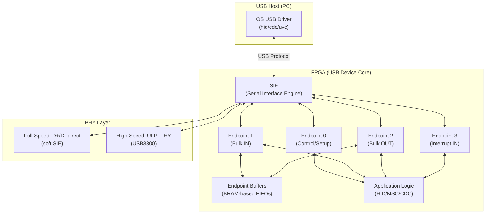
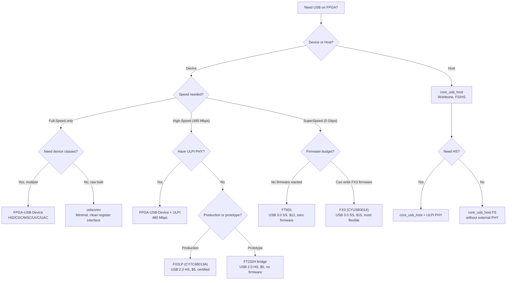

[← 12 Open Source Open Hardware Home](../README.md) · [← Networking Home](README.md) · [← Project Home](../../../README.md)

# Open USB Cores — Device, Host & PHY Integration

Open-source USB device and host controllers for FPGA — from Full-Speed (12 Mbps) device-mode cores to High-Speed (480 Mbps) implementations with ULPI PHY integration. USB is one of the hardest open IP categories on FPGA because the protocol's electrical requirements and tight timing constraints make a pure-soft implementation extremely difficult at anything beyond Full-Speed.

---

## Overview

USB on FPGA is fundamentally a PHY problem first and a protocol problem second. The USB specification defines precise electrical signaling (differential pair with specific impedance, pull-up/pull-down resistors for speed negotiation, NRZI encoding with bit stuffing). At Full-Speed (12 Mbps), a soft FPGA core can bit-bang the D+/D- lines directly. At High-Speed (480 Mbps), you need an external ULPI PHY chip (like USB3300) that handles the analog signaling while the FPGA speaks a parallel 8-bit/60 MHz interface.

| Speed | Bit Rate | FPGA Approach | PHY Requirement |
|---|---|---|---|
| **Low-Speed** | 1.5 Mbps | Soft (bit-bang) | Pull-up on D- |
| **Full-Speed** | 12 Mbps | Soft (bit-bang, tight timing) | Pull-up on D+ |
| **High-Speed** | 480 Mbps | ULPI PHY required | USB3300/USB3320 (12-pin ULPI) |

---

## Core Comparison

| Core | Mode | Speed | Interface | FPGA Verified | Repository |
|---|---|---|---|---|---|
| **usbcorev** | Device-only | FS (12 Mbps) | Native register interface | iCE40, ECP5, Artix-7 | avakar/usbcorev |
| **FPGA-USB-Device** | Device-only | FS + HS (480 Mbps) | Configurable (camera/audio/serial/HID) | Artix-7, Cyclone V, ECP5 | WangXuan95/FPGA-USB-Device |
| **core_usb_host** | Host-only | FS + HS | Wishbone | Artix-7, Cyclone V | ultraembedded/core_usb_host |
| **ValentyUSB** | Device-only | FS | Native | iCE40, ECP5 | im-tomu/valentyusb |
| **ULPI PHY wrapper** | PHY only | FS + HS | ULPI (12-pin) | Any FPGA with ULPI PHY chip | Various |

---

## USB Device Classes Supported

| Class | FPGA-USB-Device | usbcorev | ValentyUSB | Typical Use Case |
|---|---|---|---|---|
| **HID (keyboard/mouse)** | ✅ | — | ✅ | Custom keyboard/mouse emulator |
| **CDC-ACM (serial)** | ✅ | — | ✅ | Virtual COM port for debug |
| **MSC (mass storage)** | ✅ | — | — | SD card over USB |
| **UVC (video/camera)** | ✅ (MJPEG) | — | — | FPGA camera streaming to PC |
| **UAC (audio)** | ✅ | — | — | FPGA audio interface |
| **Custom bulk** | ✅ | ✅ (basic) | ✅ | Raw data pipe, application-specific |

---

## Architecture: USB Device on FPGA



---

## usbcorev — Minimal Full-Speed Device

usbcorev is the simplest open USB device core — a clean register-based interface for Full-Speed (12 Mbps) USB devices. It implements just enough of the USB spec to enumerate and exchange data on bulk endpoints.

### Register Interface

| Offset | Name | R/W | Description |
|---|---|---|---|
| `0x00` | EP0_CSR | RW | Endpoint 0 control/status: setup ready, stall, data toggle |
| `0x04` | EP0_BUF | RW | Endpoint 0 data buffer (8-byte setup + data) |
| `0x08` | EP1_CSR | RW | Endpoint 1 control/status: valid, stall, toggle |
| `0x0C` | EP1_BUF | RW | Endpoint 1 data buffer (up to 64 bytes) |
| `0x10` | EP2_CSR | RW | Endpoint 2 control/status |
| `0x14` | EP2_BUF | RW | Endpoint 2 data buffer |
| `0x18` | ADDR | RW | USB device address (set during enumeration) |
| `0x1C` | FRAME | R | Current USB frame number |

### Resource Usage

| FPGA | LUTs | FFs | BRAM | fMax |
|---|---|---|---|---|
| iCE40UP5K | ~600 | ~300 | 1 | 12 MHz (USB clock domain) |
| ECP5 25K | ~500 | ~280 | 1 | 48 MHz (internal) |

---

## FPGA-USB-Device — Multi-Class High-Speed

WangXuan95's FPGA-USB-Device is the most feature-rich open USB device core, supporting multiple device classes and both Full-Speed and High-Speed operation.

| Feature | Detail |
|---|---|
| **FS without external PHY** | Bit-bangs D+/D- directly from FPGA pins |
| **HS with ULPI** | Connects to USB3300/USB3320 for 480 Mbps |
| **Class support** | HID, CDC-ACM, MSC, UVC (MJPEG), UAC, custom bulk |
| **Configurable endpoints** | Up to 6 endpoints (control + 5 data) |
| **No CPU required** | Standalone — class logic implemented in RTL, not firmware |

### Full-Speed Without External PHY

The remarkable achievement of FPGA-USB-Device is that it implements Full-Speed USB entirely in soft logic — no external PHY chip needed. The FPGA's LVCMOS output pins directly drive the D+/D- lines through 1.5 kΩ pull-up resistors:

```
FPGA Pin ──── 1.5kΩ ──── D+ (Full-Speed pull-up)
FPGA Pin ────────────── D-
                │
                └─── USB Connector to Host
```

> **Critical timing constraint**: Full-Speed USB requires 48 MHz sampling of the 12 Mbps NRZI signal. The FPGA must meet this timing with zero clock drift. Use a crystal oscillator, not an FPGA PLL that might drift.

---

## FPGA Resource Usage by Core

Approximate synthesis results for open USB cores on common FPGA families. Values include the USB core + SIE + endpoint buffers; application logic (class handlers) adds additional LUTs as noted.

| Core | FPGA | LUTs | FFs | BRAM | fMax | Notes |
|---|---|---|---|---|---|---|
| **usbcorev** | iCE40UP5K | ~600 | ~300 | 1 | 48 MHz | FS device only; clean register interface |
| **usbcorev** | ECP5 25K | ~500 | ~280 | 1 | 48 MHz | Same design, better P&R |
| **FPGA-USB-Device** (core only) | Cyclone IV | ~350 | ~250 | 0 | 60 MHz | usbfs_core_top alone (no class layer) |
| **FPGA-USB-Device** + CDC-ACM | Cyclone IV | ~500 | ~350 | 0 | 60 MHz | USB-Serial; adds ~150 LUTs for CDC class |
| **FPGA-USB-Device** + HID | Cyclone IV | ~420 | ~280 | 0 | 60 MHz | USB-Keyboard; minimal class overhead |
| **FPGA-USB-Device** + MSC | Cyclone IV | ~600 | ~400 | 1 | 60 MHz | USB-Disk; adds block read/write FSM |
| **FPGA-USB-Device** + UVC | Cyclone IV | ~900 | ~550 | 2 | 60 MHz | USB-Camera; MJPEG FIFO + video stream FSM |
| **FPGA-USB-Device** + UAC | Cyclone IV | ~750 | ~500 | 1 | 60 MHz | USB-Audio; stereo I²S serializer + FIFOs |
| **core_usb_host** | Spartan-6 LX9 | ~392 | ~317 | 0 | 48 MHz | FS host only; AXI4-Lite register interface |
| **core_usb_host** | Artix-7 | ~350 | ~290 | 0 | 48 MHz | Slightly better P&R on 7-series |
| **ValentyUSB** (epfifo) | iCE40UP5K | ~1,500 | ~800 | 2 | 48 MHz | FS device + Wishbone bridge + CPU interface; heaviest core |
| **ValentyUSB** (dummyusb) | iCE40UP5K | ~800 | ~450 | 1 | 48 MHz | FS device only; no CPU, Wishbone bridge mode |
| **no2usb** | iCE40UP5K | ~400 | ~200 | 1 | 48 MHz | FS device; targets small iCE40 designs; dynamic EP config |

> **Reading the table**: "core only" means just the USB SIE + endpoint logic. Each USB class layer adds ~100–400 LUTs on top. A complete CDC-Serial device using FPGA-USB-Device totals ~500 LUTs; a UVC camera totals ~900 LUTs.

> **ValentyUSB** is the heaviest FS device core because it includes a full Wishbone interconnect and is designed to pair with a soft CPU (VexRiscv). On the tiny Fomu board (iCE40UP5K, 5280 LUTs), ValentyUSB + VexRiscv consumes nearly the entire fabric. Use usbcorev or no2usb for designs that don't need a CPU-managed USB stack.

---

## Hard USB Controller Chips — The FPGA + Companion Approach

When soft USB cores can't meet your needs (SuperSpeed, robust compliance, or production certification), the standard industry approach is to pair the FPGA with a **dedicated USB controller chip**. The FPGA handles application logic; the USB chip handles the protocol stack and PHY. They communicate through a simple parallel FIFO interface.

This is how virtually every production FPGA board with USB 3.0 works — including Xilinx evaluation boards, National Instruments DAQ devices, and high-end data acquisition systems.

### Controller Chip Comparison

| Chip | Vendor | USB Speed | FPGA Interface | Max Throughput | Price | Firmware Required | Open FPGA Core |
|---|---|---|---|---|---|---|---|
| **FX2LP (CY7C68013A)** | Infineon (Cypress) | HS 480 Mbps | Slave FIFO (8/16-bit) | ~40 MB/s | ~$5 | Yes (8051 firmware) | ✅ WangXuan95/FPGA-ftdi245fifo |
| **FX3 (CYUSB3014)** | Infineon (Cypress) | SS 5 Gbps | GPIF II (16/32-bit parallel) | ~400 MB/s | ~$15 | Yes (ARM9 firmware + GPIF config) | ✅ Enclustra FX3 examples |
| **FT600** | FTDI | SS 5 Gbps | 16-bit FIFO | ~200 MB/s | ~$10 | No (fixed function) | ✅ WangXuan95/FPGA-ftdi245fifo |
| **FT601** | FTDI | SS 5 Gbps | 32-bit FIFO | ~400 MB/s | ~$12 | No (fixed function) | ✅ ultraembedded/core_ft60x_axi |
| **FT232H** | FTDI | HS 480 Mbps | 245 FIFO (8-bit) | ~40 MB/s | ~$5 | No (fixed function) | ✅ WangXuan95/FPGA-ftdi245fifo |

### Why Choose a Hard Controller Over a Soft Core

| Factor | Soft Core (usbcorev, etc.) | Hard Controller (FX3, FT601) |
|---|---|---|
| **USB 3.0 SuperSpeed** | ❌ Not available | ✅ 5 Gbps |
| **USB-IF certification** | ❌ No open core is certified | ✅ Chips are pre-certified |
| **Host OS compatibility** | 🟡 Fragile (descriptor issues) | ✅ Standard drivers |
| **Hot-plug robustness** | 🟡 Often breaks on reconnect | ✅ Handled by chip firmware |
| **FPGA resource cost** | 400–1500 LUTs | 100–300 LUTs (FIFO interface only) |
| **Firmware complexity** | None (all in RTL) | FX2LP/FX3: requires firmware; FTDI: none |
| **Latency** | Low (direct RTL) | Higher (chip FIFO latency ~1 μs) |
| **Cost** | Free (RTL only) | $5–15 per chip |

### FX3 GPIF II — The Most Flexible USB 3.0 Option

The Infineon EZ-USB FX3 is the industry standard for FPGA + USB 3.0 designs. Its **GPIF II** (General Programmable Interface) is a configurable 16/32-bit parallel interface that can be programmed to match almost any FPGA-side protocol.

```
┌──────────────┐    GPIF II (16/32-bit)    ┌──────────────────┐
│   FPGA       │◄────────────────────────►│   FX3 (CYUSB3014)│
│              │    • CLK (output from FX3) │                  │
│  Application │    • DATA[15:0] or [31:0] │   ARM9 + USB     │
│  Logic       │    • SLCS# (chip select)   │   3.0 PHY        │
│              │    • SLRD# (read strobe)   │                  │
│  (FIFO or    │    • SLWR# (write strobe)  │   → USB 3.0      │
│   AXI bridge)│    • SLOE# (output enable) │     5 Gbps       │
│              │    • PKTEND# (packet end)  │                  │
│              │    • FLAGA/B/C/D (status)  │                  │
└──────────────┘                           └──────────────────┘
```

| FX3 GPIF II Parameter | Detail |
|---|---|
| **Data width** | 16-bit or 32-bit |
| **Clock** | Up to 100 MHz (synchronous, FX3 outputs clock) |
| **Throughput** | ~400 MB/s sustained (USB 3.0) |
| **Endpoints** | Up to 16 (configurable bulk/interrupt/isochronous) |
| **Firmware** | ARM926EJ-S runs C firmware; controls GPIF config + USB descriptors |
| **Tool** | GPIF II Designer (Infineon GUI for configuring the parallel interface) |

> **FX3 firmware is the catch**: You must write (or adapt) ARM9 firmware that configures the USB descriptors, GPIF II interface, and endpoint routing. Infineon provides the FX3 SDK with example Slave FIFO firmware. The FPGA side only needs a simple FIFO reader/writer.

### FTDI FT601 — The Simplest USB 3.0 Option

The FTDI FT601 is the easiest path to USB 3.0 on an FPGA — no firmware required. It presents a fixed-function 32-bit synchronous FIFO interface on one side and USB 3.0 SuperSpeed on the other.

| FT601 Parameter | Detail |
|---|---|
| **Data width** | 32-bit |
| **Clock** | 100 MHz (FPGA provides clock) |
| **Throughput** | Up to ~400 MB/s |
| **Channels** | 4 (2 IN, 2 OUT, or 4 IN, configurable via EEPROM) |
| **Driver** | FTDI D3XX driver (Windows, Linux) |
| **Firmware** | None — fixed function out of the box |

> **FT601 trade-off**: Zero firmware development vs. FTDI's proprietary D3XX driver. The driver is closed-source, and Linux support requires FTDI's kernel module. For open-source purists, the FX3 with custom firmware is more transparent.

### FX2LP — USB 2.0 High-Speed Workhorse

The Infineon EZ-USB FX2LP (CY7C68013A) is the most widely-used USB 2.0 HS controller in FPGA designs. It's been in production for 20+ years, has extensive documentation, and the Slave FIFO interface is trivial to connect.

| FX2LP Parameter | Detail |
|---|---|
| **USB Speed** | High-Speed 480 Mbps |
| **FPGA Interface** | Slave FIFO (8-bit or 16-bit) |
| **Throughput** | ~40 MB/s sustained |
| **Internal CPU** | 8051 (runs USB protocol firmware) |
| **Price** | ~$5 |
| **Channels** | Up to 6 endpoints (bulk/interrupt/isochronous) |

> **FX2LP is everywhere**: The CY7C68013A is found in thousands of commercial FPGA boards and USB data acquisition devices. If you need proven USB 2.0 HS without the soft-core risk, this is the default choice.

### Open FPGA Interface Cores for Hard Controllers

| Core | Controller | Interface | Bus | Repository |
|---|---|---|---|---|
| **FPGA-ftdi245fifo** | FT232H/FT600/FT601 | 245 FIFO | Native (simple FIFO handshake) | WangXuan95/FPGA-ftdi245fifo |
| **core_ft60x_axi** | FT601 | 32-bit FIFO | AXI-4 Master (burst-capable) | ultraembedded/core_ft60x_axi |
| **FTDI-245fifo-interface** | FT232H/FT600 | 245 FIFO | Native | mfkiwl/FTDI-245fifo-interface |
| **FX3 Slave FIFO** | FX3 (CYUSB3014) | GPIF II | Native (Infineon app note AN65974) | Infineon AN65974 |

---

## The ULPI Problem

Most FPGA boards lack a USB PHY chip (like USB3300). Without ULPI, you are stuck at Full-Speed (12 Mbps) using simple pull-up detection. This is the single biggest practical obstacle to open USB on FPGA.

### ULPI Interface

ULPI (UTMI+ Low Pin Interface) reduces the 60+ pins of the full UTMI interface to 12 pins:

| Signal | Direction | Description |
|---|---|---|
| `CLK` | PHY → Link | 60 MHz clock output |
| `DIR` | PHY → Link | Direction (1 = PHY driving data bus) |
| `STP` | Link → PHY | Stop (signals end of transmit) |
| `NXT` | PHY → Link | Next (PHY ready for next data byte) |
| `DATA[7:0]` | Bidirectional | 8-bit parallel data |
| `RESET#` | Link → PHY | PHY reset |

### Common ULPI PHY Chips

| Chip | Speed | Package | Price | Notes |
|---|---|---|---|---|
| **USB3300** | HS (480 Mbps) | QFN-32 | ~$2 | Most common, well-documented |
| **USB3320** | HS (480 Mbps) | QFN-32 | ~$3 | USB3300 successor, better ESD |
| **USB334x** | HS (480 Mbps) | QFN-24 | ~$3 | Smaller package |

### Workarounds When No ULPI PHY Is Available

| Approach | Speed | Pros | Cons |
|---|---|---|---|
| **FTDI FT232H** | 480 Mbps | Ubiquitous, well-tested | Proprietary driver, FIFO-mode only |
| **CH376S** | FS (12 Mbps) | USB host + FAT filesystem | Chinese datasheet, limited API |
| **TinyFPGA USB bootloader** | FS (12 Mbps) | Built into iCE40 boards | Bootloader only, not runtime |
| **ESP32-S3 USB bridge** | HS (480 Mbps) | WiFi + USB, cheap | Requires separate MCU firmware |
| **STM32 as USB bridge** | FS/HS | Well-documented HAL | Requires MCU firmware |
| **PMOD USBUART** | FS (12 Mbps) | Standard PMOD form factor | Limited to CDC-ACM |

---

## USB Enumeration: The First 100 ms

Every USB device must complete enumeration before data transfer. This is where most open USB cores fail:

| Step | Host Action | Device Response | Common Failure |
|---|---|---|---|
| 1. **Reset** | Drives SE0 for 10 ms | Device resets address to 0 | Device doesn't detect SE0 |
| 2. **Set Address** | SET_ADDRESS request | Device stores new address | Address not latched before next packet |
| 3. **Get Descriptor** | GET_DESCRIPTOR (device) | Device returns 18-byte device descriptor | Descriptor too long or wrong length |
| 4. **Get Config** | GET_DESCRIPTOR (config) | Device returns configuration + interface + endpoint descriptors | Wrong wTotalLength in config descriptor |
| 5. **Set Configuration** | SET_CONFIGURATION | Device activates endpoints | Endpoint buffers not initialized |

> **Debugging tip**: Use Wireshark with USBPcap on Windows or `lsusb -v` on Linux to inspect enumeration. If the device shows up but immediately disconnects, the descriptor is likely malformed.

---

## Decision Guide



---

## When to Use / When NOT to Use

### When to Use Open USB Cores

- **Custom HID devices** — keyboard/mouse/gamepad emulators where Full-Speed is sufficient
- **Virtual COM port** — CDC-ACM for FPGA debug console without a separate UART-to-USB chip
- **Camera streaming** — UVC class on FPGA-USB-Device for direct webcam output
- **Learning USB protocol** — usbcorev's clean register interface reveals how USB works

### When NOT to Use Open USB Cores

- **Production USB devices** — open cores lack USB-IF certification; use a proven USB bridge chip (FTDI, CH340, CP2102) or a hard controller (FX2LP, FX3)
- **USB 3.0 SuperSpeed (5 Gbps)** — no open FPGA core supports it; use FX3 or FT601 instead
- **USB On-the-Go (OTG)** — no open core supports dual-role; use a dedicated OTG controller chip
- **Robust hot-plug** — open cores often don't handle cable disconnect/reconnect gracefully
- **Windows-certified devices** — open cores cannot pass WHQL certification; use a certified controller chip

---

## Best Practices

1. **Start with FPGA-USB-Device CDC-ACM** — it's the fastest way to get a USB serial port working
2. **Use 1.5 kΩ pull-up on D+ for Full-Speed enumeration** — without this, the host will never detect the device
3. **Validate descriptors with USB descriptor tool** — a malformed descriptor causes silent enumeration failure
4. **Use separate clock domains** — USB needs a clean 48 MHz (FS) or 60 MHz (ULPI) clock; don't derive it from the same PLL as your application logic
5. **Test on both Linux and Windows** — Linux is more forgiving of USB spec violations; Windows will silently reject non-compliant devices

---

## Antipatterns

- **The Soft High-Speed Without ULPI** — trying to implement 480 Mbps USB signaling in soft FPGA logic without a PHY chip; it is not possible to meet the electrical and timing requirements
- **The Missing Pull-Up** — forgetting the 1.5 kΩ pull-up resistor on D+ (Full-Speed) or D- (Low-Speed); the host will never enumerate the device
- **The Infinite Enumeration Loop** — the host sends SET_ADDRESS, the device ACKs but doesn't update its address register, causing the host to retry forever

---

## Pitfalls

1. **Full-Speed timing is tight** — the 12 Mbps NRZI signal must be sampled at exactly 48 MHz with <0.25% clock tolerance; use a crystal oscillator, not an FPGA PLL with drift
2. **USB cable impedance** — USB cables are 90 Ω differential; cheap cables with wrong impedance cause signal integrity issues at High-Speed
3. **ULPI DIR/STP/NXT protocol** — the ULPI bus is half-duplex with a turn-around cycle; getting the direction switching wrong causes bus contention
4. **Endpoint data toggle** — USB uses DATA0/DATA1 toggling for bulk transfers; resetting the toggle at the wrong time causes the host to NAK every packet
5. **iCE40 special considerations** — the iCE40 has weak pull-ups that can interfere with USB D+/D- detection; use external pull-ups instead
6. **Windows driver signing** — custom USB devices on Windows need .inf files; for CDC-ACM, use the generic `usbser.sys` driver

---

## Use Cases

- **Custom game controllers** — HID class on FPGA-USB-Device for arcade cabinet controllers
- **FPGA debug console** — CDC-ACM eliminates the need for a separate USB-to-UART bridge chip
- **USB camera** — UVC class for streaming FPGA-processed video directly to a PC
- **Data acquisition** — bulk transfer at 12 Mbps (FS) or 480 Mbps (HS with ULPI) for sensor data
- **Firmware update** — MSC class for drag-and-drop bitstream updates from a PC
- **High-speed data streaming** — FT601 or FX3 for >400 MB/s sustained USB 3.0 transfer from ADC/DAC
- **Production FPGA + USB products** — FX2LP Slave FIFO for certified USB 2.0 HS with minimal FPGA-side logic
- **USB 3.0 video capture** — FX3 GPIF II + FPGA image processing pipeline, output as UVC device

---

## References

- [usbcorev (GitHub)](https://github.com/avakar/usbcorev)
- [FPGA-USB-Device (GitHub)](https://github.com/WangXuan95/FPGA-USB-Device)
- [core_usb_host (GitHub)](https://github.com/ultraembedded/core_usb_host)
- [ValentyUSB (GitHub)](https://github.com/im-tomu/valentyusb)
- [FPGA-ftdi245fifo (GitHub)](https://github.com/WangXuan95/FPGA-ftdi245fifo) — FT232H/FT600/FT601 FIFO interface
- [core_ft60x_axi (GitHub)](https://github.com/ultraembedded/core_ft60x_axi) — FT601 AXI-4 master
- [Infineon FX3 Slave FIFO App Note AN65974](https://www.infineon.com/dgdl/Infineon-AN65974) — FPGA + FX3 interface design
- [Infineon FX3 SDK](https://www.infineon.com/cms/en/product/promopages/ez-usb-fx3-sdk/) — GPIF II Designer + firmware examples
- [ULPI Specification (UTMI+ Low Pin Interface)](https://www.ulpi.org/)
- [USB 2.0 Specification](https://www.usb.org/document-library/usb-20-specification)
- [TinyFPGA USB Bootloader](https://github.com/tinyfpga/TinyFPGA-Bootloader)
- [Ethernet Cores](ethernet_cores.md) — for network connectivity alternatives
