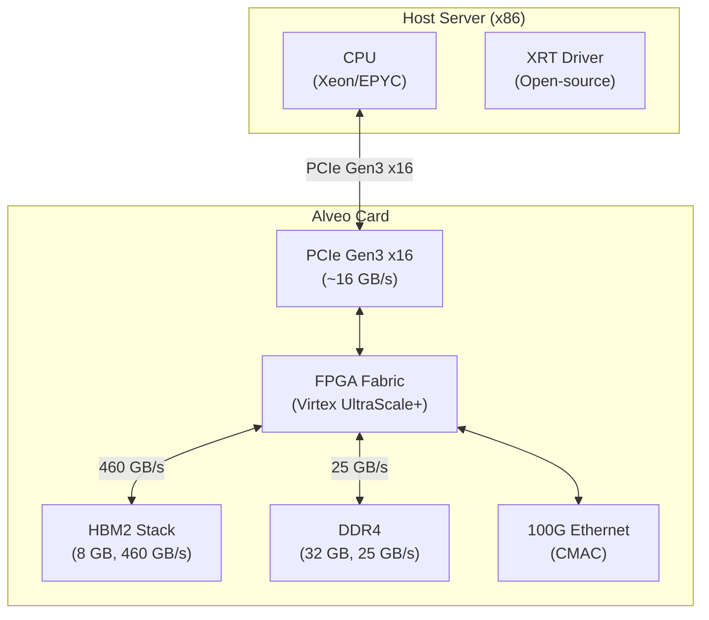

[← 12 Open Source Open Hardware Home](../README.md) · [← Open Boards Home](README.md) · [← Project Home](../../../README.md)

# High-End Open Boards — Alveo, Zynq & KRIA

FPGA boards targeting compute-heavy, PCIe-connected, or SoC-class applications — Xilinx Alveo data-center cards, ZCU/Zynq development kits, and KRIA system-on-modules. These are not hobbyist boards: they have HBM, multi-gigabit transceivers, hardened ARM processors, and price tags from $250 to $8,000.

---

## Overview

High-end FPGA boards serve three distinct communities: **data-center acceleration** (Alveo with HBM and PCIe Gen3 x16), **embedded SoC development** (Zynq UltraScale+ with ARM Cortex-A53 + FPGA fabric), and **rapid prototyping** (KRIA SOMs that bring Zynq capability to a $250 price point). Open-source projects target all three — from FINN ML inference on Alveo to LiteX on Zynq to PYNQ on KRIA.

---

## Board Catalog

| Board | FPGA | Key Specs | Open-Source Targeting | Price Range |
|---|---|---|---|---|
| **Alveo U50** | Virtex UltraScale+ XCU50 | 8 GB HBM2, 100G Eth, PCIe Gen3 x16 | RTL-level targeting via Vitis/Vivado | $4,000–$6,000 |
| **Alveo U200** | Virtex UltraScale+ XCU200 | 32 GB DDR4, PCIe Gen3 x16 | XRT runtime, OpenCL kernels | $5,000–$7,000 |
| **Alveo U250** | Virtex UltraScale+ XCU250 | 64 GB DDR4, PCIe Gen3 x16 | Most documented for open compute | $6,000–$8,000 |
| **Alveo U280** | Virtex UltraScale+ XCU280 | 8 GB HBM2 + 32 GB DDR4, PCIe Gen3 x16 | Primary target for open FPGA compute research | ~$3,500 |
| **ZCU104** | Zynq UltraScale+ XCZU7EV | Quad A53 + R5, Mali GPU, 2 GB DDR4 | Yocto/PetaLinux, LiteX, PYNQ | ~$1,700 |
| **ZCU102** | Zynq UltraScale+ XCZU9EG | Quad A53 + R5, 4 GB DDR4 | Reference for many open Zynq projects | ~$3,200 |
| **ZCU106** | Zynq UltraScale+ XCZU7EV | Quad A53 + R5, Mali, 2 GB DDR4, DP TX | Video/display focused | ~$2,000 |
| **KRIA KV260** | Zynq UltraScale+ XCK26 | SOM form-factor, cost-optimized | Xilinx App Store + open community | ~$250 |
| **KRIA KR260** | Zynq UltraScale+ XCK26 | Robotics-focused, industrial I/O | ROS 2 + FPGA acceleration | ~$350 |
| **Genesys 2** | Kintex-7 XC7K325T | 1 GB DDR3, FMC, PCIe x1 | Academic, Linux-capable open designs | ~$1,000 |
| **VCU118** | Virtus UltraScale+ XCVU9P | 4 GB DDR4, 2× FMC HPC, 100G Eth | Advanced research, Ventus GPU target | ~$5,000 |

---

## Alveo — Data-Center FPGA Acceleration

### Architecture



### Key Specifications

| Model | LUTs | BRAM (Mb) | DSP | HBM2 | DDR4 | PCIe | Price |
|---|---|---|---|---|---|---|---|
| **U50** | 872K | 1,344 | 5,952 | 8 GB | None | Gen3 x16 | ~$4,000 |
| **U200** | 1,272K | 1,704 | 9,072 | None | 64 GB | Gen3 x16 | ~$6,000 |
| **U250** | 1,728K | 2,160 | 12,288 | None | 64 GB | Gen3 x16 | ~$7,000 |
| **U280** | 1,304K | 2,016 | 9,072 | 8 GB | 32 GB | Gen3 x16 | ~$3,500 |

### Open-Source Stack for Alveo

| Component | Tool | License |
|---|---|---|
| **Runtime** | XRT (Xilinx RunTime) | Apache 2.0 |
| **Kernel development** | Vitis HLS (C/C++ → RTL) | Proprietary (free WebPACK for some devices) |
| **RTL development** | Vivado | Proprietary |
| **Networking** | Open NIC (Intel + Xilinx) | BSD |
| **Shell** | Xilinx Shell (2RP) | Binary, documented |

---

## Zynq UltraScale+ — ARM + FPGA SoC

The Zynq UltraScale+ combines a quad-core ARM Cortex-A53 (64-bit Linux-capable) with FPGA fabric on a single chip. The PS (Processing System) and PL (Programmable Logic) communicate via AXI interfaces at up to 128 Gbps.

### Zynq Architecture

```mermaid
flowchart LR
    subgraph PS["Processing System (PS)"]
        A53["Quad Cortex-A53<br/>(64-bit, Linux)"]
        R5["Dual Cortex-R5<br/>(Real-time)"]
        GPU["Mali-400 MP2<br/>(ZU7EV only)"]
        DDR_PS["DDR4 Controller<br/>(4 GB)"]
        PERIPH["Peripherals<br/>(USB, Eth, SD, UART, SPI, I2C)"]
    end

    subgraph PL["Programmable Logic (PL)"]
        FABRIC["FPGA Fabric<br/>(LUTs, BRAM, DSP)"]
        HP["AXI HP Ports<br/>(4× 128-bit, PS←PL DMA)"]
        HPC["AXI HPC Ports<br/">(2× 128-bit, coherent)"]
        GP["AXI GP Ports<br/>(4× 32-bit, register access)"]
    end

    A53 <-->|"AXI coherent<br/>(ACP/HPC)"| HPC
    A53 <-->|"AXI HP<br/>(DMA)"| HP
    PERIPH <-->|"AXI GP<br/">(register)"| GP
    DDR_PS <-->|"AXI HP<br/">(PL→DDR)"| HP
    GPU --> DDR_PS
```

### Zynq Board Comparison

| Feature | ZCU102 | ZCU104 | KV260 | KR260 |
|---|---|---|---|---|
| **FPGA** | XCZU9EG | XCZU7EV | XCK26 | XCK26 |
| **LUTs** | 600K | 230K | 154K | 154K |
| **ARM A53** | 4 | 4 | 4 | 4 |
| **ARM R5** | 2 | 2 | 2 | 2 |
| **Mali GPU** | No | Yes | Yes | Yes |
| **DDR4** | 4 GB | 2 GB | 4 GB | 4 GB |
| **FMC** | 2× HPC | 1× HPC | None (carrier) | None (carrier) |
| **Form factor** | Dev board | Dev board | SOM + carrier | SOM + carrier |
| **Price** | ~$3,200 | ~$1,700 | ~$250 | ~$350 |
| **Best for** | Reference design, FMC | Video, AI/ML | Edge AI, cost-optimized | Robotics |

---

## KRIA — Zynq at Hobbyist Prices

KRIA SOMs bring Zynq UltraScale+ to a $250 price point — previously impossible for ARM + FPGA SoC development.

### KV260 Vision AI Starter Kit

| Component | Detail |
|---|---|
| **SOM** | KRIA K26 (XCK26, 154K LUTs, quad A53, Mali) |
| **Carrier** | Starter carrier with camera connector, DP, USB, Ethernet, SD |
| **Out-of-box apps** | Smartcam, AI inference (pre-built) |
| **Software** | Ubuntu 22.04 LTS, PYNQ, Vitis-AI |
| **Open-source targeting** | PYNQ framework, VART runtime, custom PL via Vivado |

### KR260 Robotics Starter Kit

Same SOM as KV260 but with a robotics-focused carrier: CAN bus, RS-485, additional GPIO, and ROS 2 integration.

---

## When to Choose High-End

| Need | Board | Why |
|---|---|---|
| I need HBM for bandwidth | **Alveo U280** | 8 GB HBM2 at 460 GB/s — no other option at this price |
| I need ARM cores + FPGA dev | **ZCU104** or **KV260** | Zynq UltraScale+ PS + PL |
| I'm doing FPGA compute research | **Alveo U250** | Most documented, largest fabric |
| I need FMC mezzanine expansion | **Genesys 2** or **ZCU102** | FMC HPC connectors for ADC/DAC cards |
| Budget Zynq UltraScale+ | **KV260** | $250 for quad A53 + 154K LUT FPGA |
| ML inference at the edge | **KV260** | Pre-built AI apps + Vitis-AI |
| Robotics with FPGA acceleration | **KR260** | CAN/RS-485 + ROS 2 + FPGA |

---

## Decision Guide

```mermaid
flowchart TD
    A[Need a high-end FPGA board?] --> B{ARM cores needed?}
    B -->|Yes| C{Budget?}
    B -->|No| D{PCIe required?}
    C -->|$250–400| E[KRIA KV260/KR260<br/>Zynq SOM + carrier]
    C -->|$1,700+| F{Need FMC?}
    F -->|Yes| G[ZCU102 ($3,200)<br/>2× FMC HPC]
    F -->|No| H[ZCU104 ($1,700)<br/>Video/AI focused]
    D -->|Yes| I{Need HBM?}
    D -->|No| J[Genesys 2 ($1,000)<br/>Kintex-7, academic]
    I -->|Yes| K[Alveo U280<br/>8 GB HBM2, ~$3,500]
    I -->|No| L[Alveo U200/U250<br/>DDR4 only, ~$6,000+]
```

---

## When to Use / When NOT to Use

### When to Use

- **Data-center acceleration** — Alveo for ML inference, networking, quantitative finance
- **Edge AI** — KV260 with Vitis-AI for camera-based inference
- **Zynq Linux + FPGA** — any Zynq UltraScale+ board for custom hardware + software co-design
- **FMC mezzanine I/O** — ZCU102/VCU118 for high-speed ADC/DAC/radio cards

### When NOT to Use

- **Hobbyist projects** — these boards are expensive and require proprietary tools (Vivado)
- **Learning FPGA basics** — a $15 Tang Nano or $70 iCEBreaker is a better starting point
- **Pure software development** — if you don't need the FPGA fabric, use a plain ARM SBC

---

## Best Practices

1. **Start with KRIA for Zynq development** — the $250 KV260 gives you the same Zynq experience as a $3,200 ZCU102 for most use cases
2. **Use XRT for Alveo development** — the open-source XRT runtime provides a consistent API across all Alveo cards
3. **Use PYNQ for Zynq prototyping** — Jupyter + Python + FPGA accelerators; fastest path from idea to running code
4. **Don't buy ZCU102 unless you need FMC** — the ZCU104 is $1,500 cheaper and has the same PS

---

## Antipatterns

- **The Alveo for Hobby Projects** — buying a $5,000 Alveo card for a personal project; the power, cooling, and host requirements make it impractical
- **The ZCU102 Without FMC** — spending $3,200 on a ZCU102 and never using the FMC connectors; a ZCU104 or KV260 would have been sufficient
- **The Custom Zynq Board** — designing a custom Zynq carrier board without first prototyping on a KRIA SOM; the SOM approach is faster and cheaper

---

## Pitfalls

1. **Alveo requires a server-class host** — PCIe Gen3 x16 needs a proper server with adequate power and cooling; desktop PCs may not provide enough PCIe slot power
2. **Zynq boot is complex** — FSBL → PMU firmware → ATF → U-Boot → Linux; a mistake in any stage bricks the board until JTAG recovery
3. **KRIA SOM availability** — the K26 SOM is sometimes out of stock; buy the complete starter kit, not the SOM alone
4. **Vivado license requirements** — Zynq UltraScale+ and Alveo require paid Vivado licenses; WebPACK does not support these devices
5. **HBM thermal constraints** — Alveo U50/U280 HBM generates significant heat; ensure your server has adequate airflow

---

## Use Cases

- **ML inference in data centers** — Alveo + FINN for sub-microsecond inference
- **Network function acceleration** — Alveo + Open NIC for SmartNIC applications
- **Video analytics** — KV260 + Vitis-AI for smart camera applications
- **Software-defined radio** — ZCU104/VCU118 with FMC ADC/DAC cards
- **Robotics control** — KR260 + ROS 2 + FPGA motor control
- **High-frequency trading** — Alveo U280 with HBM for microsecond-level feed processing

---

## References

- [Xilinx Alveo Platform](https://www.xilinx.com/products/boards-and-kits/alveo.html)
- [XRT Runtime (GitHub)](https://github.com/Xilinx/XRT) — open-source
- [KRIA KV260](https://www.xilinx.com/products/som/kria/kv260-vision-starter-kit.html)
- [PYNQ Project](http://www.pynq.io/) — Python + Zynq
- [Zynq UltraScale+ Technical Reference Manual (UG1085)](https://www.xilinx.com/support/documentation/user_guides/ug1085-zynq-ultrascale-trm.pdf)
- [Hobbyist Boards](hobbyist_boards.md) — affordable open-toolchain boards
- [Repurposed Boards](repurposed_boards.md) — commercial hardware at low cost
