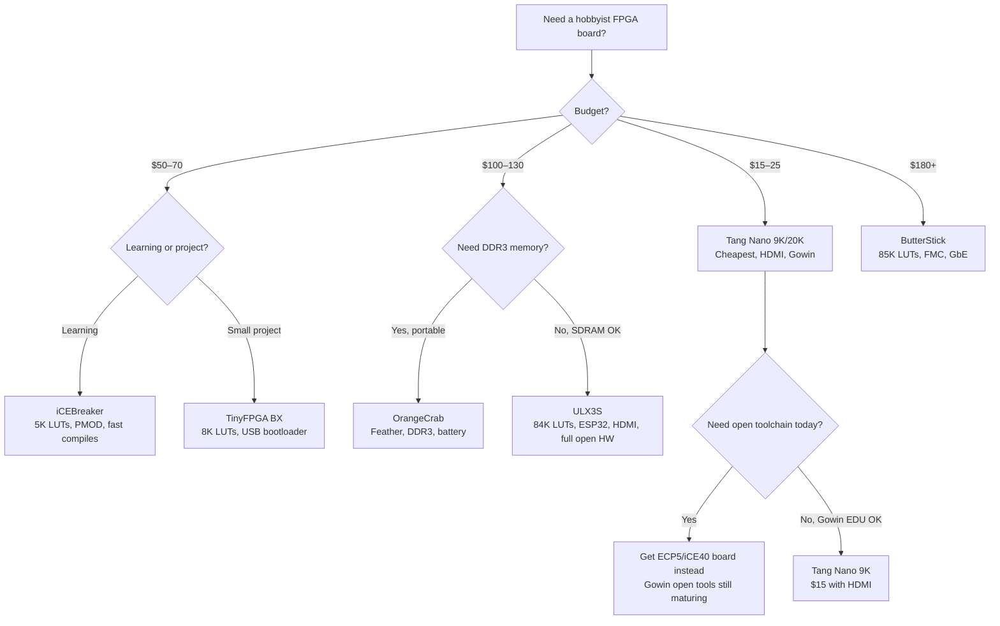

[← 12 Open Source Open Hardware Home](../README.md) · [← Open Boards Home](README.md) · [← Project Home](../../../README.md)

# Hobbyist & Development Boards — The Open-Source FPGA Renaissance

The boards driving the open-source FPGA renaissance — affordable, open-toolchain-compatible, and community-supported. These are the boards that make FPGA development accessible without a $3,000 Vivado license or a vendor-locked evaluation kit.

---

## Overview

The hobbyist FPGA board market exploded after 2018, driven by three forces: the maturity of open-source toolchains (Yosys + nextpnr), Lattice's permissive bitstream documentation (iCE40 and ECP5), and community-designed open hardware (ULX3S, OrangeCrab). The result is a landscape where you can get a working FPGA development environment for $15 (Tang Nano 9K) using entirely open-source tools.

---

## Comparison Matrix

| Board | FPGA | LUTs | RAM | Flash | Price | Open Toolchain | Special |
|---|---|---|---|---|---|---|---|
| **ULX3S** | Lattice ECP5 LFE5U-85F | 84K | 32 MB SDRAM | 16 MB SPI | ~$130 | ✅ Yosys + nextpnr + Trellis | ESP32 companion, HDMI, GPIO, PMOD, open HW |
| **OrangeCrab** | Lattice ECP5 LFE5U-25F | 25K | 128 MB DDR3 | 16 MB SPI | ~$100 | ✅ Yosys + nextpnr + Trellis | Feather form-factor, USB-C, battery charger |
| **iCEBreaker** | Lattice iCE40UP5K | 5K | 128 KB SPRAM | 1 MB SPI | ~$70 | ✅ Yosys + nextpnr + IceStorm | PMOD, RGB LED, best for learning |
| **TinyFPGA BX** | Lattice iCE40LP8K | 8K | 128 KB SPRAM | 2 MB SPI | ~$50 | ✅ Yosys + nextpnr + IceStorm | USB bootloader, tiny, breadboard-friendly |
| **ButterStick** | Lattice ECP5 LFE5U-85F | 85K | 256 MB DDR3 | 32 MB SPI | ~$180 | ✅ Yosys + nextpnr + Trellis | FMC connector, GbE, highest open-spec ECP5 |
| **Tang Nano 9K** | Gowin GW1NR-9 | 8.6K | 64 MB PSRAM | 32 MB SPI | ~$15 | 🟡 Gowin EDU (Apicula maturing) | Cheapest, HDMI, USB-C, breadboardable |
| **Tang Nano 20K** | Gowin GW2AR-18 | 20K | 64 MB PSRAM | 32 MB SPI | ~$25 | 🟡 Gowin EDU (Apicula maturing) | More LUTs, still ultra-cheap, HDMI |
| **Tang Console 60K** | Gowin GW5A-60 | 60K | — | USB drive | ~$40 | 🟡 Gowin EDU | Purpose-built retro gaming, HDMI, USB controllers |
| **Tang Console 138K** | Gowin GW5A-138 | 138K | — | USB drive | ~$60 | 🟡 Gowin EDU | Maximum retro core compatibility |
| **Colorlight i5** | Lattice ECP5 LFE5U-25F | 25K | 32 MB SDRAM | — | ~$15 | ✅ Yosys + nextpnr + Trellis | Repurposed LED controller — see [repurposed_boards.md](repurposed_boards.md) |

---

## Board Deep Dives

### ULX3S — The Flagship Open Board

The ULX3S is the most complete open-hardware FPGA board. Designed by the Gatemate community (Ferdi, Emard, Slavko), it is fully open-source from PCB to firmware.

| Feature | Detail |
|---|---|
| **FPGA** | Lattice ECP5 LFE5U-85F (84K LUTs) |
| **Memory** | 32 MB SDRAM (IS42S16400J) |
| **Flash** | 16 MB SPI flash (bitstream + storage) |
| **ESP32** | Wi-Fi + Bluetooth companion (full Linux on ESP32) |
| **HDMI** | Direct TMDS output (4 diff pairs) |
| **Audio** | 3.5 mm jack (sigma-delta DAC) |
| **USB** | USB-C (JTAG programming + USB-serial) |
| **PMOD** | 4× standard PMOD connectors |
| **GPIO** | 2× 20-pin headers (Raspberry-Pi compatible) |
| **Buttons** | 6 push buttons, 6 slide switches |
| **Display** | 7-segment LED, RGB LED |
| **Power** | USB-C or LiPo battery |

**Why the ULX3S matters**: It's the reference platform for LiteX, the most-tested ECP5 board in the open-source community, and the only one with an ESP32 companion that provides Wi-Fi, Bluetooth, and a full Linux environment alongside the FPGA.

### OrangeCrab — Feather-Form FPGA

OrangeCrab packs an ECP5 and 128 MB DDR3 into a tiny Feather-compatible form factor — small enough to fit inside other projects.

| Feature | Detail |
|---|---|
| **FPGA** | Lattice ECP5 LFE5U-25F (25K LUTs) |
| **Memory** | 128 MB DDR3L (MT41K64M16TW) |
| **Flash** | 16 MB SPI flash |
| **USB** | USB-C (FPGA JTAG + serial) |
| **Battery** | LiPo charger (MCP73871) |
| **Display** | RGB LED |
| **Buttons** | 2 push buttons |
| **Form factor** | Adafruit Feather (50.8 × 22.9 mm) |

**Why the OrangeCrab matters**: DDR3 memory in a Feather form-factor gives it 4× the bandwidth of SDRAM-based boards. The battery charger makes it genuinely portable.

### iCEBreaker — The Learning Platform

iCEBreaker was designed specifically for FPGA education — 5K LUTs is small enough that designs compile in seconds, and the PMOD ecosystem provides plug-and-play I/O.

| Feature | Detail |
|---|---|
| **FPGA** | Lattice iCE40UP5K (5K LUTs) |
| **Memory** | 128 KB Single-Port RAM (SPRAM) |
| **Flash** | 1 MB SPI flash |
| **USB** | USB-C (FTDI for JTAG + serial) |
| **PMOD** | 2× standard PMOD connectors |
| **Display** | 3× RGB LED |
| **Buttons** | 4 push buttons |

**Why the iCEBreaker matters**: The iCE40UP5K has SPRAM (single-port RAM) — small but real block RAM that enables framebuffer and FIFO designs. Combined with the open IceStorm toolchain, it provides the fastest design iteration cycle of any FPGA board (compile + program in <10 seconds).

### Tang Nano 9K / 20K — The Ultra-Cheap Gowin Boards

Sipeed's Tang Nano boards brought Gowin FPGAs to the hobbyist market at unprecedented prices. The 9K costs $15 — less than many microcontroller dev boards.

| Feature | Tang Nano 9K | Tang Nano 20K |
|---|---|---|
| **FPGA** | Gowin GW1NR-9 (8.6K LUTs) | Gowin GW2AR-18 (20K LUTs) |
| **Memory** | 64 MB PSRAM | 64 MB PSRAM |
| **Flash** | 32 MB SPI flash | 32 MB SPI flash |
| **HDMI** | ✅ | ✅ |
| **USB** | USB-C | USB-C |
| **Open toolchain** | 🟡 (Apicula maturing) | 🟡 (Apicula maturing) |
| **Price** | ~$15 | ~$25 |

**Why the Tang Nano matters**: At $15, it's the cheapest way to get an HDMI-output FPGA. The Gowin open toolchain (Apicula/Yosys + nextpnr-gowin) is maturing rapidly but still has rough edges compared to iCE40/ECP5 support.

---

## Open Toolchain Compatibility Matrix

| Board | Yosys Synthesis | nextpnr PnR | Bitstream Tools | Status |
|---|---|---|---|---|
| **ULX3S** (ECP5) | ✅ Full support | ✅ nextpnr-ecp5 | ✅ Project Trellis | Production |
| **OrangeCrab** (ECP5) | ✅ Full support | ✅ nextpnr-ecp5 | ✅ Project Trellis | Production |
| **iCEBreaker** (iCE40) | ✅ Full support | ✅ nextpnr-ice40 | ✅ Project IceStorm | Production |
| **TinyFPGA BX** (iCE40) | ✅ Full support | ✅ nextpnr-ice40 | ✅ Project IceStorm | Production |
| **ButterStick** (ECP5) | ✅ Full support | ✅ nextpnr-ecp5 | ✅ Project Trellis | Production |
| **Tang Nano 9K** (Gowin) | ✅ Yosys + gowin plugin | 🟡 nextpnr-gowin | 🟡 Project Apicula | Usable, maturing |
| **Tang Nano 20K** (Gowin) | ✅ Yosys + gowin plugin | 🟡 nextpnr-gowin | 🟡 Project Apicula | Usable, maturing |

---

## Notable Projects & Derived Works

The open-source FPGA community has produced a rich ecosystem of real projects running on these boards. This is not an exhaustive list — it showcases the breadth of what each board can do.

### ULX3S — The Project Powerhouse

With 84K LUTs, ESP32 companion, HDMI, and SD card, the ULX3S has the largest project ecosystem of any open-hardware FPGA board.

| Project | Category | Description | Repository / Source |
|---|---|---|---|
| **Minimig (Amiga 500)** | Retro computing | Full Amiga 500 emulator with OCS chipset, 68000 CPU, floppy via SD card | ulx3s/ulx3s.github.io |
| **Sega Master System** | Retro gaming | Complete SMS console with audio, controller via buttons or PS/2 | lawrie/ulx3s_retro |
| **NES** | Retro gaming | Nintendo Entertainment System with PPU and sprite rendering | ironsteel/nes_ecp5 |
| **Apple II** | Retro computing | Apple II+ emulator with disk images from SD | emard/apple2fpga |
| **TRS-80 Model 1** | Retro computing | Full TRS-80 Model I with video and keyboard | lawrie/ulx3s_retro |
| **ZX Spectrum** | Retro computing | ZX Spectrum 48K with tape loading from SD | lawrie/ulx3s_zx8 |
| **Jupiter Ace** | Retro computing | Forth-based 1982 home computer with PS/2 + HDMI | lawrie/ulx3s_retro |
| **Next186 (MS-DOS)** | Retro computing | 80186-based PC compatible running MS-DOS from SD card | Basman74/Next186 |
| **Galaksija BASIC** | Retro computing | Yugoslavian 1983 home computer running BASIC | emard/galaksija |
| **LiteX Linux (VexRiscv)** | RISC-V SoC | Full Linux on VexRiscv with DDR, Ethernet, HDMI | litex-hub/linux-on-litex-vexriscv |
| **SaxonSoc Linux** | RISC-V SoC | Alternative Linux SoC written in SpinalHDL | SpinalHDL/SaxonSoc |
| **KianV RISC-V Linux** | RISC-V SoC | RV32IMA SV32 Linux SoC with MMU | kianrehani/KianV |
| **FemtoRV** | RISC-V education | Minimalist RISC-V core with step-by-step tutorial | BrunoLevy/learn-fpga |
| **Doom-chip** | Demoscene | Hardware Doom render loop in Silice HDL — runs the original Doom WAD | sylefeb/Silice |
| **FM Radio Receiver** | SDR | FM radio using just an RLC network + FPGA analog comparator | emard/ulx3s_examples |
| **RDS Modulator + FM TX** | SDR | FM transmitter with RDS data — no external components | emard/ulx3s_examples |
| **16-APSK Modulator** | SDR | Satellite modulation using PipelineC HDL | PipelineC project |
| **Oscilloscope** | Instrumentation | 2-channel oscilloscope with HDMI display from hdl4fpga | hdl4fpga/scopeio |
| **Logic Analyzer** | Instrumentation | Multi-channel logic analyzer with HDMI waveform display | ReneRebe / ulx3s community |
| **Synth-o-Wheel** | Audio | True polyphonic additive synthesizer in VHDL | ulx3s community |
| **Voodoo Graphics** | Graphics | 3dfx Voodoo GPU emulator running Glide games on HDMI | victor-fisyuk/voodoo-fpga |
| **Tiny Tapeout ASIC test** | ASIC prototyping | ULX3S as test platform for Tiny Tapeout ASIC shuttle runs | tinytapeout |
| **LED Panel Driver** | Display | 64×64 HUB75 LED panel driver | ulx3s_examples |

### OrangeCrab — Portable RISC-V & Audio

| Project | Category | Description | Repository / Source |
|---|---|---|---|
| **VexRiscv SoC** | RISC-V SoC | Default bootloader includes VexRiscv; firmware in SPI flash | orangecrab-fpga/orangecrab-examples |
| **LiteX Linux** | RISC-V SoC | Linux on VexRiscv using LiteDRAM for DDR3 | litex-hub/linux-on-litex-vexriscv |
| **FPGA-USB-Device** | USB | Full-Speed USB CDC-serial device (bit-bang) | WangXuan95/FPGA-USB-Device |
| **CFU Playground** | ML | Google's Custom Function Unit framework for TFLM acceleration | google/CFU-Playground |
| **Portable synthesizer** | Audio | Battery-powered audio synthesizer using Feather form-factor | Community projects |

### iCEBreaker — Learning & USB

| Project | Category | Description | Repository / Source |
|---|---|---|---|
| **FemtoRV tutorial** | RISC-V education | Step-by-step RISC-V core build + C programming tutorial | BrunoLevy/learn-fpga |
| **ValentyUSB** | USB | Full-Speed USB device stack in LiteX/Migen | im-tomu/valentyusb |
| **LiteX SoC examples** | SoC | RISC-V SoC programmable from C, Rust, or MicroPython | icebreaker-fpga/icebreaker-litex-examples |
| **Project F tutorials** | FPGA graphics | FPGA graphics tutorials targeting iCEBreaker | projectf.io |
| **no2usb** | USB | Minimal USB core targeting iCE40 | no2fpga/no2usb |
| **Fomu-compatible designs** | USB device | iCEBreaker as prototyping platform for Fomu-form-factor USB devices | im-tomu |

### Tang Nano 9K / 20K — Ultra-Cheap Retro & HDMI

The Gowin boards have a growing retro gaming ecosystem despite the maturing toolchain. Both the 9K and 20K have onboard HDMI connectors, making them some of the cheapest FPGA boards with direct video output.

| Project | Category | Board | Description | Repository / Source |
|---|---|---|---|---|
| **MiSTeryNano** | Retro computing | 20K | Atari ST core — the first MiSTer-class core ported to Tang Nano | harbaum/MiSTeryNano |
| **C64Nano** | Retro gaming | 20K | Commodore 64 core with 1541 floppy drive emulation | MiSTle-Dev/C64Nano |
| **VIC20Nano** | Retro computing | 20K / 9K | Commodore VIC-20 core | vossstef/VIC20Nano |
| **MSXnano** | Retro computing | 20K | MSX2+ core with V9958, HDMI output, SD card + Nextor | RetroSilicon/MSXnano |
| **ZXnano** | Retro computing | 20K | ZX Spectrum core with HDMI output | RetroSilicon/ZXnano |
| **NESTang** | Retro gaming | 20K / Console | Cycle-accurate NES with 720p HDMI output, extensive mapper support | nand2mario/nestang |
| **SNESTang** | Retro gaming | Console | SNES with LoROM/HiROM, DSP chips, 720p HDMI | nand2mario/snestang |
| **GBATang** | Retro gaming | Console | Game Boy Advance with open-source BIOS, full 32MB gamepak | nand2mario/gbatang |
| **MDTang** | Retro gaming | Console | Sega Genesis/Mega Drive core | nand2mario/mdtang |
| **PicoRV32 SoC** | RISC-V | 20K | PicoRV32-based SoC with UART, GPIO | grughuhler/picorv32_tang_nano_20k |
| **PicoRV32 + HDMI** | RISC-V | 9K | PicoRV32 SoC with HDMI terminal (SimpleVout) | sipeed/TangNano-9K-example |
| **HDMI color bars** | Video demo | 20K | 1280×720 HDMI test pattern generator | sipeed/TangNano-20K-example |
| **Minimal HDMI** | Video demo | 9K | Barebones 720p HDMI test pattern (learning-oriented) | jiink/Tang-Nano-9K-Minimal-HDMI-Example |
| **USB HID Host** | USB | 9K | Keyboard/mouse/gamepad USB host (bit-bang) | nand2mario/usb_hid_host |

> **HDMI on Tang Nano — the TLVDS caveat**: The Tang Nano 9K and 20K have HDMI connectors, but Sipeed's PCB routing uses ELVDS (emulated LVDS) instead of true TLVDS for the TMDS pairs. This works for most HDMI displays at 720p but can cause signal integrity issues with some monitors. The Tang Console 60K/138K fixes this with proper TLVDS routing.

> **The nand2mario ecosystem**: Developer nand2mario has become the single most prolific contributor to the Tang Nano retro scene, creating NESTang, SNESTang, GBATang, MDTang, and the TangCore gaming distribution. See [smallthingsretro.com](https://nand2mario.github.io/projects/). The TangCore distribution runs on the newer Tang Console hardware with MCU-managed core switching.

### Tang Console 60K / 138K — Purpose-Built Retro Gaming

Sipeed's Tang Console (released 2025) is a dedicated FPGA retro gaming console built around the Tang Mega 60K or 138K SOM. It's the first cheap FPGA board designed specifically for retro gaming — with proper HDMI, USB controller ports, and a BL616 MCU for core management.

| Feature | Tang Console 60K | Tang Console 138K |
|---|---|---|
| **FPGA** | GW5A-LV60PG484 | GW5A-LV138PG484 |
| **LUTs** | 60K | 138K |
| **HDMI output** | 720p / 1080p | 720p / 1080p |
| **USB ports** | 2× USB-C (controllers) | 2× USB-C (controllers) |
| **MCU** | BL616 (core switching + USB host) | BL616 |
| **Storage** | USB drive (ROMs) | USB drive |
| **Price** | ~$40 | ~$60 |
| **TangCore support** | All cores | All cores |

> **Tang Console vs Tang Nano 20K for retro gaming**: The Console's BL616 MCU handles USB host, core switching, and on-screen display — tasks that would consume FPGA fabric on a bare Nano 20K. The proper TLVDS HDMI output fixes the Nano's signal integrity issues. If your goal is playing retro games rather than learning FPGA design, the Console is the better choice.

### TinyFPGA BX — Minimalist USB

| Project | Category | Description | Repository / Source |
|---|---|---|---|
| **FPGA-USB-Device** | USB | Full-Speed USB device (CDC, HID) using only 3 I/O pins | WangXuan95/FPGA-USB-Device |
| **RetroCade Synth** | Audio | C64 SID, YM2149, POKEY audio chips with MIDI interface | Community |
| **PicoRV32** | RISC-V | Minimal RISC-V SoC using USB serial for I/O | cliffordwolf/picorv32 |
| **TinyFPGA Bootloader** | USB | The board's own USB bootloader — a real-world USB-FS device in production | tinyfpga/TinyFPGA-Bootloader |

### ButterStick — High-Bandwidth

| Project | Category | Description | Repository / Source |
|---|---|---|---|
| **LiteX + HDMI** | SoC | LiteX SoC with DDR3 + HDMI output via GPDI SYZYGY addon | butterstick-fpga/example-litex-gpdi |
| **GbE Loopback** | Networking | Gigabit Ethernet loopback test | gregdavill/ButterStick-projects |
| **Logic analyzer** | Instrumentation | Multi-channel high-speed logic capture using FMC/SYZYGY | gregdavill/ButterStick-projects |
| **Custom SDR** | SDR | Software-defined radio using SYZYGY high-speed ADC/DAC PMODs | Community |

---

## Selection Guide

---

## When to Use / When NOT to Use Hobbyist Boards

### When to Use

- **Learning FPGA development** — iCEBreaker or TinyFPGA BX for fastest iteration
- **Open-source projects** — all ECP5/iCE40 boards have full open-toolchain support
- **Retro computing cores** — ULX3S is the reference platform for non-MiSTer retro cores
- **LiteX SoC development** — ULX3S and OrangeCrab are the most-tested LiteX targets
- **Embedded IoT** — ULX3S's ESP32 companion provides Wi-Fi + Bluetooth alongside the FPGA

### When NOT to Use

- **Production products** — hobbyist boards lack the reliability testing, temperature ratings, and supply-chain guarantees of vendor evaluation boards
- **PCIe designs** — no hobbyist board has PCIe connectivity; see [High-End Boards](high_end_boards.md)
- **High-speed transceiver work** — ECP5 and iCE40 lack multi-gigabit transceivers; need Artix-7 GTP or Ultrascale+ GTH
- **Large designs (>85K LUTs)** — no hobbyist open-toolchain board exceeds 85K LUTs

---

## Best Practices

1. **Start with iCEBreaker or TinyFPGA BX** — 5–8K LUTs and <10-second compile times make the learning curve gentle
2. **Use ULX3S as your "real work" board** — 84K LUTs, DDR3 via LiteDRAM, ESP32, HDMI — it has everything
3. **Install the open toolchain first** — `apt install yosys nextpnr-ecp5 fpga-icestorm trellis` on Ubuntu; no vendor licenses needed
4. **Use LiteX for SoC designs** — `litex_boards` has targets for all these boards; `python -m litex_boards.targets.ulx3s` generates a complete SoC
5. **Buy PMOD peripherals** — PMOD is the universal I/O standard for hobbyist boards; Digilent and various community members sell PMOD modules for sensors, displays, and communication

---

## Antipatterns

- **The Tang Nano for Serious Work** — buying a $15 Tang Nano for a production prototype; the Gowin open toolchain is still maturing and the EDU license has restrictions
- **The Overspecified Board** — buying a ButterStick (85K LUTs) when your design fits in an iCE40 (5K LUTs); the larger board has slower compile times and more complexity
- **The Missing PMOD** — buying a board without PMOD connectors and then discovering you can't connect any I/O modules

---

## Pitfalls

1. **OrangeCrab DDR3 requires LiteDRAM** — the DDR3L memory on the OrangeCrab cannot be used with a simple SDRAM controller; you need LiteDRAM or a custom DDR3 PHY
2. **iCE40 SPRAM limitations** — the iCE40UP5K has 128 KB of SPRAM, but it's single-ported and not dual-ported like BRAM; you cannot do simultaneous read-write
3. **Gowin EDU license restrictions** — the free Gowin license limits device family and does not allow commercial use; Apicula (open) bypasses this but is less mature
4. **ULX3S ESP32 firmware** — the ESP32 companion needs firmware to function; without it, Wi-Fi and Bluetooth are unavailable
5. **TinyFPGA BX USB bootloader** — the USB bootloader occupies the first 4 pages of flash; an incorrectly configured bitstream can overwrite the bootloader and require SPI flash reprogramming

---

## Use Cases

- **FPGA education** — iCEBreaker workshops, university courses, Project F tutorials
- **Retro computing** — ULX3S running Amiga/Atari ST/C64/ZX Spectrum/NES/SMS cores (see [Notable Projects](#notable-projects--derived-works) above)
- **RISC-V Linux** — ULX3S or OrangeCrab running LiteX Linux with VexRiscv; 3 independent Linux-capable SoCs exist for ULX3S
- **IoT + FPGA** — ULX3S ESP32 + FPGA for sensor processing + wireless communication
- **RISC-V soft CPU** — VexRiscv or PicoRV32 on ECP5 with LiteX; even the $15 Tang Nano 9K runs PicoRV32
- **Signal processing & SDR** — FM radio receiver, RDS modulator, 16-APSK satellite modulator on ULX3S; custom SDR on ButterStick
- **Instrumentation** — oscilloscope and logic analyzer on ULX3S with HDMI waveform display
- **USB peripherals** — custom HID/CDC devices using FPGA-USB-Device on ULX3S, OrangeCrab, or TinyFPGA BX
- **Audio synthesis** — Synth-o-Wheel polyphonic synthesizer on ULX3S; RetroCade synth on TinyFPGA BX
- **3D graphics** — 3dfx Voodoo GPU emulator on ULX3S; Doom-chip hardware render loop
- **ASIC prototyping** — ULX3S as a test platform for Tiny Tapeout shuttle runs
- **Ultra-cheap retro gaming** — $15 Tang Nano 9K or $25 20K running C64, VIC-20, NES, Game Boy, and Atari ST cores

---

## References

- [ULX3S (GitHub)](https://github.com/ulx3s) — hardware design, firmware, examples
- [ULX3S Community Projects](https://github.com/ulx3s/ulx3s.github.io) — comprehensive project list
- [ULX3S Retro Computing](https://github.com/lawrie/ulx3s_retro) — retro cores for ULX3S
- [OrangeCrab (GitHub)](https://github.com/orangecrab-fpga) — hardware design, examples
- [iCEBreaker (Website)](https://www.icebreaker-fpga.org/) — tutorials, PMOD shop
- [TinyFPGA (GitHub)](https://github.com/tinyfpga) — bootloader, examples
- [Sipeed Tang Nano](https://www.sipeed.com/) — Gowin boards
- [ButterStick Projects (GitHub)](https://github.com/gregdavill/ButterStick-projects) — example projects
- [Project Trellis](https://github.com/YosysHQ/prjtrellis) — ECP5 bitstream tools
- [Project IceStorm](https://github.com/YosysHQ/icestorm) — iCE40 bitstream tools
- [Project Apicula](https://github.com/YosysHQ/apicula) — Gowin bitstream tools
- [LiteX Boards](https://github.com/litex-hub/litex-boards) — SoC targets for all boards
- [FemtoRV Tutorial](https://github.com/BrunoLevy/learn-fpga) — RISC-V learning path for ULX3S and iCEBreaker
- [nand2mario Retro Projects](https://nand2mario.github.io/projects/) — Tang Nano retro gaming cores
- [Arduino FPGA Boards](arduino_fpga_boards.md) — MCU + FPGA hybrid boards
- [Repurposed Boards](repurposed_boards.md) — commercial hardware repurposed for FPGA dev
- [High-End Boards](high_end_boards.md) — Alveo, ZCU, KRIA
