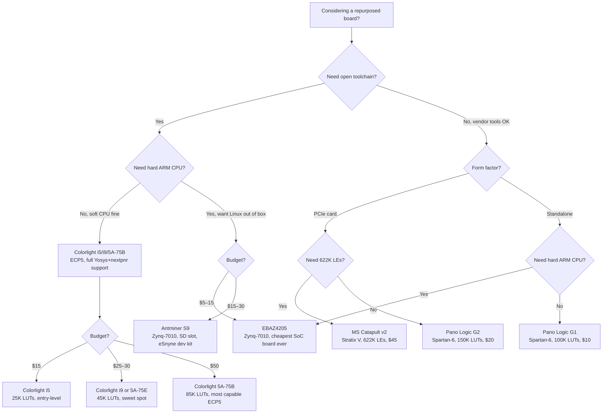

[← 12 Open Source Open Hardware Home](../README.md) · [← Open Boards Home](README.md) · [← Project Home](../../../README.md)

# Repurposed FPGA Boards — Commercial Hardware at Open-Source Prices

Commercial hardware repurposed for open FPGA development — getting 25K+ LUT FPGAs for under $20 by hacking LED display controllers, Bitcoin mining control boards, thin clients, and other non-development-board products. The Colorlight i5 is the most popular open FPGA dev board by volume, and it was never designed to be one. The EBAZ4205 mining controller offers a complete Zynq SoC (ARM + FPGA + DDR3 + Linux) for as little as $5.

---

## Overview

Repurposed boards work because industrial products often contain FPGAs that are fully accessible once you know the pin mapping. The FPGA doesn't care whether it's driving an LED panel or running a RISC-V core — the bitstream is the same. The community's contribution is reverse-engineering the pinout, documenting the board, and creating open-source toolchain support.

---

## The Repurposed Boards

| Board | Original Purpose | FPGA | LUTs | RAM | Cost | Open Toolchain |
|---|---|---|---|---|---|---|
| **Colorlight i5** | LED display controller | Lattice ECP5 LFE5U-25F | 25K | 32 MB SDRAM | ~$15 | ✅ Yosys + nextpnr + Trellis |
| **Colorlight i9** | LED display controller | Lattice ECP5 LFE5U-45F | 45K | 32 MB SDRAM | ~$30 | ✅ Yosys + nextpnr + Trellis |
| **Colorlight 5A-75B** | LED display controller | Lattice ECP5 LFE5U-85F | 85K | 32–64 MB SDRAM | ~$50 | ✅ Yosys + nextpnr + Trellis |
| **Colorlight 5A-75E** | LED display controller | Lattice ECP5 LFE5U-45F | 45K | 32 MB SDRAM | ~$25 | ✅ Yosys + nextpnr + Trellis |
| **EBAZ4205** | Bitcoin miner controller (Ebit E9+) | Xilinx Zynq-7010 | 28K LUTs + dual ARM A9 | 256 MB DDR3 | ~$5–15 | 🟡 Vivado (no open bitstream) |
| **Antminer S9** | Bitcoin miner controller (Bitmain) | Xilinx Zynq-7010 | 28K LUTs + dual ARM A9 | 256–512 MB DDR3 | ~$15–30 | 🟡 Vivado (no open bitstream) |
| **Elgato Cam Link 4K** | HDMI capture dongle | Lattice ECP5 LFE5U-45F | 45K | — | ~$50 (used) | ✅ Yosys + nextpnr + Trellis |
| **Pano Logic G2** | Zero client / thin client | Xilinx Spartan-6 XC6SLX150T | 150K | 128 MB DDR3 | ~$20 (eBay) | 🟡 (Xilinx ISE, no open flow) |
| **Pano Logic G1** | Zero client / thin client | Xilinx Spartan-6 XC6SLX100 | 100K | 64 MB DDR2 | ~$10 (eBay) | 🟡 (Xilinx ISE, no open flow) |
| **MS Catapult v2** | Azure SmartNIC (Pikes Peak) | Intel Stratix V 5SGXEA7 | 622K | DDR3 + QSFP+ | ~$45 (eBay) | 🟡 Quartus (no open flow) |

---

## Mining Board Deep Dive

Bitcoin mining farm decommissioning has flooded the secondhand market with Zynq-based control boards. These are arguably the best LUTs-per-dollar deal in FPGA history — a full Zynq SoC (ARM + FPGA + DDR3) for under $15.

### EBAZ4205 (Ebit E9+ Controller)

The cheapest Zynq development board in existence. Originally the control card for the Ebit E9+ Bitcoin miner, now sold on AliExpress and Taobao for $5–15.

| Feature | Detail |
|---|---|
| **SoC** | Xilinx Zynq-7010 (XC7Z010CLG400) — dual ARM Cortex-A9 @ 667 MHz + 28K FPGA LUTs |
| **DDR3** | 256 MB DDR3 |
| **NAND** | 128 MB SLC NAND flash |
| **Ethernet** | 10/100 Mbps (IP101GA) |
| **Boot** | NAND (default) or TF card (move R2584 → R2577) |
| **JTAG** | Header J8 (Xilinx pinout, needs soldering) |
| **UART** | Header J7 (needs soldering) |
| **TF Card** | Socket absent by default; must solder your own |
| **Power** | 5–12 V via DATA ports or J3/J5 (after soldering D24 Schottky) |
| **Linux** | Ships with built-in Linux + BTC miner; disable miner with `mv /etc/rcS.d/S95cgminer.sh /etc/rcS.d/K95cgminer.sh` |
| **Price** | ~$5–15 |

> **What makes the EBAZ4205 special**: It's a complete Zynq SoC with ARM CPU + FPGA + DDR3 + NAND + Ethernet + Linux for less than a fast-food meal. No other platform offers this combination at this price. The catch: no standard connectors (you solder headers), no on-board USB-UART, and 10/100 Ethernet only.

### Antminer S9 Control Board

Bitmain's Antminer S9 control board is mechanically similar to the EBAZ4205 but has some differences. The eSnyne project provides a complete development environment for it.

| Feature | Detail |
|---|---|
| **SoC** | Xilinx Zynq-7010 — dual ARM Cortex-A9 @ 667 MHz + 28K FPGA LUTs |
| **DDR3** | 256 MB (some variants: 512 MB) |
| **NAND** | 256 MB NAND flash |
| **Ethernet** | RJ-45 |
| **SD Card** | On-board SD card slot |
| **JTAG** | Port with Xilinx pinout |
| **UART** | Pin header |
| **LEDs/Buttons** | 4 programmable LEDs, 2 push buttons |
| **Boot modes** | JTAG / SD / QSPI / NAND / NOR (4 jumpers) |
| **Price** | ~$15–30 (eBay, AliExpress) |

> **eSnyne project** (github.com/MelodyCoin/eSnyne): A complete development kit for the Antminer S9 control board — includes board files, Vivado constraints, and example designs. Also works with T9+ and E3 boards.

> **Zynq advantage over Colorlight**: The EBAZ4205 and S9 have a hard ARM CPU that can run Linux out of the box — no soft CPU needed. This means you get a full Linux environment with networking and filesystem on day one, with the FPGA fabric available for acceleration. Colorlight boards require a soft CPU (VexRiscv) that consumes fabric LUTs.

---

## Elgato Cam Link 4K — The Hidden ECP5

The Elgato Cam Link 4K is an HDMI-to-USB capture dongle built around a Lattice ECP5. It was reverse-engineered by Kate Temkin and Mike Walters, revealing a fully accessible ECP5-45K with open-toolchain support.

| Feature | Detail |
|---|---|
| **FPGA** | Lattice ECP5 LFE5U-45F (45K LUTs) |
| **Original function** | HDMI capture → USB 3.0 output |
| **HDMI input** | Yes — directly routed to FPGA pins |
| **USB 3.0** | Via Cypress FX3 controller |
| **Open toolchain** | ✅ Yosys + nextpnr + Trellis |
| **Price** | ~$50 used / $80 new |

> **Why the Cam Link matters**: It's one of the few consumer products where an ECP5-45K is paired with an HDMI input — making it uniquely suited for video processing projects. However, the Cypress FX3 USB controller and HDMI PHY add complexity compared to a bare ECP5 dev board. Best for people who specifically need HDMI input capability.

---

## MS Catapult v2 (Pikes Peak) — The Datacenter FPGA for $45

Microsoft's Catapult v2 (codename: Pikes Peak) is a decommissioned Azure SmartNIC containing an Intel Stratix V GX — a $5,000 datacenter FPGA card available on eBay for $45–80. The community has reverse-engineered the board and documented the JTAG pinout.

| Feature | Detail |
|---|---|
| **FPGA** | Intel Stratix V 5SGXEA7N2F45C2 (622K LEs, 256 18×18 multipliers) |
| **Memory** | 4 GB DDR3 SODIMM + 2× QSFP+ (40 Gbps each) |
| **Host interface** | PCIe x8 Gen3 |
| **Toolchain** | Intel Quartus (free Web edition, no open bitstream) |
| **Price** | ~$45–80 (eBay) |

> **622K LEs for $45** is an absurd deal — that's a datacenter-grade FPGA for the price of a hobbyist board. However, the Stratix V requires Quartus (no open bitstream), the card needs a PCIe host machine, and the QSFP+ transceivers require expensive optical modules. Best for people who need massive FPGA fabric for compute-heavy workloads and already have a Quartus license.

---

## Colorlight Deep Dive

The Colorlight boards are the **most popular open FPGA dev boards by volume** — not marketed as dev boards, but the ECP5 variants are fully supported by the open toolchain. They are manufactured in large quantities for the LED display market, which keeps prices low and availability high.

### What You Get

| Feature | i5 | i9 | 5A-75B |
|---|---|---|---|
| **FPGA** | ECP5 25K | ECP5 45K | ECP5 85K |
| **SDRAM** | 32 MB (1 chip) | 32 MB (1 chip) | 32–64 MB (2 chips) |
| **Ethernet** | GbE (RTL8211) | GbE | GbE (2 ports) |
| **JTAG** | Standard Lattice header | Standard Lattice header | Standard Lattice header |
| **Power** | 5V barrel or terminal | 5V barrel | 5V barrel or terminal |
| **LED outputs** | 4× HUB75 headers | 4× HUB75 headers | 8× HUB75 headers |
| **Price** | ~$15 | ~$30 | ~$50 |

### What You Need to Add

1. **External JTAG programmer** — FT2232H module (~$10) connected to the JTAG header
2. **USB-UART** — Connect an FT232 or CP2102 to GPIO pins for serial console
3. **A 3D-printed case** — open designs available on Thingiverse
4. **Pin mapping reference** — community-documented pin assignments (see References)

### What You Can Build

| Project | Board | Feasibility |
|---|---|---|
| **RISC-V SoC (VexRiscv + LiteX)** | i5/i9/5A-75B | ✅ Well-documented |
| **Ethernet packet processing** | i5/i9/5A-75B | ✅ GbE is already routed |
| **SDRAM-based frame buffer** | i5/i9/5A-75B | ✅ LiteDRAM supports it |
| **MiSTer-like retro core** | 5A-75B (85K) | ✅ Some cores fit |
| **HDMI output** | i5/i9/5A-75B | 🟡 Possible via PMOD or direct TMDS |
| **USB device** | i5/i9/5A-75B | 🟡 Add USB PHY via GPIO |

### Limitations

- **No PMOD/Arduino headers** — everything is through the original pin headers or HUB75 connectors
- **No USB UART built-in** — add via GPIO pins
- **SDRAM only (no DDR)** — sufficient for most open projects, limiting for very high bandwidth
- **No on-board flash** — the original firmware uses the MCU's flash; you need to add SPI flash or use the JTAG programmer for bitstream loading
- **HUB75 headers are 2.54 mm pitch** — breadboard-compatible but require female-to-female jumpers

---

## Pano Logic G2 — The Xilinx Alternative

Pano Logic thin clients contain large Spartan-6 FPGAs with DDR3 memory. They're available on eBay for $10–20 because they're obsolete as thin clients.

| Pano Logic Feature | Detail |
|---|---|
| **FPGA** | Xilinx Spartan-6 XC6SLX150T (150K LUTs) |
| **Memory** | 128 MB DDR3 |
| **DisplayPort** | 2× DisplayPort output |
| **USB** | 4× USB 2.0 |
| **Ethernet** | GbE |
| **Toolchain** | Xilinx ISE 14.7 (free, but Windows-only and deprecated) |

> **Open toolchain status**: There is no open-source bitstream tool for Spartan-6. You must use Xilinx ISE, which is deprecated and runs only on Windows (or Linux with Wine). This significantly limits the Pano Logic's appeal for open-source developers.

---

## Notable Projects & Derived Works

### Colorlight Boards

| Project | Board | Category | Description | Source |
|---|---|---|---|---|
| **RISC-V SoC (VexRiscv + LiteX)** | i5/i9/5A-75B | RISC-V | Full LiteX SoC with VexRiscv, Ethernet, SDRAM | litex-hub/litex-boards |
| **SERV RISC-V SoC** | 5A-75B | RISC-V | Minimal SERV core + SoC | olofk/serv |
| **RISC-V on 5A-75B** | 5A-75B | RISC-V | Independent RISC-V SoC implementation | ghent360/riscvOnColorlight-5A-75B |
| **LiteEth Ethernet tap** | i5/i9 | Networking | Ethernet packet processing using onboard GbE PHY | litex-hub/liteeth |
| **LED Cube** | 5A-75B | Display | 3D LED cube driving HUB75 panels | lucysrausch/colorlight-led-cube |
| **Linux on VexRiscv** | 5A-75B | OS | Full Linux on soft CPU with SDRAM frame buffer | litex-hub/linux-on-litex-vexriscv |
| **HDMI output** | i5/i9 | Video | TMDS output via PMOD or direct pin routing | Community |
| **PMOD adapter PCB** | 5A-75B | Hardware | 7-PMOD adapter board for 5A-75B | Community PCB designs |
| **WireGuard VPN** | i5 | Networking | Hardware WireGuard VPN on ECP5 with GbE | chili-chips-ba/wireguard-fpga |

### Mining Boards (EBAZ4205 / Antminer S9)

| Project | Board | Category | Description | Source |
|---|---|---|---|---|
| **PYNQ OS** | EBAZ4205 | OS | PYNQ Linux with Jupyter notebook interface | Muhammad-Yunus/EBAZ4205_PROJECT |
| **Built-in Linux** | EBAZ4205 | OS | Ships with ARM Linux + NAND; disable BTC miner and use directly | xjtuecho/EBAZ4205 |
| **Vivado + SDK designs** | EBAZ4205 | Development | Blink, UART, GPIO, custom IP examples | Muhammad-Yunus/EBAZ4205_PROJECT |
| **eSnyne dev kit** | Antminer S9 | Development | Complete Vivado board files, constraints, example designs | MelodyCoin/eSnyne |
| **Frequency meter** | EBAZ4205 | Instrumentation | Sub-10 ps time resolution frequency counter | EEVblog community |
| **Custom expansion board** | Antminer S9 | Hardware | Zynq-7000 HAT with additional I/O | Community (LinkedIn) |
| **SERV RISC-V** | EBAZ4205 | RISC-V | SERV soft CPU running on the FPGA fabric | olofk/serv |

### Other Repurposed Boards

| Project | Board | Category | Description | Source |
|---|---|---|---|---|
| **Cam Link firmware hack** | Elgato Cam Link 4K | Video | Reprogram ECP5 for custom HDMI processing | ktemkin/camlink-re |
| **Stratix V PCIe dev** | MS Catapult v2 | High-speed | Datacenter FPGA as PCIe accelerator | wirebond/catapult_v2_pikes_peak |
| **Gzip accelerator** | Comtech AHA363 | Compression | PCIe gzip compression board reverse engineering | Community |

---

## Community Ecosystem

| Resource | Description |
|---|---|
| **[Colorlight-FPGA-projects](https://github.com/wuxx/Colorlight-FPGA-projects)** | Pin mapping, examples, LiteX targets |
| **[Chubby75 (5A-75B/E)](https://github.com/q3k/chubby75)** | Comprehensive reverse engineering of Colorlight 5A-75B/E |
| **[colorlight-i9](https://github.com/hdl-util/colorlight-i9)** | i9-specific pinout and projects |
| **[litex-boards](https://github.com/litex-hub/litex-boards)** | LiteX targets for all Colorlight boards |
| **[EBAZ4205](https://github.com/xjtuecho/EBAZ4205)** | Wiki, FAQ, tutorials, KiCad design files |
| **[EBAZ4205 Projects](https://github.com/Muhammad-Yunus/EBAZ4205_PROJECT)** | PYNQ, Vivado, SDK examples |
| **[eSnyne (Antminer S9)](https://github.com/MelodyCoin/eSnyne)** | Complete dev kit for S9 control board |
| **[Pano Logic G2](https://github.com/tomverbeure/panologic-g2)** | Reverse engineering, pin mapping, examples |
| **[Cam Link RE](https://github.com/ktemkin/camlink-re)** | Elgato Cam Link 4K reverse engineering |
| **[Catapult v2](https://github.com/wirebond/catapult_v2_pikes_peak)** | MS Catapult board documentation |
| **[awesome-fpga-boards](https://github.com/iDoka/awesome-fpga-boards)** | Curated list of all repurposable FPGA boards |

---

## Decision Guide

---

## When to Use / When NOT to Use

### When to Use Repurposed Boards

- **Maximum LUTs per dollar** — 25K LUTs for $15 (Colorlight i5) is unbeatable
- **Ethernet-focused projects** — the GbE PHY is already routed and tested
- **Learning FPGA on a tight budget** — cheaper than any dev board
- **Multi-board projects** — buy 5 Colorlight i5s for $75

### When NOT to Use Repurposed Boards

- **You need PMOD/Arduino headers** — repurposed boards have no standard I/O connectors
- **You need on-board USB** — add your own USB-UART bridge
- **You need on-board flash** — the FPGA loads from JTAG by default
- **You want a polished experience** — hobbyist boards (ULX3S, iCEBreaker) have better documentation and support

---

## Best Practices

1. **Buy the FT2232H JTAG programmer first** — it's required for all Colorlight boards; some sellers bundle it
2. **Use the litex-boards targets** — `python -m litex_boards.targets.colorlight_i5` generates a complete SoC
3. **Document your pin usage** — the Colorlight pin mapping is community-maintained and varies between board revisions
4. **Check the board revision** — different revisions have different pin mappings; confirm your revision before wiring

---

## Antipatterns

- **The Pano Logic for Open-Source** — buying a Pano Logic G2 expecting to use Yosys/nextpnr; Spartan-6 has no open bitstream support
- **The Colorlight Without a JTAG Programmer** — ordering a Colorlight i5 without an FT2232H module; you cannot program the FPGA without it
- **The HUB75 as GPIO** — trying to use the HUB75 LED headers as general-purpose I/O; they have specific electrical characteristics (series resistors, level shifters) that make them unsuitable for high-speed signals
- **The EBAZ4205 as a Pure FPGA Board** — expecting a polished dev board experience; it requires soldering headers, adding a TF card socket, and fighting the pre-installed BTC miner firmware
- **The Catapult v2 Without a PCIe Host** — buying a Stratix V card expecting standalone operation; it requires a desktop PC with a free PCIe x8 slot and external power
- **The Cam Link 4K as a General ECP5 Board** — buying one just for the ECP5; the FX3 USB controller and HDMI PHY add complexity that a bare Colorlight doesn't have

---

## Pitfalls

1. **Board revision differences** — Colorlight has made multiple revisions with different pin assignments; always check the silkscreen and verify against the community pin map
2. **SDRAM timing** — the SDRAM chips on Colorlight boards may not meet the timing assumed by default LiteDRAM configurations; adjust the PHY settings
3. **No on-board flash** — without SPI flash, the FPGA loses its bitstream on power-off; you must re-program via JTAG each time or add a flash chip
4. **Pano Logic ISE compatibility** — ISE 14.7 runs on Windows 7/10 but not Windows 11; Linux users need Wine or a VM
5. **Ethernet PHY initialization** — the RTL8211 PHY on Colorlight boards needs specific MDIO register writes for proper operation; check the LiteEth examples
6. **EBAZ4205 missing connectors** — the TF card socket, UART header, and JTAG header are unpopulated by default; you must solder them yourself
7. **EBAZ4205 boot mode** — the board boots from NAND by default (with BTC miner); to boot from SD, physically move resistor R2584 to R2577
8. **EBAZ4205/S9 Vivado dependency** — the Zynq-7010 requires Vivado (free WebPack, ~30 GB download); there is no open bitstream for 7-series FPGAs
9. **Catapult v2 QSFP+ cost** — the 40 Gbps QSFP+ ports need expensive optical transceivers ($50–100 each) or DAC cables; budget for this
10. **Cam Link USB re-enumeration** — reprogramming the ECP5 on the Cam Link will break the USB device; the host OS will see the device disconnect and reconnect

---

## Use Cases

- **Budget RISC-V development** — VexRiscv + LiteX on Colorlight i5 ($15 + $10 JTAG = $25 total)
- **Budget Zynq Linux** — EBAZ4205 ships with Linux; disable the miner and start developing on ARM + FPGA for $5
- **Ethernet tap/bridge** — GbE processing on $15 Colorlight hardware
- **HDMI video processing** — Elgato Cam Link 4K has ECP5-45K with HDMI input already routed
- **Retro computing** — MiSTer-like cores on 5A-75B (85K LUTs); Linux on VexRiscv
- **SDR** — Software-defined radio with GbE backhaul on Colorlight; Stratix V on Catapult v2 for heavy DSP
- **Multi-node FPGA clusters** — 5× Colorlight i5s for $75, connected via Ethernet
- **Hardware VPN** — WireGuard on ECP5 with GbE (Colorlight i5)
- **PYNQ / Jupyter development** — EBAZ4205 + PYNQ OS for Python-driven FPGA acceleration
- **Datacenter prototyping** — 622K LEs Stratix V for $45 via MS Catapult v2
- **Frequency measurement** — sub-10 ps resolution frequency counter on EBAZ4205
- **Anti-e-waste upcycling** — repurposing decommissioned mining and display hardware instead of landfill

---

## References

- [Colorlight FPGA Projects (GitHub)](https://github.com/wuxx/Colorlight-FPGA-projects) — pin maps, examples
- [Chubby75 — Colorlight 5A-75B/E RE](https://github.com/q3k/chubby75) — comprehensive reverse engineering
- [EBAZ4205 Wiki (GitHub)](https://github.com/xjtuecho/EBAZ4205) — tutorials, schematics, KiCad files
- [EBAZ4205 Projects (GitHub)](https://github.com/Muhammad-Yunus/EBAZ4205_PROJECT) — PYNQ, Vivado, SDK examples
- [eSnyne — Antminer S9 Dev Kit](https://github.com/MelodyCoin/eSnyne) — board files, constraints, examples
- [Pano Logic G2 Reverse Engineering](https://github.com/tomverbeure/panologic-g2)
- [Elgato Cam Link RE](https://github.com/ktemkin/camlink-re) — ECP5 reverse engineering
- [MS Catapult v2 (GitHub)](https://github.com/wirebond/catapult_v2_pikes_peak) — board documentation
- [awesome-fpga-boards (GitHub)](https://github.com/iDoka/awesome-fpga-boards) — curated list of repurposable FPGA boards
- [LiteX Boards — Colorlight targets](https://github.com/litex-hub/litex-boards)
- [Project Trellis](https://github.com/YosysHQ/prjtrellis) — ECP5 bitstream tools
- [Hobbyist Boards](hobbyist_boards.md) — purpose-built dev boards
- [High-End Boards](high_end_boards.md) — Alveo, ZCU, KRIA
