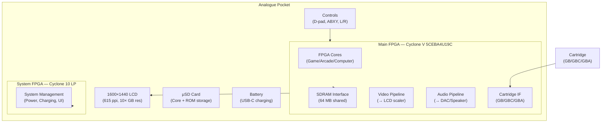
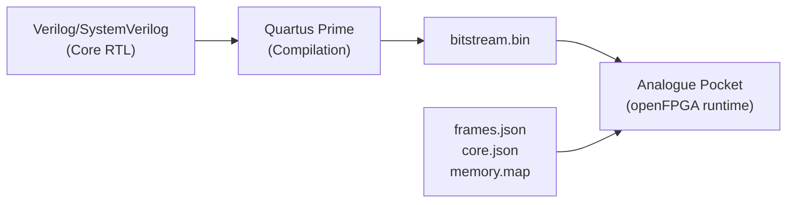

[← 12 Open Source Open Hardware Home](../README.md) · [← Retro Computing Home](README.md) · [← Project Home](../../../README.md)

# Analogue Pocket + openFPGA — Commercial Handheld, Open Core Development

The Analogue Pocket is a commercial handheld gaming device built on an Intel Cyclone V FPGA. Its **openFPGA** platform lets third-party developers create and distribute FPGA cores — a unique bridge between proprietary consumer hardware and the open FPGA community. The hardware is closed, but the core development API is open.

---

## Overview

The Analogue Pocket exists because of a specific design choice: rather than using software emulation like the Retroid Pocket or Miyoo Mini, Analogue uses an FPGA to recreate the original console hardware at the gate level. The result is cycle-accurate gameplay with zero input lag on original cartridge media — something no software emulator can guarantee.

The openFPGA platform turns the Pocket from a closed consumer device into a development target. Third-party developers (not Analogue employees) have ported dozens of MiSTer cores, created original arcade implementations, and built entirely new FPGA applications for the platform.

---

## Hardware

### Main Board Architecture



| Component | Spec | Notes |
|---|---|---|
| **Main FPGA** | Intel Cyclone V 5CEBA4U19C (49K LE) | Same family as DE10-Nano, but ~45% the LEs |
| **System FPGA** | Intel Cyclone 10 LP (16K LE) | Handles power management, system UI, battery charging |
| **Display** | 1600×1440 LCD, 615 ppi | Exactly 10× Game Boy resolution (160×144 → 1600×1440) |
| **RAM** | 64 MB SDRAM (shared) | Split between frame buffer and core memory |
| **Cartridge Slot** | Physical cartridge adapter | GB, GBC, GBA cartridges — reads real ROMs |
| **Controls** | D-pad, ABXY, L/R, Start/Select | No analog sticks |
| **Audio** | Built-in speaker + 3.5 mm headphone | I²S DAC |
| **Storage** | μSD card | Core bitstreams + ROM images |
| **Connectivity** | USB-C (charging only, no data) | Dock adds HDMI output |
| **Battery** | ~4–6 hours gameplay | USB-C charging |

---

## openFPGA Platform

### What openFPGA Provides

Analogue's openFPGA is an API, not open-source hardware. The Pocket's PCB design, FPGA pinout, and system firmware are all closed. What openFPGA gives developers:

| Resource | Access Level | Notes |
|---|---|---|
| **SDRAM** | Full access | 64 MB, shared with system frame buffer |
| **Display** | Via scaler API | Core outputs video; Pocket's scaler handles LCD timing |
| **Controls** | Full access | D-pad, ABXY, L/R mapped as digital inputs |
| **Cartridge slot** | Full access | Read cartridge ROM/RAM directly |
| **SD card** | Read-only | Load ROM images and core data |
| **Audio** | I²S output | Stereo, configurable sample rate |
| **Video scaler** | Via configuration | Aspect ratio, scanline filters, integer scaling |

### Core Format and Distribution

An openFPGA core consists of:

```
pocket/
├── Cores/
│   └── <author>.<core_name>/
│       ├── core.json          # Core metadata (name, author, platform, version)
│       ├── frames.json        # Video timing and scaler configuration
│       ├── memory.map         # Cartridge mapping (for cartridge-based cores)
│       ├── data/              # ROM data, BIOS files
│       └── bitstream.bin      # FPGA bitstream
├── Assets/
│   └── <author>.<core_name>/
│       └── common/            # Box art, save states
├── Saves/
│   └── <author>.<core_name>/  # SRAM/battery saves
└── Settings/
    └── <author>.<core_name>/  # Core-specific settings
```

### Development Flow



1. **Write RTL** in Verilog or SystemVerilog (standard FPGA design)
2. **Compile** with Quartus Prime (Cyclone V target)
3. **Package** with JSON metadata (core.json, frames.json)
4. **Distribute** via community repositories (no Analogue approval needed)
5. **Install** by copying to μSD card

---

## Available Cores (Community)

### Console Cores

| Console | Core Author | Status | Cartridge Support |
|---|---|---|---|
| **Game Boy** | Spiritualized | ✅ Excellent | ✅ Physical cartridges |
| **Game Boy Color** | Spiritualized | ✅ Excellent | ✅ Physical cartridges |
| **Game Boy Advance** | Spiritualized | ✅ Excellent | ✅ Physical cartridges |
| **NES** | spiritualized1999 | ✅ Good | ROM only |
| **SNES** | Various | ✅ Good | ROM only |
| **Genesis/Mega Drive** | Various | ✅ Good | ROM only |
| **PC Engine/TG16** | Various | ✅ Good | ROM only |
| **Neo Geo** | Various | ✅ Working | ROM only |
| **Atari 2600/7800** | Various | ✅ Working | ROM only |
| **Game Gear** | Various | ✅ Working | ROM only |
| **Atari Lynx** | Various | ✅ Working | ROM only |

### Arcade Cores

Many arcade cores are ports of MiSTer arcade implementations, adapted for the Pocket's smaller FPGA (49K LE vs DE10-Nano's 110K LE). This limits which arcade systems can be ported — large Neo Geo games and late-90s arcade hardware are generally too big.

### Computer Cores

| Computer | Status | Notes |
|---|---|---|
| **Amiga 500** | ✅ Working | Minimig-derived, limited by SDRAM |
| **Commodore 64** | ✅ Working | Complete with SID audio |
| **ZX Spectrum** | ✅ Working | Popular in EU community |
| **MSX** | ✅ Working | Good compatibility |
| **Amstrad CPC** | ✅ Working | Basic implementation |

---

## Relationship with MiSTer

| Aspect | MiSTer | Analogue Pocket |
|---|---|---|
| **FPGA** | Cyclone V (110K LE on DE10-Nano) | Cyclone V (49K LE) |
| **Openness** | Fully open (hardware + software + cores) | Partially open (openFPGA API, closed hardware) |
| **Portability** | No (needs monitor + DE10-Nano + USB hub) | Yes (handheld, self-contained) |
| **Core availability** | 200+ cores | 50+ cores (subset of MiSTer, ported) |
| **Core porting** | Original development | Most cores are MiSTer ports |
| **Video output** | HDMI (720p/1080p) | Built-in LCD (1600×1440) |
| **Input** | USB keyboard/mouse/joystick | Built-in controls |
| **Cost** | ~$250+ (fully set up) | $220 (complete) |
| **SDRAM** | 32 MB add-on board | 64 MB built-in (shared) |
| **Audio** | HDMI + 3.5 mm line out | Built-in speaker + headphone |
| **Cartridge** | No | ✅ GB/GBC/GBA slot |

### Porting MiSTer Cores to Pocket

The main constraint when porting MiSTer cores to the Pocket is the **49K LE limit** (vs 110K LE on DE10-Nano). This means:

- Cores that use >49K LEs cannot be ported without significant optimization
- SDRAM is shared with the frame buffer on Pocket, reducing available memory for core data
- The Pocket's video scaler API differs from MiSTer's ascal — video timing parameters must be recalculated
- The HPS (ARM Linux) on MiSTer doesn't exist on Pocket — all file I/O and UI must go through the system FPGA

---

## Dock and HDMI Output

The Analogue Dock adds:

| Feature | Detail |
|---|---|
| **HDMI output** | 1080p, 720p, 480p selectable |
| **USB-C power** | Pass-through charging |
| **Controller support** | 2× Bluetooth controller support via Dock |
| **Audio** | HDMI audio + 3.5 mm output |

The Dock does not add any FPGA resources — it's an I/O expander that routes the main FPGA's HDMI signal through a separate output.

---

## When to Use / When NOT to Use

### When to Use the Pocket

- **Portable retro gaming** — the best handheld FPGA experience available
- **Playing original GB/GBC/GBA cartridges** — the cartridge slot makes it unique
- **Developing FPGA cores for a commercial platform** — openFPGA provides a real user base
- **Testing MiSTer core ports on a constrained FPGA** — 49K LE target forces optimization

### When NOT to Use the Pocket

- **Open hardware development** — the Pocket's hardware design is closed; you cannot modify it
- **MiSTer-level core compatibility** — many MiSTer cores are too large for the Pocket's 49K LE FPGA
- **Arcade cabinet integration** — no direct video output without the Dock; MiSTer is better for fixed installations
- **FPGA learning** — the closed toolchain and Quartus requirement make it harder than open boards like ULX3S

---

## Best Practices

1. **Start with the MiSTer fork template** — most Pocket cores begin as MiSTer core adaptations; understand the MiSTer framework first
2. **Optimize LE usage early** — 49K LEs run out fast; use Quartus's resource usage reports to identify optimizations
3. **Use the Pocket's scaler for video** — don't try to generate LCD timing directly; output standard video timing and let the system scaler handle it
4. **Test with real cartridges** — the Pocket's cartridge slot is a key differentiator; verify that cartridge reads work correctly
5. **Follow the openFPGA JSON schema exactly** — the Pocket's runtime is strict about metadata format; even minor JSON errors prevent core loading

---

## Antipatterns

- **The Giant Core** — trying to port a MiSTer core that uses 90K LEs without optimization; it simply won't fit
- **Ignoring the Shared SDRAM** — the 64 MB SDRAM is shared with the frame buffer; writing core data to the same bank as the display buffer causes visual corruption
- **Direct LCD Timing** — trying to generate the 1600×1440 LCD timing in the core instead of using the scaler API; the system FPGA manages the LCD

---

## Pitfalls

1. **Quartus Prime required** — the Pocket uses Intel Cyclone V; there is no open-toolchain path (Yosys/nextpnr don't support Cyclone V bitstream generation)
2. **SDRAM bandwidth contention** — the frame buffer and core memory share the same 64 MB SDRAM; high-bandwidth cores (e.g., Neo Geo) can starve the display pipeline
3. **No USB data** — the USB-C port is for charging only; there is no way to transfer data via USB (use μSD card)
4. **No analog video output** — without the Dock, the Pocket only has its internal LCD; there is no VGA or composite output
5. **openFPGA API versioning** — Analogue updates the Pocket firmware periodically; cores may need updates to maintain compatibility
6. **Core distribution is manual** — there is no official app store; cores are distributed via community repositories and installed by copying to μSD

---

## Use Cases

- **Portable cycle-accurate retro gaming** — the only handheld that plays original GB/GBC/GBA cartridges at the gate level
- **FPGA core development for a consumer device** — the only commercial FPGA platform with an open core API
- **MiSTer core testing on a constrained target** — forcing optimization by targeting 49K LEs
- **Arcade gaming on the go** — 50+ arcade cores from the community
- **Retro computer emulation** — Amiga, C64, ZX Spectrum in your pocket

---

## References

- [Analogue Pocket (Official)](https://www.analogue.co/pocket)
- [openFPGA Developer Documentation](https://www.analogue.co/developer)
- [MiSTer FPGA](mister.md) — the primary source for most Pocket cores
- [MiST — The Original Platform](mist.md) — predecessor to both MiSTer and Pocket cores
- [Other Retro FPGA Platforms](other_retro_platforms.md) — SiDi, ZX-Uno, MARS
- [Analogue Pocket Community](https://github.com/OpenFPGA-Projects)
