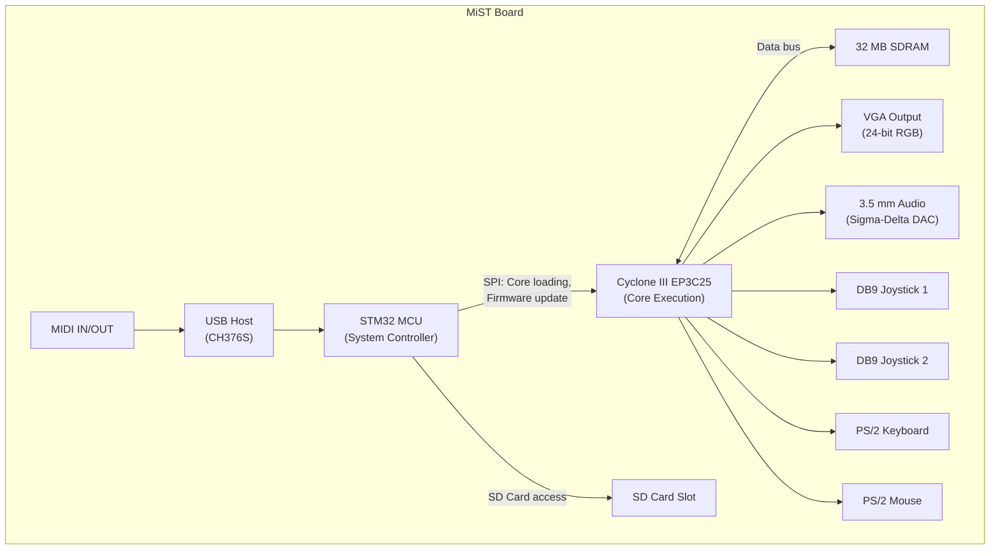

[← 12 Open Source Open Hardware Home](../README.md) · [← Retro Computing Home](README.md) · [← Project Home](../../../README.md)

# MiST — The Original Open Retro FPGA Platform

MiST (AMIGA + ST = MiST) is the original open-source FPGA retro-hardware platform — launched in 2013 by Till Harbaum, it pioneered the concept of cycle-accurate hardware recreation on affordable FPGA boards. Every retro FPGA platform that followed (MiSTer, SiDi, Analogue Pocket) owes its architectural DNA to MiST's MCU-host + FPGA-fabric design.

---

## Overview

MiST was born from a simple observation: the Amiga and Atari ST — the two most iconic 16-bit home computers — shared enough architectural similarities (68000 CPU, custom chipset, 15 kHz video) that a single FPGA platform could recreate both. The name encodes this: **M**ega **S**T + m**I**ni **T** = MiST (or more playfully, **AMIGA** + **ST** = MiST).

What made MiST revolutionary in 2013 was not the FPGA — Cyclone III boards had been available for years. It was the **system architecture**: an ARM MCU managing file I/O, firmware updates, and user interface, while the FPGA ran cycle-accurate hardware recreations. This split became the template for every retro FPGA platform since.

---

## Hardware

### Board Specifications

| Component | Spec | Notes |
|---|---|---|
| **FPGA** | Intel Cyclone III EP3C25 (25K LE) | 10-generation-old, but sufficient for 8/16-bit systems |
| **RAM** | 32 MB SDRAM | Single SDRAM chip, 16-bit data bus |
| **Storage** | SD card slot (SPI mode) | FAT filesystem, managed by MCU |
| **Video** | VGA output (24-bit RGB) | Direct from FPGA, 15 kHz and 31 kHz capable |
| **Audio** | 3.5 mm stereo jack | Sigma-delta DAC in FPGA |
| **Input** | 2× DB9 joystick ports | Atari-style pinout |
| **Input** | PS/2 keyboard/mouse | Directly connected to FPGA |
| **USB** | USB host (CH376S chip) | For MIDI, serial, HID devices |
| **MIDI** | MIDI IN/OUT | Via USB-MIDI adapter |
| **MCU** | ARM STM32 (system controller) | Manages SD card, OSD, firmware update |

### Block Diagram



---

## Architecture: The MCU + FPGA Split

The STM32 ARM MCU is the **system controller**, not a co-processor. It handles:

| MCU Responsibility | Detail |
|---|---|
| **SD card filesystem** | FAT16/32, loads ROM images and core bitstreams |
| **Firmware update** | Reads new MCU firmware + FPGA bitstream from SD, flashes both |
| **OSD menu** | On-screen display overlay for core selection and settings |
| **Input routing** | USB HID → FPGA core (via SPI to FPGA) |
| **Core loading** | Writes FPGA bitstream via JTAG from SD card |

The FPGA handles:

| FPGA Responsibility | Detail |
|---|---|
| **Core execution** | Cycle-accurate hardware recreation (Amiga, ST, C64, etc.) |
| **Video generation** | VGA output with proper timing for CRT monitors |
| **Audio generation** | Direct audio synthesis (Paula, SID, AY-3-8910, etc.) |
| **Input handling** | DB9 joystick, PS/2 keyboard/mouse |
| **Memory interface** | SDRAM controller for ROM/RAM data |

This architecture (MCU host + FPGA fabric) became the template for later platforms:

```
MiST (2013) — Cyclone III, STM32 MCU
  ├─► MiSTer (2017) — Cyclone V, ARM HPS replaces MCU
  │   └─► HPS adds Linux, USB stack, HDMI, Ethernet
  ├─► SiDi / SiDi128 — Cyclone IV/V, same MCU architecture
  └─► MiSTeX — Software bridge running MiSTer cores on MiST/SiDi hardware
```

---

## Core Library

MiST hosts 50+ cores covering the major 8-bit and 16-bit platforms:

### Computer Cores

| Computer | Core | Status | Notes |
|---|---|---|---|
| **Amiga 500** | Minimig port | ✅ Excellent | The platform's namesake |
| **Atari ST** | Mist core | ✅ Excellent | The other half of the name |
| **Commodore 64** | C64 core | ✅ Excellent | SID audio, 1541 floppy |
| **ZX Spectrum** | ZX Spectrum core | ✅ Good | 48K/128K/Pentagon |
| **Amstrad CPC** | CPC core | ✅ Good | 464/664/6128 |
| **MSX** | MSX core | ✅ Good | MSX1/MSX2 |
| **Atari 8-bit** | Atari 800 core | ✅ Good | 400/800/XL/XE |
| **Apple II** | Apple II core | ✅ Working | 64K / 128K |
| **BBC Micro** | BBC core | ✅ Working | Model B |
| **TRS-80** | TRS-80 core | ✅ Working | Model I/III |

### Console Cores

| Console | Core | Status | Notes |
|---|---|---|---|
| **NES** | NES core | ✅ Good | Mapper support varies |
| **SNES** | SNES core | ✅ Good | Limited by 25K LEs |
| **Genesis/Megadrive** | Megadrive core | ✅ Good | Best on MiST (vs MiSTer) |
| **PC Engine** | PCE core | ✅ Good | CD support limited |
| **Atari 2600** | A2600 core | ✅ Good | |
| **ColecoVision** | Coleco core | ✅ Working | |
| **Game Boy** | GB core | ✅ Working | DMG only |

### Arcade Cores

Limited arcade support — the 25K LE FPGA constrains which arcade systems can be implemented. Simpler early-80s arcade games (Pac-Man, Galaga, Donkey Kong) work; late-80s and beyond are generally too large.

---

## Legacy and Current Status

| Aspect | Assessment |
|---|---|
| **Still relevant?** | Yes — many cores run on MiST first, then get ported to MiSTer |
| **Hardware availability** | Clones available (SiDi, QMTech Cyclone III boards) |
| **Core count** | 50+ cores (Amiga, ST, C64, consoles, arcade) |
| **FPGA limitation** | Cyclone III is 10-generation old — no modern I/O standards |
| **Community size** | Small but dedicated — German retro computing community |
| **Active development** | Yes — new cores and updates still appear |
| **MiSTeX compatibility** | MiSTeX allows running MiSTer cores on MiST hardware |

### The MiST → MiSTer Transition Path

The MiST and MiSTer communities overlap significantly:

1. **Core developers** often target MiST first (simpler hardware, faster compile times) and then port to MiSTer
2. **MiSTeX** provides a software bridge for running MiSTer cores on MiST hardware
3. **Architecture knowledge** transfers directly — MiST's MCU+FPGA split is conceptually identical to MiSTer's HPS+FPGA split

---

## Comparison: MiST vs MiSTer

| Feature | MiST | MiSTer |
|---|---|---|
| **FPGA** | Cyclone III (25K LE) | Cyclone V (110K LE) |
| **System control** | STM32 MCU | ARM Cortex-A9 HPS (Linux) |
| **SDRAM** | 32 MB | 32 MB add-on + 1 GB DDR3 (HPS) |
| **Video output** | VGA only | HDMI (via HPS) + VGA |
| **USB input** | Limited (CH376S) | Full Linux USB stack |
| **Network** | None | Ethernet (via HPS) |
| **Storage** | SD card (MCU-managed) | SD card + USB + network |
| **Price** | ~$80 (SiDi clone) | ~$250+ |
| **Core library** | 50+ cores | 200+ cores |
| **Community** | Small, European | Large, global |
| **Active development** | Moderate | Very active |

---

## When to Use / When NOT to Use

### When to Use MiST

- **You already have MiST hardware** — the core library is solid for 8/16-bit systems
- **VGA CRT gaming** — MiST outputs native 15 kHz VGA, perfect for CRT monitors
- **Amiga/Atari ST authenticity** — the platform was designed for these systems
- **Budget retro FPGA** — SiDi (MiST-compatible) at $80 is the cheapest entry point

### When NOT to Use MiST

- **You need HDMI output** — MiST is VGA-only; MiSTer has HDMI
- **You want the largest core library** — MiSTer has 4× more cores
- **You need USB peripherals** — MiST's USB support is limited; MiSTer has full Linux USB
- **New to retro FPGA** — MiSTer has better documentation and community support

---

## Best Practices

1. **Use a CRT monitor with MiST** — the VGA output at 15 kHz is designed for CRTs; LCDs may not accept the sync rates
2. **Install MiSTeX for MiSTer core compatibility** — it significantly expands the available core library
3. **Use the SiDi as a MiST replacement** — it's cheaper, still in production, and runs the same firmware
4. **Check core availability before investing** — the 25K LE limit means many MiSTer cores cannot run on MiST

---

## Antipatterns

- **The HDMI Expectation** — buying a MiST expecting HDMI output; it's VGA-only
- **The Large Core** — trying to port a MiSTer core that requires 80K LEs to MiST's 25K LE FPGA
- **The Abandoned Platform Mindset** — treating MiST as dead; it still receives core updates and has active developers

---

## Pitfalls

1. **Cyclone III toolchain** — requires Intel Quartus (not open-source); the Cyclone III is not supported by Yosys/nextpnr
2. **15 kHz VGA** — most modern LCD monitors don't accept 15 kHz sync; you need a CRT or an OSSC
3. **SD card compatibility** — some SD cards don't work well with the STM32's SPI-mode access; use known-good brands
4. **STM32 firmware update** — updating the MCU firmware requires a specific procedure; a failed update can brick the board (recoverable with SWD debugger)
5. **DB9 joystick compatibility** — the DB9 ports use Atari-style pinout; Sega Mega Drive controllers work, but Nintendo/Sony controllers do not

---

## Use Cases

- **Amiga 500 recreation** — the platform's original purpose, and still one of the best
- **Atari ST recreation** — the other half of MiST's identity
- **CRT gaming** — native 15 kHz VGA output for authentic retro experience
- **Budget retro FPGA** — SiDi at $80 is the cheapest way to get into FPGA retro gaming
- **Core development prototyping** — smaller FPGA means faster compile times for initial development

---

## References

- [MiST Wiki](https://github.com/mist-devel/mist-board/wiki)
- [MiST GitHub (mist-devel)](https://github.com/mist-devel)
- [MiSTeX (GitHub)](https://github.com/MiSTeX-devel)
- [SiDi Board](https://github.com/Sorgelig/SiDi128)
- [MiSTer Platform](mister.md) — MiST's successor
- [Other Retro Platforms](other_retro_platforms.md) — SiDi, ZX-Uno, MARS
- [Analogue Pocket](analogue_openfpga.md) — commercial alternative
