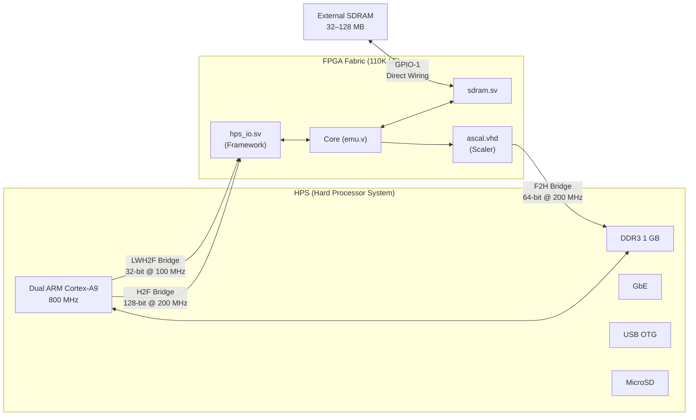
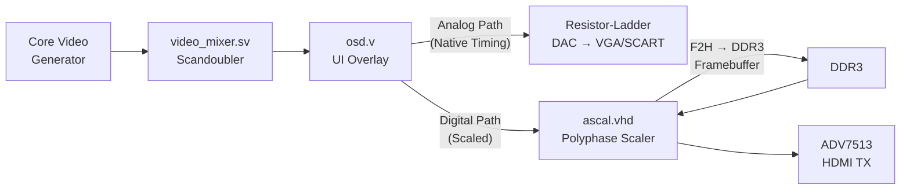
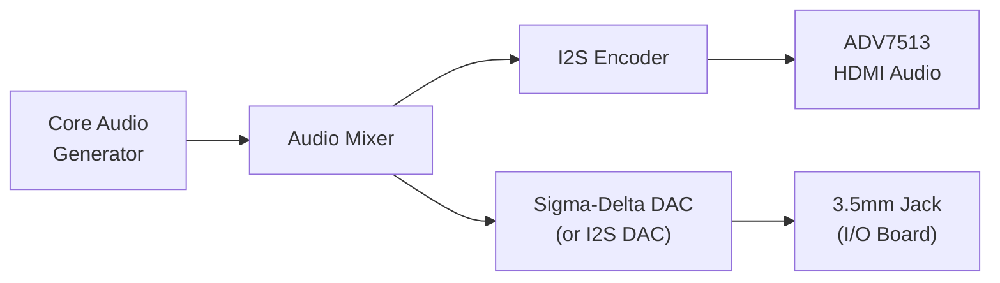
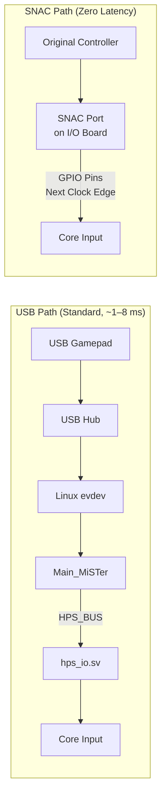

[← 12 Open Source Open Hardware Home](../README.md) · [← Retro Computing Home](README.md) · [← Project Home](../../../README.md)

# MiSTer FPGA — The Open-Source Hardware Recreation Platform

MiSTer is the dominant open-source FPGA retro-gaming and hardware-preservation platform. It turns an affordable off-the-shelf Cyclone V SoC development board (the Terasic DE10-Nano) into a universal cycle-accurate hardware recreation system — not a software emulator, but a functioning replica of the original circuits running in programmable silicon.

> **Companion Knowledge Base**: For the full MiSTer documentation suite (HPS Linux, Buildroot, SDRAM timing theory, ascal scaler deep dives, driver development, and more), see the [MiSTer Knowledge Base](https://github.com/alfishe/mister-knowledgebase).

---

## Overview

MiSTer is not a product — there is no company, no retail box, no marketing department. It is an open-source framework built on the conviction that the machines of the past deserve better than software approximation. The FPGA fabric physically instantiates the same digital circuits that existed in the original hardware: ALUs compute in parallel, address buses drive simultaneously, DMA controllers arbitrate memory at the same time the video chip fetches sprite data — exactly as in the original silicon.

### Why Hardware Recreation Over Software Emulation

| Aspect | Software Emulation | FPGA Hardware Recreation |
|---|---|---|
| **Concurrency** | Scheduled — emulator decides execution order | True parallel — circuits are concurrent, no ordering to get wrong |
| **Timing fidelity** | Interleaved at sub-scanline granularity | Cycle-accurate — same clock edge, same bus contention |
| **Input-to-photon latency** | 3–5 frames (USB polling + OS + GPU queue) | Nanoseconds with SNAC — no framebuffer, no compositor |
| **Undocumented behaviors** | Per-game hacks and compatibility databases | Automatic — if the circuit is right, everything works |
| **Preservation value** | Preserves software (ROMs, disk images) | Preserves hardware — executable documentation in HDL |

### Platform Evolution

MiSTer is the third generation of an unbroken lineage:

| Generation | Project | FPGA | Controller | Key Innovation |
|---|---|---|---|---|
| 1 (2005) | **Minimig** | Cyclone III EP3C25 (25K LE) | PIC18F252 (8-bit MCU) | Proved Amiga 500 could be rebuilt in FPGA |
| 2 (2012) | **MiST** | Cyclone III EP3C25 (25K LE) | Atmel SAM3U (ARM Cortex-M3) | FPGA + ARM controller paradigm; multi-system |
| 3 (2017) | **MiSTer** | Cyclone V SoC 5CSEBA6 (110K LE) | Dual ARM Cortex-A9 @ 800 MHz (Linux) | SoC with die-internal AXI bridges; 200+ cores |

Each generation solved the predecessor's bottleneck: Minimig's single-system limitation → MiST's multi-system but bandwidth-starved SPI → MiSTer's SoC with GB/s interconnects and a full Linux stack.

---

## Architecture

### The HPS-FPGA Duality

The Cyclone V SoC integrates two computational domains on a single die:



- **HPS** runs Linux + the `Main_MiSTer` C++ binary — handles USB input, SD card I/O, OSD, networking, video configuration
- **FPGA Fabric** runs the cycle-accurate core — the actual CPU, video, sound, and bus logic of the target machine
- Both domains communicate through die-internal AXI bridges, not an external SPI bus

### HPS↔FPGA Bridge Architecture

| Bridge | Width | Clock | Direction | MiSTer Use |
|---|---|---|---|---|
| **H2F** | 128-bit | 200 MHz | HPS → FPGA | ROM/disk image transfer, input state, OSD data |
| **LWH2F** | 32-bit | 100 MHz | HPS → FPGA | Configuration registers, SSPI command/control |
| **F2H** | 64-bit | 200 MHz | FPGA → HPS | DDR3 framebuffer access for `ascal`, large ROM cache |

> **SSPI Protocol**: MiSTer does not use standard AXI for primary HPS↔FPGA communication. Instead, `hps_io.sv` implements a custom Software SPI (SSPI) protocol over the LWH2F bridge — `Main_MiSTer` bit-bangs 16-bit words at ~150 MB/s using ARM NEON burst writes. This keeps the core interface simple and deterministic. The F2H bridge *is* used in standard AXI manner for DDR3 framebuffer access.

### The Physical Stack

| Board | Function | Why Required |
|---|---|---|
| **DE10-Nano** | Cyclone V SoC carrier — 110K LE, DDR3, HDMI, USB, Ethernet | Mandatory — the platform foundation |
| **SDRAM Module** (32/128 MB) | Deterministic FPGA-side memory via GPIO-1 | Required for most cores — DDR3 is HPS-side only and has non-deterministic latency |
| **I/O Board** | Analog VGA/SCART video, audio, SNAC, fan, secondary SD | Optional — for CRT output and zero-latency native controllers |
| **USB Hub Board** | 7-port USB 2.0 hub | Optional — DE10-Nano has only one USB port |

**GPIO header allocation**: GPIO-0 → I/O Board (analog video, audio, buttons, SNAC); GPIO-1 → SDRAM module (data/address/control bus, directly wired to FPGA).

### Memory Architecture

The platform has two distinct memory domains:

| Memory | Capacity | Access | Latency | Use |
|---|---|---|---|---|
| **DDR3** (HPS-side) | 1 GB | Via F2H AXI bridge | 100–200 ns (non-deterministic) | Video framebuffer, large ROM cache, Linux |
| **External SDRAM** (FPGA-side) | 32–128 MB | Direct GPIO wiring | Deterministic (1 clock per access) | Cycle-accurate CPU RAM, ROM caching, frame buffers |

The SDRAM board exists because retro consoles require deterministic memory responses within a single CPU clock cycle. A 7.16 MHz Amiga expects chip RAM to respond in ~140 ns with zero variance — DDR3 via AXI cannot guarantee this due to refresh cycles, bank conflicts, and Linux memory pressure.

| SDRAM Config | Capacity | Chips | Supported Cores |
|---|---|---|---|
| 32 MB (XS v2.2) | 32 MB | 1× IS42S16320F | Most 8-bit and 16-bit cores |
| 128 MB (XS v3.0) | 128 MB | 2× AS4C32M16SB | All cores including PSX, N64, Neo Geo, ao486 |

---

## The sys/ Framework

MiSTer's most important technical innovation is the standardized `sys/` framework — a hardware abstraction layer that lets core developers focus solely on hardware recreation.

### What the Framework Provides

A core developer does **not** need to understand:
- HDMI signaling, TMDS encoding, or video scaling mathematics
- USB protocols, controller enumeration, or HID report parsing
- SD card filesystems, FAT32, or file I/O
- OSD rendering, font rendering, or menu systems
- SDRAM timing calibration or DDR3 AXI bus arbitration

The developer writes the HDL that recreates the target machine, connects it to the framework's standardized ports, and declares a `CONF_STR` string for the OSD menu. Everything else comes for free.

### Framework Components

| Component | File | Function |
|---|---|---|
| **Top-level shell** | `sys_top.v` | Instantiates all framework modules, connects core to hardware |
| **HPS interface** | `hps_io.sv` | SSPI command demux, ROM loading, input, OSD data |
| **Video mixer** | `video_mixer.sv` | Scandoubler, shadow mask, video processing |
| **Polyphase scaler** | `ascal.vhd` | Multi-tap 2D interpolation for HDMI output (uses DDR3 framebuffer) |
| **OSD blender** | `osd.v` | Overlays menu text on video output |
| **SDRAM controller** | `sdram.sv` | Multi-port arbiter with bank interleaving and refresh scheduling |
| **DDR3 wrapper** | `ddram.v` | AXI bridge wrapper for DDR3 access from FPGA side |
| **Audio mixer** | `sys_top.v` logic | Mixes left/right, routes to I2S (HDMI) and sigma-delta DAC (analog) |
| **I2S encoder** | `i2s.v` | Digital audio for HDMI |
| **Sigma-delta DAC** | `sigma_delta_dac.vhd` | Analog audio output via GPIO |

### Core Interface: HPS_BUS

The core communicates with the framework through a 49-bit `HPS_BUS`:

```
HPS_BUS[48:0]
├── ioctl_*     — File I/O (ROM loading, disk access)
├── joystick_*  — Controller state (up to 12 players)
├── conf_*      — Configuration string data
├── status_*    — OSD toggle/setting state
├── buttons_*   — User button state
├── ps2_*       — PS/2 keyboard/mouse
└── audio_*     — Audio sample output
```

### CONF_STR: Declarative OSD

The core defines its menu options as a simple string constant parsed by `Main_MiSTer`:

```verilog
// From a SNES core
localparam CONF_STR = {
    "SNES;;",
    "S,SFC,Load ROM;",
    "O[1],NTSC,PAL;",
    "O[2],Stereo,Mono;",
    "DIP;",
    "T[0],Reset;"
};
```

This declarative approach — `S` = file selector, `O` = option toggle, `T` = trigger button — means zero code is needed for the OSD menu.

---

## Video Pipeline

MiSTer provides a dual-path video output: analog (zero-lag CRT) and digital (HDMI with scaling).



### Analog Path (I/O Board)
- **Zero lag** — no framebuffer, pixels sent to DAC at the core's exact clock rate
- **Native timing** — 240p stays 240p at 15 kHz, exactly as original hardware
- **Optional scandoubling** — for 31 kHz PC CRTs that cannot display 15 kHz signals

### Digital Path (HDMI)
- **`ascal` polyphase scaler** — 4-tap FIR interpolation (horizontal + vertical)
- **DDR3 framebuffer** — double/triple-buffered via F2H AXI bridge to prevent tearing
- **5 clock domains** — input clock (core), Avalon clock (DDR3), output clock (display), coefficient clock, palette clock
- **Configurable filters** — bilinear, sharp-bilinear, CRT shadow-mask emulation
- **Adaptive sync** — matches display refresh rate to core timing where supported

### Direct Video

An alternative to the I/O Board — repurposes the HDMI port for analog output using a cheap HDMI-to-VGA adapter. The core's native resolution is output through the ADV7513 at the original scan rate. Controlled by `direct_video=1` in `MiSTer.ini`. Cannot be used simultaneously with standard HDMI output.

---

## Audio Pipeline

Audio follows two parallel output paths:



- Core generates 16-bit signed PCM samples (typically 48 kHz)
- Framework mixes left/right channels, applies optional filtering
- **HDMI audio**: I2S encoded, embedded in HDMI stream
- **Analog audio**: Sigma-delta DAC (or I2S DAC on newer I/O Board revisions) → 3.5mm stereo jack

---

## Input Pipeline



**SNAC (Serial Native Accessory Converter)** connects original OEM controllers (NES, SNES, Genesis, Neo Geo, etc.) directly to FPGA GPIO pins. The core reads button state on the next clock edge — exactly as the original console's controller port worked. Each SNAC adapter is system-specific because the electrical protocol differs between consoles.

---

## Key Cores

### Consoles

| System | Core Name | Accuracy | Notable Features |
|---|---|---|---|
| NES | NES | Cycle-accurate | FDS, mapper chips |
| SNES | SNES | Cycle-accurate | SA-1, Super FX, DSP coprocessors |
| Genesis/MD | Genesis | Cycle-accurate | MegaCD + 32X support |
| Neo Geo | NeoGeo | Near-perfect | Requires 128 MB SDRAM |
| PC Engine / TG16 | TurboGrafx16 | Cycle-accurate | CD-ROM² support |
| Game Boy / GBC / GBA | Gameboy | Cycle-accurate | All three in one core |
| PlayStation | PSX | Very good | R3000A + GTE + MDEC + CD-ROM (CHD) |
| Nintendo 64 | N64 | Good | VR4300 + RDP + RSP + 8 MB RDRAM |
| Sega Saturn | Saturn | Good | Dual SH2 + VDP1/VDP2 + SCSP |

### Computers

| System | Core Name | Notes |
|---|---|---|
| Amiga 500/1200 | Minimig | AGA, RTG, turbo modes |
| Commodore 64 | C64 | SID emulation, REU support |
| Atari ST | AtariST | ST/STE/MEGA |
| ZX Spectrum | Spectrum | Pentagon, Scorpion variants |
| PC (486SX) | ao486 | Complete x86 PC — DOS, VGA, Sound Blaster, IDE |

### Arcade

500+ arcade cores, many from the **Jotego** collection (CPS1/1.5/2/3, Neo Geo, Sega System 16, exhaustive Yamaha FM synthesizer reimplementation).

---

## The HPS Software Stack

### Main_MiSTer Binary

The `Main_MiSTer` C++ application (~50,000+ lines) runs on the ARM Cortex-A9 under Linux and handles:
- **Core lifecycle** — loads `.rbf` bitstreams via the Linux FPGA Manager (`/dev/fpga0`)
- **ROM/disk loading** — reads files from MicroSD, streams to FPGA via H2F bridge
- **USB input** — reads `/dev/input/eventN`, translates to core button signals via `hps_io.sv`
- **OSD rendering** — parses `CONF_STR`, renders menu, sends overlay data to `osd.v`
- **Video configuration** — loads scaler coefficients, configures `ascal` parameters
- **Networking** — SSH, Samba file transfer, NTP time sync

### Boot Sequence

```
U-Boot → Linux kernel (zImage + DTB from SD)
       → Init system → /media/fat/MiSTer binary
       → Parse MiSTer.ini, scan for cores
       → Load menu.rbf via FPGA Manager
       → Establish HPS_BUS communication
       → Menu core displays OSD on HDMI
       → User selects core → load .rbf → transfer ROM → core runs
```

Total boot time: ~15–20 seconds from power-on to OSD display.

### Linux Distribution

The HPS runs a custom Buildroot Linux with:
- Linux 5.x kernel with Cyclone V SoC patches
- U-Boot bootloader with DE10-Nano HDMI initialization patches
- FAT32 `/media/fat/` partition for cores, ROMs, and configuration
- ext4/rootfs for the Linux system and `Main_MiSTer` binary

---

## FPGA Performance & Utilization

The Cyclone V 5CSEBA6 provides:

| Resource | Available | Typical Core Usage |
|---|---|---|
| Logic Elements | 110K | SNES ~40%, PSX ~70%, N64 ~95% |
| ALMs | 41,910 | — |
| M10K Memory | 5,570 Kbit | Core-dependent |
| DSP Blocks | 224 | Audio synthesis, scaling math |
| PLLs | 6 fractional | Core clock + HDMI + audio clocks |

The N64 and Saturn cores push the fabric to near-full utilization — 6th-generation consoles (PS2, Dreamcast) are widely considered beyond the Cyclone V's capacity.

---

## Platform Comparison

| Feature | MiSTer (DE10-Nano) | MiST | Analogue Pocket | Software Emulation |
|---|---|---|---|---|
| **FPGA** | 110K LE (Cyclone V) | 25K LE (Cyclone III) | 49K LE (Cyclone V) | N/A |
| **Processor** | Dual Cortex-A9 (Linux) | Cortex-M3 (bare-metal) | None (firmware only) | Host CPU |
| **Memory** | DDR3 1 GB + SDRAM 32–128 MB | SDRAM 32 MB | SDRAM 32 MB | Host RAM |
| **HPS↔FPGA bus** | Die-internal AXI (GB/s) | External SPI (~2 MB/s) | N/A | N/A |
| **Video output** | HDMI (scaled) + Analog (native) | Analog only | LCD + HDMI dock | Windowed/fullscreen |
| **OS** | Linux (full networking, SSH, Samba) | Bare-metal | Proprietary AnalogueOS | Host OS |
| **Core count** | 200+ | ~50 | ~30 (openFPGA) | Thousands |
| **Open source** | Fully open (HDL + SW + HW) | Fully open | Cores open, platform closed | Varies |
| **Price (board)** | ~$225 (DE10-Nano) | Discontinued | ~$220 | Free |

---

## Pricing & Hardware Options (2026)

| Board / Option | Approximate Cost | Notes |
|---|---|---|
| **DE10-Nano** (Terasic direct) | ~$225 | Standard; ~$190 with academic discount |
| **QMTech Cyclone V SoC** | ~$90–110 | Cheaper alternative; requires QMTech-specific I/O boards |
| **MiSTer Pi** (Taki Udon) | ~$80–100 | Budget clone; full core compatibility |
| SDRAM (128 MB) | ~$30–45 | Required for most cores |
| I/O Board | ~$45–55 | Optional (analog video + SNAC) |
| USB Hub | ~$25–35 | Optional (multi-controller) |

**Total DIY cost**: ~$320–385 (DE10-Nano path) or ~$200–290 (QMTech/MiSTer Pi path).

---

## Fidelity Milestones

| Year | Milestone | Significance |
|---|---|---|
| 2017–2018 | Minimig (Amiga), Atari ST, C64, ZX Spectrum | Proved the DE10-Nano could host MiST-class cores |
| 2019 | **ao486** — complete 486SX PC | First "impossible" core — soft x86 + VGA + Sound Blaster |
| 2020 | **SNES** — near-perfect cycle accuracy | Matched bsnes/higan accuracy in hardware |
| 2020–2021 | **Genesis + MegaCD + 32X** | Multi-processor: 68000 + Z80 + dual SH2 |
| 2021–2022 | **PlayStation (PSX)** | The watershed core — proved 32-bit was real on Cyclone V |
| 2023 | **Sega Saturn** | Dual SH2 + VDP1/VDP2 — previously considered impossible |
| 2023–2024 | **Nintendo 64** | VR4300 + RDP + RSP — the crown jewel |

---

## When to Use MiSTer

| Use Case | Recommended | Alternative |
|---|---|---|
| Cycle-accurate retro gaming on CRT | MiSTer + I/O Board + SNAC | Software emulation (less accurate) |
| Retro gaming on modern HDMI display | MiSTer (no I/O Board needed) | Analogue Pocket (simpler, closed ecosystem) |
| Arcade cabinet integration | MiSTer + MiSTercade (JAMMA) | MAME PC (more games, less accurate) |
| Hardware preservation / study | MiSTer (HDL is readable, modifiable) | Software emulators (preserve software, not hardware) |
| Competitive speedrunning | MiSTer + CRT + SNAC (tournament-legal) | Software (3–5 frame latency disadvantage) |

---

## Best Practices

1. **Always use a 5V/3A+ power supply** — insufficient power causes silent SDRAM corruption, USB dropouts, and FPGA configuration failures
2. **Get the 128 MB SDRAM module** — the 32 MB module limits you to 8-bit and most 16-bit cores; PSX, N64, and Neo Geo require 128 MB
3. **Use `update_all` for setup** — the community script by Theypsilon automates downloading all cores, MRA files, and scripts
4. **Start from Template_MiSTer for core development** — clone the template, implement `emu.v`, set `CONF_STR`, and you'll see pixels on HDMI within an afternoon
5. **Pin constraints are critical** — LiteDRAM and SDRAM require correct pin grouping, just like vendor DDR controllers
6. **Verify SDRAM calibration first** — if memtest fails, nothing else works; run the SDRAM test from the MiSTer menu

---

## Antipatterns

- **Using DDR3 for cycle-accurate RAM** — non-deterministic latency (100–200+ ns) violates retro console timing requirements; always use external SDRAM
- **Bitbanging HPS↔FPGA with custom protocol** — use the standard `hps_io.sv` / `HPS_BUS` interface; reinventing this breaks compatibility with `Main_MiSTer`
- **Ignoring CONF_STR for OSD** — rolling your own menu system duplicates effort and confuses users who expect standard MiSTer OSD behavior
- **Assuming the FPGA can be fully utilized** — the `sys/` framework itself consumes ~15–20% of the fabric; plan for ~80% usable for core logic

---

## Pitfalls

- **SDRAM timing is sensitive** — the SDRAM controller relies on precise phase alignment; overclocking the SDRAM clock or using long unshielded ribbon cables causes timing failures
- **Direct Video disables HDMI** — `direct_video=1` repurposes the HDMI TX for analog output; you cannot use both simultaneously
- **Core switching reconfigures the FPGA** — loading a new `.rbf` resets the entire fabric; save states must be persisted to DDR3 before switching
- **USB polling adds latency** — for competitive play, use SNAC to bypass the USB stack entirely
- **F2H bridge contention** — if both `ascal` (video) and a core (ROM cache) compete for DDR3 bandwidth, video may glitch; this is a known limitation of the shared DDR3 architecture

---

## Challenges & Future

- **Single-vendor hardware dependency** — the entire platform runs on the DE10-Nano; no official MiSTer 2.0 has been announced
- **Cyclone V approaching capacity limits** — N64 and Saturn use ~95% of the fabric; 6th-gen consoles (PS2, Dreamcast) are likely beyond reach
- **Clone boards** (QMTech, MiSTer Pi) mitigate availability risk but fragment the hardware ecosystem
- **MiSTeX** — community effort to port the framework to alternative FPGA platforms (Artix-7 + SBC)
- **Open-source sustainability** — Patreon-exclusive beta releases (Jotego) vs. radical openness debate remains unresolved

---

## References

- [Main_MiSTer (HPS Binary)](https://github.com/MiSTer-devel/Main_MiSTer) — the Linux-side C++ manager binary
- [MiSTer FPGA Wiki](https://github.com/MiSTer-devel/Wiki_MiSTer/wiki) — official setup guides, core lists, INI reference
- [MiSTer-devel GitHub Organization](https://github.com/MiSTer-devel) — all official repos
- [Template_MiSTer (Core Development Framework)](https://github.com/MiSTer-devel/Template_MiSTer)
- [MiSTer Knowledge Base (Companion)](https://github.com/alfishe/mister-knowledgebase)
- [DE10-Nano Overview](../open_boards/hobbyist_boards.md)
- [MiSTer FPGA Forum](https://misterfpga.org/)
- [MiSTer FPGA Discord](https://discord.gg/misterfpga)
