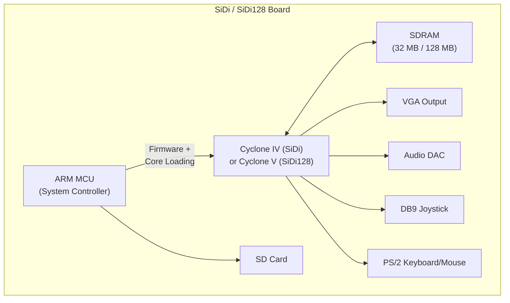
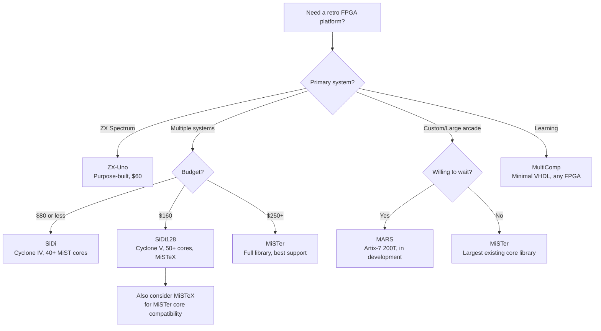

[← 12 Open Source Open Hardware Home](../README.md) · [← Retro Computing Home](README.md) · [← Project Home](../../../README.md)

# Other Retro FPGA Platforms — Beyond MiSTer

Beyond MiSTer and MiST, a rich ecosystem of alternative FPGA retro-hardware platforms exists — each with unique trade-offs in cost, capability, and community support. From the $60 ZX-Uno (Spectrum-focused) to the ambitious MARS project (designed as a MiSTer successor), these platforms serve niche communities that MiSTer's DE10-Nano focus doesn't address.

---

## Overview

MiSTer dominates the retro FPGA scene, but it's not the right answer for everyone. The DE10-Nano costs $250+ fully configured, is perpetually out of stock, and requires a monitor, USB hub, and multiple add-on boards. The platforms below offer alternatives: cheaper boards, portable form factors, Spectrum-specific authenticity, or a path beyond Cyclone V.

---

## Platform Comparison

| Platform | FPGA | LEs | RAM | Price | Cores | Status | Key Differentiator |
|---|---|---|---|---|---|---|---|
| **SiDi** | Cyclone IV EP4CE22 | 22K | 32 MB SDRAM | ~$80 | 40+ | Active | Cheapest Cyclone retro platform |
| **SiDi128** | Cyclone V (49K) | 49K | 128 MB SDRAM | ~$160 | 50+ | Active | Cyclone V + 128 MB, MiSTer-lite |
| **ZX-Uno** | Xilinx Spartan-6 LX9/LX16 | 9K/16K | 32 MB SDRAM | ~$60 | 30+ | Mature | Spectrum-focused, compact |
| **ZX-Uno Next** | Xilinx Artix-7 (35T) | 33K | 32 MB SDRAM | ~$130 | Growing | New | Spectrum Next compatibility |
| **FPGA Arcade Replay** | Xilinx Spartan-6 LX45 | 43K | 64 MB DDR2 | ~$200 (rare) | 20+ | Dormant | Daughterboard architecture |
| **MARS** | Xilinx Artix-7 (200T) | 215K | DDR3 | TBD | TBD | In development | Ambitious MiSTer successor |
| **MiSTeX** | Multi-target (DE10-Nano, MiST, SiDi128) | Varies | Varies | Free (software) | 70+ | Active | Runs MiSTer cores on MiST/SiDi |
| **MultiComp** | Any FPGA (generic VHDL) | ~3K+ | None required | Free | 5+ | Educational | Generic VHDL computer-on-FPGA |

---

## SiDi / SiDi128 — The Budget Cyclone Platforms

SiDi (Simple Digital) and SiDi128 are open-hardware boards designed by the same community that maintains the MiST firmware. They run MiST firmware (not MiSTer), which means they use an MCU for system control instead of the ARM HPS.

### Architecture

### SiDi vs SiDi128 vs MiSTer

| Feature | SiDi | SiDi128 | MiSTer (DE10-Nano) |
|---|---|---|---|
| **FPGA** | Cyclone IV 22K | Cyclone V 49K | Cyclone V 110K |
| **SDRAM** | 32 MB | 128 MB | 32 MB (add-on) + 1 GB DDR3 (HPS) |
| **System control** | ARM MCU | ARM MCU | ARM HPS (Linux) |
| **Firmware** | MiST firmware | MiST firmware | MiSTer (Linux-based) |
| **Video output** | VGA only | VGA only | HDMI (via HPS) + VGA |
| **USB input** | Via MCU | Via MCU | Direct (Linux USB stack) |
| **Price** | ~$80 | ~$160 | ~$250+ |
| **Core compatibility** | MiST cores | MiST cores + some MiSTer | All MiSTer cores |

The SiDi's Cyclone IV (22K LE) is too small for most MiSTer cores, but it runs the original MiST core library. The SiDi128's Cyclone V (49K) is large enough for many MiSTer ports via MiSTeX.

---

## ZX-Uno — The Spectrum Specialist

The ZX-Uno is a single-board retro computer built around the ZX Spectrum architecture. Unlike MiSTer (which is a general-purpose platform), ZX-Uno is purpose-built for the Sinclair/ZX community.

### ZX-Uno Hardware

| Component | Spec |
|---|---|
| **FPGA** | Xilinx Spartan-6 LX9 (9K LE) or LX16 (16K LE) |
| **RAM** | 32 MB SDRAM |
| **Video** | VGA output (RGBS via optional header) |
| **Audio** | AY-3-8910 + beeper, 3.5 mm jack |
| **Storage** | SD card (SPI mode) |
| **Input** | PS/2 keyboard, Kempston joystick |
| **Expansion** | GPIO header for peripherals |

### ZX Spectrum Cores

| Core | Machine | Status | Notes |
|---|---|---|---|
| **ZX Spectrum 48K** | Sinclair ZX Spectrum | ✅ Excellent | Original Spec emulated at gate level |
| **ZX Spectrum 128K** | Sinclair ZX Spectrum+ | ✅ Excellent | +2A/+3 modes |
| **ZX Spectrum Next** | Spectrum Next | ✅ Working | Layer 2, sprites, extended color |
| **Pentagon** | Russian clone | ✅ Good | Popular in Russian community |
| **TS-Conf** | TS-Configuration | ✅ Good | Extended graphics modes |
| **SPECCY2010** | Custom Spectrum | ✅ Good | Enhanced core with Turbo modes |

The ZX-Uno also runs non-Spectrum cores (C64, MSX, Atari 8-bit) but these are secondary — the platform's value is its deep Spectrum integration and community.

---

## MARS — The MiSTer Successor (In Development)

MARS (Modular Advanced Retro System) is an ambitious project to build a MiSTer successor with a significantly larger FPGA:

| Planned Feature | MARS | MiSTer (DE10-Nano) |
|---|---|---|
| **FPGA** | Xilinx Artix-7 200T (215K LE) | Cyclone V (110K LE) |
| **Memory** | DDR3 (large, TBD) | 32 MB SDRAM + 1 GB DDR3 (HPS) |
| **System control** | TBD | ARM HPS (Linux) |
| **Video output** | HDMI + analog | HDMI + VGA |
| **Target cores** | All MiSTer + larger arcade | MiSTer library (some too large) |
| **Status** | In development | Active, mature |
| **Price** | TBD | ~$250+ |

> **Caveat**: MARS is still in development. No boards are available for purchase. The project's significance is in demonstrating that the retro FPGA community wants hardware beyond the DE10-Nano's limits.

---

## MiSTeX — Running MiSTer Cores on Non-MiSTer Hardware

MiSTeX is a software bridge that enables MiSTer cores to run on MiST and SiDi hardware. It translates between the MiSTer API (HPS_BUS, CONF_STR) and the MiST API (MCU-based control).

| MiSTeX Feature | Detail |
|---|---|
| **Target platforms** | MiST, SiDi, SiDi128 |
| **Core count** | 70+ cores ported |
| **Method** | Software shim layer (MiSTer API → MiST API translation) |
| **Limitations** | Cores larger than 49K LE (SiDi128) or 25K LE (MiST) cannot run; no HPS features (Linux, USB, HDMI) |

MiSTeX is important because it demonstrates that MiSTer cores can be portable across hardware — a prerequisite for any future MiSTer successor platform.

---

## MultiComp — The Educational Platform

MultiComp (by Grant Searle) is a minimal VHDL computer that runs on any FPGA with ~3K+ LEs. It implements a simple 8-bit CPU (Z80-compatible), serial UART, and VGA output:

| Component | Implementation |
|---|---|
| **CPU** | Z80-compatible soft core |
| **RAM** | Block RAM (internal, no external memory needed) |
| **Video** | Simple character-based VGA (80×25 text) |
| **Serial** | UART for terminal I/O |
| **Storage** | None (in-memory only) |
| **Language** | Microsoft BASIC in ROM |

MultiComp is not a retro platform — it's an educational tool that shows how little VHDL you need to build a working computer on an FPGA.

---

## Selection Guide

---

## When to Use / When NOT to Use

### When to Use Alternative Platforms

- **Budget-constrained retro gaming** — SiDi at $80 is 3× cheaper than a MiSTer setup
- **ZX Spectrum authenticity** — ZX-Uno has the deepest Spectrum support of any platform
- **Existing MiST hardware** — if you already have a MiST, MiSTeX gives you access to 70+ MiSTer cores
- **Educational purposes** — MultiComp teaches FPGA computer design in <500 lines of VHDL

### When NOT to Use Alternative Platforms

- **You want the largest core library** — MiSTer has 200+ cores; no alternative comes close
- **You need HDMI output** — only MiSTer has HDMI via HPS; SiDi/ZX-Uno are VGA-only
- **You need USB peripherals** — MiSTer's Linux HPS handles USB natively; other platforms have limited input options
- **You want community support** — MiSTer's Discord has 10K+ members; alternative platforms have much smaller communities

---

## Best Practices

1. **Check core compatibility before buying** — not all MiSTer cores run on smaller FPGAs; verify your must-have cores are available
2. **Use MiSTeX on SiDi128 for best non-MiSTer experience** — it gives you MiSTer core compatibility at $160
3. **Choose ZX-Uno only for Spectrum** — it's excellent for Spectrum but limited for everything else
4. **Don't wait for MARS** — it's in development with no timeline; buy MiSTer or SiDi now

---

## Antipatterns

- **The Wrong Platform for the Core** — buying a SiDi (22K LE) and then discovering your favorite arcade core requires 80K LE; always check core requirements first
- **The VGA-Only Limitation** — buying a SiDi or ZX-Uno and then needing HDMI for your display; these platforms only output VGA
- **The Waiting Game** — delaying a purchase to wait for MARS which has no release date; the retro FPGA landscape changes slowly

---

## Pitfalls

1. **SiDi firmware differs from MiSTer** — SiDi runs MiST firmware, not MiSTer; the update process and core format are different
2. **ZX-Uno SD card format** — the ZX-Uno uses a custom FAT format; standard SD cards need special formatting
3. **MiSTeX limitations** — MiSTeX cannot provide HPS features (Linux, USB, HDMI); it only translates the core API
4. **ZX-Uno Spartan-6 toolchain** — requires Xilinx ISE (not Vivado); ISE is deprecated and only runs on older OS versions
5. **Community fragmentation** — alternative platforms have smaller communities; help and documentation are harder to find

---

## Use Cases

- **Budget retro gaming** — SiDi for under $100
- **ZX Spectrum enthusiast** — ZX-Uno with authentic Spectrum experience
- **MiST owner wanting MiSTer cores** — MiSTeX bridge
- **FPGA computer education** — MultiComp on any dev board
- **Future-proofing** — watching MARS development for the next generation

---

## References

- [SiDi / SiDi128 (GitHub)](https://github.com/Sorgelig/SiDi128)
- [ZX-Uno (Wiki)](https://zxuno.speccy.org/)
- [MiSTeX (GitHub)](https://github.com/MiSTeX-devel)
- [MultiComp (Grant Searle)](http://searle.wales/)
- [MARS Project](https://github.com/MiSTer-devel/MARS) — in development
- [MiSTer Platform](mister.md) — the dominant retro FPGA platform
- [MiST Platform](mist.md) — the original retro FPGA platform
- [Analogue Pocket](analogue_openfpga.md) — commercial handheld alternative
