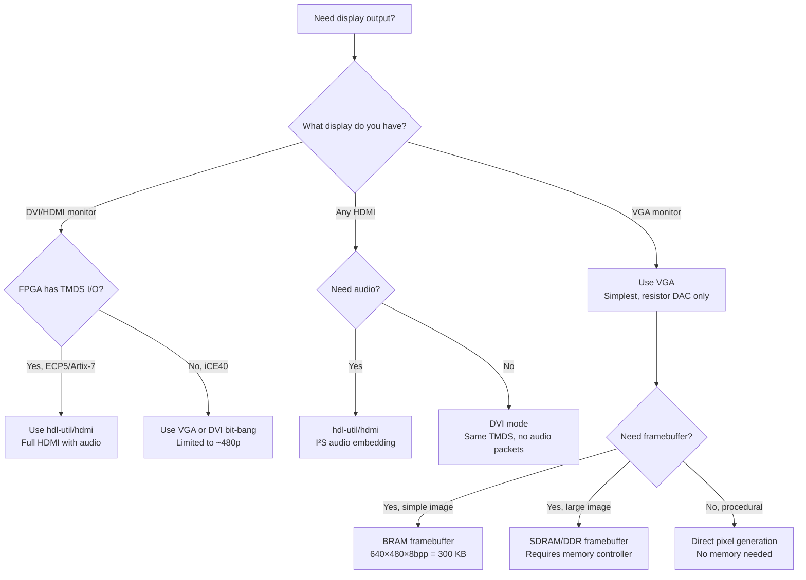

[← 12 Open Source Open Hardware Home](../README.md) · [← Video Display Home](README.md) · [← Project Home](../../../README.md)

# Open Display Cores — VGA, DVI & HDMI TX for FPGA

FPGA display controller cores — from simple VGA framebuffers to full HDMI transmitters with I²S audio embedding. Every FPGA project that needs to show something on a screen needs one of these, and the choice between VGA, DVI, and HDMI is driven by your FPGA's I/O capabilities, not just feature preference.

---

## Overview

Display output from an FPGA is fundamentally a **timing generation + pixel serialization** problem. The display controller must generate precise horizontal and vertical sync signals at the exact pixel clock frequency, and serialize pixel data fast enough to drive the physical interface. VGA is trivial (parallel RGB + sync). HDMI/DVI requires TMDS encoding at 10× the pixel clock — 742.5 Mbps per lane for 1080p60.

The open-source ecosystem covers the full range, from Project F's educational VGA controllers to hdl-util's production-grade HDMI with audio.

---

## Core Comparison

| Core | Output | Resolution | Color Depth | Audio | FPGA Verified | Repository |
|---|---|---|---|---|---|---|
| **Project F Display** | VGA | Up to 1920×1080 | 1–8 bpp (indexed) to 24-bit RGB | No | iCE40, ECP5, Artix-7 | projf/projf-explore |
| **hdl-util/hdmi** | HDMI/DVI | Up to 1920×1080 | 24-bit RGB | ✅ I²S audio embedding | ECP5, Artix-7, Cyclone V | hdl-util/hdmi |
| **Simple VGA** | VGA | 640×480 | 12-bit RGB (4-4-4) | No | iCE40, ECP5 | Various |
| **LiteVideo** | HDMI | 720p/1080p | 24-bit RGB | Via LiteX | ECP5, Artix-7 | enjoy-digital/litevideo |
| **Amaranth HDMI** | HDMI/DVI | Up to 1080p | 24-bit RGB | ✅ I²S | ECP5, Artix-7 | amaranth-lang/amaranth |

---

## Display Interface Comparison

| Interface | Pins | FPGA I/O Required | Max Resolution (FPGA practical) | Latency | Notes |
|---|---|---|---|---|---|
| **VGA** (analog) | 5–12 (R,G,B,HS,VS) | GPIO + resistor DAC | 1920×1080 @ 60 Hz | 0 frames | Simplest, needs VGA monitor |
| **DVI** (digital) | 4 diff pairs (TMDS) | LVDS or TMDS-capable I/O | 1920×1080 @ 60 Hz | 0 frames | Digital, no audio standard |
| **HDMI** (digital) | 4 diff pairs (TMDS) | LVDS or TMDS-capable I/O | 1920×1080 @ 60 Hz | 0 frames | DVI + audio + EDID |
| **DisplayPort** | 1–4 lanes | High-speed transceiver | 4K+ | 0–1 frames | Complex, needs SERDES, rare in open |

---

## VGA: The Simplest Display Output

VGA uses parallel analog RGB signals with separate horizontal and vertical sync. An FPGA generates the digital sync and color values; a simple resistor ladder DAC converts the digital color to analog voltage levels.

### VGA Timing

For standard 640×480 @ 60 Hz (25.175 MHz pixel clock):

| Parameter | Horizontal | Vertical |
|---|---|---|
| **Active region** | 640 pixels | 480 lines |
| **Front porch** | 16 pixels | 10 lines |
| **Sync pulse** | 96 pixels | 2 lines |
| **Back porch** | 48 pixels | 33 lines |
| **Total** | 800 pixels | 525 lines |

### VGA Resistor DAC

```
FPGA Pin ──┬── 470Ω ──┬── VGA Red (0.7 V max)
            │           │
            ├── 1.0kΩ ──┤
            │           │
           GND        VGA Red pin

3-bit red: R2 (470Ω), R1 (1.0kΩ), R0 (2.2kΩ)
```

Each color channel uses a resistor divider to produce analog voltage levels. For 3-bit per channel (8 levels), you need 3 resistors per channel × 3 channels = 9 resistors total. For 8-bit per channel (256 levels), you need a proper DAC chip (e.g., ADV7125).

### VGA Controller (Verilog)

```verilog
// VGA 640×480 @ 60 Hz timing generator
module vga_timing #(
    parameter H_ACTIVE  = 640,
    parameter H_FP      = 16,
    parameter H_SYNC    = 96,
    parameter H_BP      = 48,
    parameter V_ACTIVE  = 480,
    parameter V_FP      = 10,
    parameter V_SYNC    = 2,
    parameter V_BP      = 33
)(
    input  clk,          // 25.175 MHz pixel clock
    input  rst,
    output hsync,
    output vsync,
    output video_active,
    output [9:0] x,      // pixel column (0–639 during active)
    output [9:0] y       // pixel row (0–479 during active)
);
    localparam H_TOTAL = H_ACTIVE + H_FP + H_SYNC + H_BP;
    localparam V_TOTAL = V_ACTIVE + V_FP + V_SYNC + V_BP;

    reg [9:0] h_cnt, v_cnt;

    always @(posedge clk) begin
        if (rst) begin
            h_cnt <= 0; v_cnt <= 0;
        end else begin
            if (h_cnt == H_TOTAL - 1) begin
                h_cnt <= 0;
                if (v_cnt == V_TOTAL - 1)
                    v_cnt <= 0;
                else
                    v_cnt <= v_cnt + 1;
            end else
                h_cnt <= h_cnt + 1;
        end
    end

    assign hsync = (h_cnt >= H_ACTIVE + H_FP) && (h_cnt < H_ACTIVE + H_FP + H_SYNC);
    assign vsync = (v_cnt >= V_ACTIVE + V_FP) && (v_cnt < V_ACTIVE + V_FP + V_SYNC);
    assign video_active = (h_cnt < H_ACTIVE) && (v_cnt < V_ACTIVE);
    assign x = h_cnt;
    assign y = v_cnt;
endmodule
```

---

## TMDS: The Key to HDMI/DVI

HDMI and DVI use **TMDS** (Transition Minimized Differential Signaling) — a DC-balanced serial protocol that encodes 8 bits of pixel data into 10-bit symbols transmitted at 10× the pixel clock.

### TMDS Encoding Pipeline

```
Pixel Data (8-bit) + Control Signals
         ↓
  TMDS Encoder (per channel)
  1. Minimize transitions (XOR/XNOR select)
  2. DC balance (running disparity counter)
  3. 8-bit → 10-bit symbol
         ↓
  Serializer (10:1)
  Pixel clock × 10 = TMDS bit rate
         ↓
  Differential output (TMDS pair)
```

| Resolution | Pixel Clock | TMDS Bit Rate (per lane) | Lanes |
|---|---|---|---|
| 640×480 @ 60 Hz | 25.175 MHz | 251.75 Mbps | 3 (R, G, B) + 1 (clock) |
| 1280×720 @ 60 Hz | 74.25 MHz | 742.5 Mbps | 3 + 1 |
| 1920×1080 @ 60 Hz | 148.5 MHz | 1.485 Gbps | 3 + 1 |

### FPGA TMDS Implementation by Family

| FPGA | TMDS Approach | Max Resolution | Notes |
|---|---|---|---|
| **Lattice iCE40** | Bit-banged LVDS | ~480p | No TMDS I/O; bit-banging works at low res only |
| **Lattice ECP5** | LVDS25E (hard TMDS-capable) | 1080p | Best open-toolchain HDMI platform |
| **Xilinx Artix-7** | OSERDES2 + LVDS I/O | 1080p | Well-documented, TMDS_33 I/O standard |
| **Xilinx Kintex-7** | OSERDES2 + TMDS_33 | 1080p+ | Same as Artix-7 with more speed |
| **Intel Cyclone V** | LVDS I/O + serializer | 1080p | Used in MiSTer and Analogue Pocket |
| **Gowin GW1NR / GW2AR** | ELVDS (OSER10/OSER5 + emulated LVDS) | 720p | Tang Nano 9K/20K; ⚠️ ELVDS not true TLVDS — some monitors incompatible |
| **Gowin GW5A** | TLVDS (hard LVDS I/O) | 1080p | Tang Console 60K/138K; proper TLVDS fixes Nano signal issues |

> **Gowin ELVDS vs TLVDS for HDMI**: The Tang Nano 9K (GW1NR-9) and 20K (GW2AR-18) use **ELVDS** (Emulated LVDS) for their HDMI TMDS pairs because Sipeed's PCB routing doesn't connect to the true TLVDS-capable pins. ELVDS works for most displays at 720p but can cause signal integrity issues with picky monitors. The newer Tang Console (GW5A-60/138K) has proper **TLVDS** routing and supports 1080p reliably. If you're targeting the Tang Nano boards, always test with your specific monitor. See [Hobbyist Boards](../open_boards/hobbyist_boards.md) for the full Tang ecosystem details.

> **Gowin HDMI open-source status**: Gowin provides a proprietary HDMI/DVI TX IP core in Gowin EDA, but there is no mature open-source TMDS serializer for Gowin FPGAs yet. Community projects on Tang Nano boards typically use the Gowin IP or hand-crafted OSER10-based serializers. The [Apicula](https://github.com/YosysHQ/apicula) project is working toward open bitstream support but does not yet cover the high-speed I/O primitives needed for TMDS.

### TMDS Encoder (Verilog)

```verilog
// Simplified TMDS encoder for one channel
module tmds_encoder (
    input  clk,
    input  [7:0] data,        // pixel data
    input  [1:0] ctrl,        // control bits (during blanking)
    input  data_en,            // 1 = pixel data, 0 = control
    output reg [9:0] tmds_out
);
    reg [9:0] encoded;
    reg [3:0] disparity;       // running DC balance

    always @(posedge clk) begin
        if (!data_en) begin
            // Control period: fixed 10-bit symbols
            case (ctrl)
                2'b00: tmds_out <= 10'b1101010100;
                2'b01: tmds_out <= 10'b0010101011;
                2'b10: tmds_out <= 10'b0101010100;
                2'b11: tmds_out <= 10'b1010101011;
            endcase
            disparity <= 0;
        end else begin
            // Data period: transition-minimized, DC-balanced
            // (full implementation requires XOR/XNOR select + disparity tracking)
            tmds_out <= encoded;
        end
    end
endmodule
```

---

## hdl-util/hdmi — HDMI with Audio

The most complete open-source HDMI transmitter, supporting 24-bit color and I²S audio embedding. Audio is inserted into the HDMI data stream during horizontal blanking periods (called "data islands").

### HDMI Audio Insertion

```
Horizontal blanking period:
┌──────────┬─────────────────────┬────────────┐
│ H-Sync   │  Data Island        │  Guard     │
│ (control)│  (audio samples +   │  (control) │
│          │   info frames)      │            │
└──────────┴─────────────────────┴────────────┘
     ←── Video active period ──→
```

Audio samples are packed into HDMI info frames during blanking. A 48 kHz stereo stream requires ~1.5 Mbps, which easily fits within the blanking bandwidth of any standard resolution.

---

## Resource Usage Estimates

| Core | FPGA | LUTs | FFs | BRAM | DSP | fMax |
|---|---|---|---|---|---|---|
| VGA 640×480 (3-bit) | iCE40UP5K | ~200 | ~100 | 0 | 0 | 25 MHz |
| VGA 640×480 (24-bit) | ECP5 25K | ~300 | ~150 | 2 | 0 | 25 MHz |
| VGA framebuffer (640×480, 8bpp) | ECP5 25K | ~500 | ~300 | 15 | 0 | 25 MHz |
| DVI 720p (TMDS bit-bang) | ECP5 25K | ~800 | ~400 | 0 | 0 | 74.25 MHz |
| HDMI 1080p (TMDS) | ECP5 85K | ~1500 | ~800 | 4 | 0 | 148.5 MHz |
| HDMI 1080p + audio | ECP5 85K | ~2000 | ~1200 | 6 | 0 | 148.5 MHz |

---

## Common Resolutions and Timing

| Resolution | Refresh | Pixel Clock | H Total | V Total | Notes |
|---|---|---|---|---|---|
| 640×480 | 60 Hz | 25.175 MHz | 800 | 525 | VGA standard, easiest to start with |
| 800×600 | 60 Hz | 40.0 MHz | 1056 | 628 | SVGA, common on ECP5 |
| 1024×768 | 60 Hz | 65.0 MHz | 1344 | 806 | XGA, needs fast I/O |
| 1280×720 | 60 Hz | 74.25 MHz | 1650 | 750 | 720p HD, HDMI standard |
| 1920×1080 | 60 Hz | 148.5 MHz | 2200 | 1125 | 1080p Full HD, needs TMDS I/O |
| 1920×1080 | 30 Hz | 74.25 MHz | 2200 | 1125 | Half-bandwidth trick for smaller FPGAs |

---

## Decision Guide



---

## When to Use / When NOT to Use

### When to Use Open Display Cores

- **Retro computing/gaming cores** — VGA for CRT monitors, HDMI for modern displays
- **Status/debug displays** — simple VGA output showing register state or memory contents
- **Signal visualization** — oscilloscope-style display of ADC samples
- **Embedded UI** — basic graphical interface on an FPGA without a hard GPU

### When NOT to Use Open Display Cores

- **Zynq UltraScale+ designs** — the PS has hardened DisplayPort and HDMI TX; use the hard IP
- **4K resolution** — open HDMI cores max out at 1080p; 4K needs DisplayPort or HDMI 2.0 with transceivers
- **HDR video** — open cores don't support HDR metadata or deep color (>24-bit)
- **Production display interfaces** — open cores lack HDCP, CEC, and other HDMI compliance requirements

---

## Best Practices

1. **Start with VGA 640×480** — it's the simplest and most forgiving resolution; move to HDMI only when you need digital output
2. **Use the OSERDES for TMDS on Xilinx** — never try to bit-bang TMDS at 1080p on Artix-7; use OSERDES2 and the TMDS_33 I/O standard
3. **Generate pixel clocks with an MMCM/PLL** — display timing requires precise pixel clocks; derived clocks from logic won't meet jitter specifications
4. **Double-buffer the framebuffer** — one buffer for display read, one for write; swapping mid-frame causes tearing
5. **Use hdl-util/hdmi for production HDMI** — it's the most tested open HDMI core; others may have edge-case timing violations

---

## Antipatterns

- **The TMDS Bit-Bang at 1080p** — trying to serialize 10-bit TMDS symbols at 1.485 Gbps using soft logic; it cannot meet timing on any FPGA without dedicated serializer hardware
- **The Unbuffered VGA** — generating VGA sync from combinatorial logic instead of a proper timing counter; glitchy sync signals cause monitors to lose lock
- **The Single-Port Framebuffer** — reading and writing the same BRAM port for both display and rendering; dual-port BRAM exists for exactly this reason

---

## Pitfalls

1. **Pixel clock jitter** — displays are sensitive to clock jitter; use a PLL/MMCM to generate pixel clocks, not a divided system clock
2. **TMDS I/O standard on ECP5** — must use LVDS25E I/O type with proper termination; wrong I/O standard produces no output or damaged signals
3. **Negative sync polarity** — VGA sync polarity varies by resolution; 640×480 uses negative H/V sync, others may differ. Check the VESA standard.
4. **HDMI EDID** — modern HDMI monitors expect the source to read the EDID (I²C at address 0x50) and configure output accordingly; ignoring EDID can result in no display
5. **Frame buffer bandwidth** — 1080p@60 at 24-bit requires ~3.6 Gbps of read bandwidth; a single SDRAM channel at 166 MHz/32-bit provides ~5 Gbps — barely enough for read + write
6. **iCE40 TMDS limitation** — the iCE40 has no native TMDS I/O; bit-banged LVDS works up to ~25 MHz pixel clock (640×480), beyond that use an external HDMI encoder (e.g., ADV7513)

---

## Use Cases

- **Retro computing cores** — VGA output for CRT monitors (authentic scanlines), HDMI for modern displays (see [MiSTer](../retro_computing/mister.md))
- **Oscilloscope on FPGA** — ADC samples plotted on VGA in real time
- **Digital signage** — HDMI output driving a commercial display
- **FPGA camera pipeline** — sensor → processing → HDMI output (see [OSSC](ossc.md) for analog input)
- **Educational projects** — displaying Mandelbrot set, sprites, or procedural patterns on VGA

---

## References

- [Project F — FPGA Graphics](https://projectf.io/posts/fpga-graphics/) — excellent VGA/HDMI tutorials
- [hdl-util/hdmi (GitHub)](https://github.com/hdl-util/hdmi) — HDMI with audio
- [LiteVideo (GitHub)](https://github.com/enjoy-digital/litevideo) — LiteX-integrated HDMI
- [DVI Spec (DDWG)](https://www.ddwg.org/) — Digital Visual Interface specification
- [HDMI Specification](https://hdmi.org/) — HDMI Licensing
- [VESA Coordinated Video Timings](https://vesa.org/) — standard display timings
- [OSSC](ossc.md) — analog-to-HDMI scan conversion
- [RetroTINK & Scalers](retrotink_and_scalers.md) — external scaling solutions
