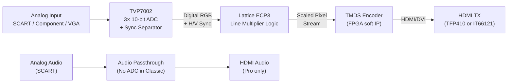
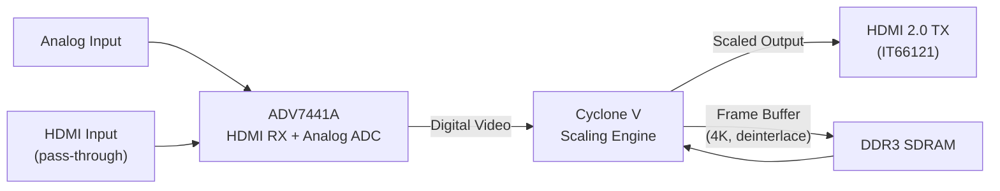
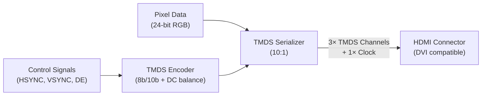

[← 12 Open Source Open Hardware Home](../README.md) · [← Video Display Home](README.md) · [← Project Home](../../../README.md)

# OSSC — Open Source Scan Converter

The OSSC (Open Source Scan Converter) is the gold standard for zero-lag analog-to-digital video conversion. It takes retro console RGB/YPbPr signals and converts them to pristine HDMI output entirely in FPGA hardware — no frame buffering, no software processing, no latency beyond a single scanline.

---

## Overview

Retro consoles and computers output analog video at resolutions and refresh rates incompatible with modern HDMI displays:
- **240p** at 15 kHz (NES, SNES, Genesis, PS1, most pre-1996 consoles)
- **480i** at 15 kHz (PS2, GameCube in interlaced mode)
- **288p/576i** at 15 kHz (PAL systems)

Modern TVs either refuse these signals entirely or apply heavy internal processing (deinterlacing, upscaling, motion interpolation) that adds 2–5 frames of latency and destroys the pixel-sharp aesthetic of retro graphics.

The OSSC solves this by converting analog signals to digital HDMI **in real time, scanline by scanline** — no frame buffer, no processing delay. Total latency: **<1 scanline** (<64 μs at 15 kHz), imperceptible to humans and irrelevant even for competitive speedrunning.

### Open Source Status

| Component | License | Repository |
|---|---|---|
| **Hardware (Classic)** | CC BY-SA | [marqs85/ossc_hw](https://github.com/marcus-jansson/ossc_hw) |
| **Firmware (Classic)** | GPLv3 | [marqs85/ossc](https://github.com/marqs85/ossc) |
| **Hardware (Pro)** | Closed (partially) | Designed by Markus K. (marqs85) |
| **Firmware (Pro)** | Open (core logic) | [osscpro_firmware](https://github.com/marqs85/ossc_pro) |

---

## Hardware Variants

| Feature | **OSSC Classic (v1.6)** | **OSSC Pro** |
|---|---|---|
| **FPGA** | Lattice ECP3 LFE3-35EA (33K LUT) | Intel Cyclone V 5CEBA4 (49K LE) |
| **Analog ADC** | TVP7002 | ADV7441A (HDMI input also supported) |
| **Video Inputs** | SCART RGB, Component (YPbPr), VGA (RGBHV) | SCART, Component, VGA, HDMI IN (pass-through) |
| **Video Output** | HDMI/DVI 1.0 (up to ~1200p) | HDMI 2.0 (up to 4K60) |
| **Line Mult.** | 2×/3×/4×/5× | Adaptive (1×–6×+), arbitrary scaling |
| **Frame Buffer** | None (zero-lag only) | Optional (for 4K upscaling, deinterlacing) |
| **Audio** | Analog passthrough (no ADC) | Digital audio extraction, analog + HDMI audio |
| **Deinterlacing** | None (line-mult only) | Motion-adaptive, bob, weave |
| **Scanlines** | Basic overlay | Advanced (per-profile, CRT simulation) |
| **HDR** | No | Yes (HLG, PQ) |
| **Price** | ~$150–200 (assembled) | ~$350–450 (assembled) |

---

## Architecture

### Signal Flow (OSSC Classic)



### Signal Flow (OSSC Pro)



The Pro adds an optional DDR3 framebuffer — this enables 4K output (which requires buffering multiple lines for vertical scaling) and motion-adaptive deinterlacing. When the framebuffer is disabled, the Pro operates in the same zero-lag scanline mode as the Classic.

---

## Line Multiplication: The Core Technique

Line multiplication is the OSSC's fundamental operation. Instead of buffering an entire frame and scaling it (which adds latency), the OSSC processes each scanline as it arrives:

### How It Works

```
Input: 240p (15 kHz, ~15.7 kHz H-sync)
Each input scanline takes ~63.5 μs

Line 2×: Output each input line twice
┌───────────────────────┐     ┌────────────────────────┐
│ Input Line N          │ ──→ │ Output Line N (copy 1) │
│                       │     │ Output Line N (copy 2) │
└───────────────────────┘     └────────────────────────┘
Result: 480p at 31 kHz

Line 3×: Output each input line three times
Result: 720p at 47 kHz

Line 4×: 960p at 63 kHz
Line 5×: 1200p at 79 kHz
```

The multiplier simply repeats each input line N times, with minimal line buffer (1–2 scanlines stored in FPGA block RAM). No frame buffer, no processing delay.

### Line Multiplication Modes

| Mode | Input → Output | Best For | Latency |
|---|---|---|---|
| **Passthrough** | Same resolution | Bypassing TV upscalers | 0 |
| **Line 2×** | 240p → 480p | Most monitors (31 kHz compatible) | <1 scanline |
| **Line 3×** | 240p → 720p | HD displays (720p native) | <1 scanline |
| **Line 4×** | 240p → 960p | 1920×1200 monitors | <1 scanline |
| **Line 5×** | 240p → 1200p | 1600×1200 / 1920×1200 monitors | <1 scanline |
| **Optimized** | Variable | OSSC Pro — adaptive to display | <1 scanline |

### Interlaced Content Handling

For 480i content, the OSSC offers:

| Method | How | Quality | Latency |
|---|---|---|---|
| **Bob deinterlace** | Display each field independently, alternate lines | Flickery but fast | <1 scanline |
| **Weave** | Combine both fields into one frame | Static image OK, motion artifacts | 1 field |
| **Line 2× on fields** | Double each field line | Reduces flicker, maintains speed | <1 scanline |
| **Motion-adaptive (Pro)** | Per-pixel motion detection, blend/weave adaptive | Best quality | 1–2 fields |

---

## Scanline Generation

The OSSC includes scanline simulation — darkening every Nth output line to mimic the appearance of a CRT's alternating scan lines.

### Classic Scanlines

```verilog
// Simplified scanline logic (conceptual)
// Line counter tracks which output line we're on
always @(posedge clk) begin
    if (line_counter[0] == 1'b1)  // Every other line
        pixel_out = pixel_in * sl_strength;  // Darken by strength factor
    else
        pixel_out = pixel_in;  // Pass through
end
```

| Parameter | Range | Effect |
|---|---|---|
| **Strength** | 0–100% | How much to darken scanline lines (0 = off, 100 = black) |
| **Alternate** | On/Off | Toggle which lines are darkened (for non-integer multipliers) |
| **Hi/Lo** | Even/odd | Select which field gets darkened in interlaced mode |

### OSSC Pro Scanlines

The Pro extends scanline simulation with:
- **Per-profile settings** — different scanline configs per input mode
- **CRT simulation mode** — phosphor decay, beam width variation, corner darkening
- **Subpixel rendering** — scanlines applied at sub-pixel granularity for smoother appearance
- **Custom LUTs** — user-defined scanline intensity curves

---

## TVP7002 ADC: The Analog Front End

The TVP7002 is a triple 10-bit ADC with integrated sync separation — the critical component that digitizes the analog input:

| Parameter | TVP7002 Spec | Relevance |
|---|---|---|
| **Sampling rate** | Up to 165 MSPS | Oversamples 15 kHz signals for clean digitization |
| **Resolution** | 3× 10-bit | 1024 levels per channel — adequate for retro 6-bit / 9-bit palettes |
| **Input bandwidth** | Up to 165 MHz | Handles all retro console signals including 480p |
| **Sync extraction** | SOG (sync-on-green), composite sync, H/V separate | Supports all common sync formats |
| **Clamp** | Back-porch or mid-porch | Maintains correct black level |
| **Gain** | Programmable 0–2× | Compensates for weak signals (long SCART cables) |

The FPGA configures the TVP7002 over I²C at startup, setting sampling rate, gain, clamp position, and sync polarity. The TVP7002 outputs parallel digital RGB + pixel clock + sync signals to the FPGA.

---

## TMDS Encoding: The HDMI Output

The OSSC generates HDMI/DVI output using a soft TMDS encoder in the FPGA:



| Parameter | Value |
|---|---|
| **Pixel clock** | Up to 165 MHz (Classic), up to 594 MHz (Pro with HDMI 2.0) |
| **Color depth** | 24-bit RGB (8-bit per channel) |
| **Encoding** | TMDS (Transition Minimized Differential Signaling) |
| **DC balancing** | Yes (8b/10b encoding with running disparity) |
| **Audio** | Not supported on Classic; HDMI audio on Pro |

> **DVI vs HDMI**: The Classic outputs DVI-compatible TMDS (no audio, no CEC). The IT66121 HDMI transmitter on some Classic revisions and the Pro add full HDMI support including audio and HDCP bypass.

---

## Display Compatibility

Not all displays handle the OSSC's output correctly. The line-multiplied signals have non-standard timings:

| Mode | Pixel Clock | H-Rate | V-Rate | Display Compatibility |
|---|---|---|---|---|
| 240p passthrough | 6–13.5 MHz | 15 kHz | 50/60 Hz | CRT only |
| 480p (2×) | 12–27 MHz | 31 kHz | 50/60 Hz | Most monitors |
| 720p (3×) | 18–40 MHz | 47 kHz | 50/60 Hz | Most HDTVs |
| 960p (4×) | 24–54 MHz | 63 kHz | 50/60 Hz | Many monitors, some TVs |
| 1200p (5×) | 30–68 MHz | 79 kHz | 50/60 Hz | PC monitors only |

**Common issues**:
- Some TVs reject non-standard timings even at 480p (missing VESA/CTA standard modes)
- Line 4× and 5× exceed the bandwidth of many HDMI inputs on consumer TVs
- The OSSC outputs at the **exact input refresh rate** (e.g., 59.73 Hz for SNES, not exactly 60 Hz) — some displays drop frames or show intermittent black screens

The OSSC Pro's framebuffer mode addresses these issues by re-timing the output to standard VESA/CTA modes.

---

## Comparison with Alternatives

| Feature | OSSC Classic | OSSC Pro | RetroTINK 2X Pro | RetroTINK 5X Pro | GBS-Control |
|---|---|---|---|---|---|
| **FPGA** | ECP3 (33K LUT) | Cyclone V (49K LE) | Cyclone 10 (undisclosed) | Cyclone 10 | None (TVP5725 + ESP8266) |
| **Latency** | <1 scanline | <1 scanline (zero-lag mode) | <1 scanline | ~1–2 scanlines | ~1 frame |
| **4K output** | No | Yes | No | No | No |
| **Deinterlacing** | Bob only | Motion-adaptive | Bob / weave | Motion-adaptive | Bob / weave |
| **HDMI input** | No | Yes | No | No | No |
| **Scanlines** | Basic | Advanced | Basic | Advanced | Basic |
| **Open source** | Fully | Firmware only | No | No | Firmware only |
| **Price** | ~$150–200 | ~$350–450 | ~$150 | ~$300 | ~$40 (DIY) |

---

## When to Use the OSSC

| Use Case | Recommended | Alternative |
|---|---|---|
| Competitive retro gaming on HDTV | OSSC Classic (2×, zero-lag) | RetroTINK 2X (simpler, same latency class) |
| 4K scaling with minimal lag | OSSC Pro (framebuffer + 4K) | RetroTINK 4K (more features, closed source) |
| CRT-compatible output from retro consoles | OSSC not needed — use CRT directly | RGB to CRT (no conversion needed) |
| Streaming retro gameplay | OSSC Pro (HDMI pass-through + 4K) | Capture card + OSSC Classic |
| Learning video processing FPGA design | OSSC Classic (open HDL + simple architecture) | MiSTer ascal (more complex, different purpose) |
| Budget retro-to-HDMI | GBS-Control (~$40 DIY) | OSSC Classic (higher quality) |

---

## Best Practices

1. **Start with Line 2×** — it is the most universally compatible mode and adds zero perceptible latency
2. **Check your display's supported timings** — use the OSSC's info screen to verify the output mode; some TVs silently reject non-standard timings
3. **Use quality SCART cables** — cheap cables with inadequate shielding cause ghosting, color bleeding, and sync issues that the OSSC cannot fix
4. **Set TV to "PC/Game mode"** — disable all TV-side processing (motion interpolation, sharpness, noise reduction) to preserve the OSSC's clean output
5. **Match scanline strength to multiplier** — higher line multiplication (4×, 5×) needs stronger scanlines to be visible; lower multiplication (2×) needs lighter scanlines

---

## Antipatterns

- **Using Line 5× with a TV** — 1200p at 79 kHz exceeds most TV HDMI bandwidth; use Line 3× (720p) for TVs, Line 4×/5× for PC monitors only
- **Enabling scanlines at 2×** — at 480p, scanlines are very coarse and look unnatural; scanlines work best at 4× or 5× where they approximate CRT spacing
- **Mixing OSSC with TV upscaling** — the whole point is to bypass the TV's scaler; if the TV re-processes the OSSC's output, you've gained nothing
- **Using the OSSC with already-digital sources** — HDMI consoles (Wii U, Switch) don't need the OSSC; it only converts analog signals

---

## Pitfalls

- **Non-standard timings** — the OSSC faithfully reproduces the input refresh rate (e.g., SNES at 59.73 Hz, not 60.00 Hz); some TVs detect this as "unsupported" and show a black screen
- **No frame buffer on Classic** — if the display cannot lock to the input timing, there is no fallback; you must switch to a compatible multiplier mode
- **Audio delay (Pro only)** — when using the framebuffer on the Pro, audio must be delayed to match the video buffer; this adds ~1 frame of audio latency
- **TVP7002 sampling artifacts** — at certain pixel clock frequencies, the ADC's PLL can produce visible pixel jitter; adjusting the sampling phase in the OSSC menu resolves this
- **SCART cable wiring varies** — some SCART cables carry composite sync on pin 20, others use sync-on-green; the OSSC's sync source setting must match the cable

---

## References

- [OSSC GitHub (Classic Firmware)](https://github.com/marqs85/ossc)
- [OSSC Hardware Schematics](https://github.com/marcus-jansson/ossc_hw)
- [OSSC Pro Information](https://osscpro.com/)
- [TVP7002 Datasheet](https://www.ti.com/product/TVP7002)
- [HDMI/DVI TMDS Specification](https://hdmi.org/)
- [RetroTINK Comparison](retrotink_and_scalers.md)
