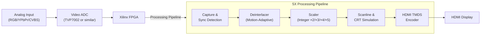
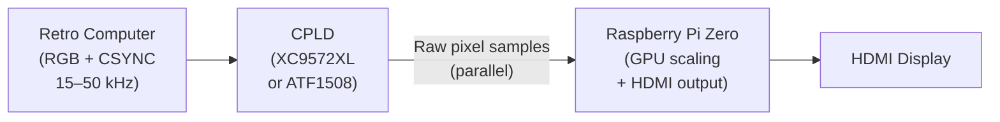
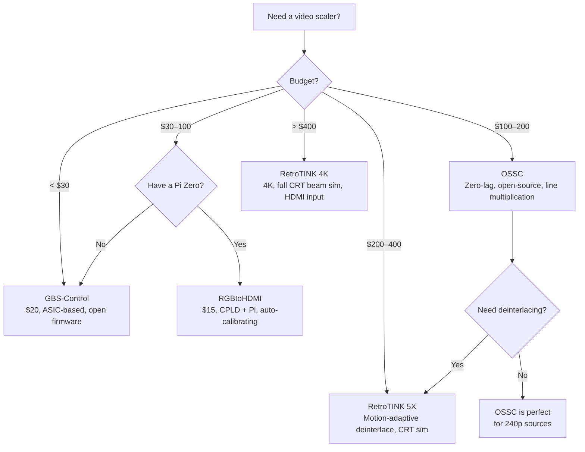

[← 12 Open Source Open Hardware Home](../README.md) · [← Video Display Home](README.md) · [← Project Home](../../../README.md)

# RetroTINK & Open Scaler Projects — FPGA in Video Scaling

A survey of video scalers and converters — from the commercial RetroTINK line (which demonstrates what FPGA scaling can achieve) to open-source alternatives like GBS-Control and RGBtoHDMI. Video scaling is one of the most impactful FPGA applications for the retro gaming community, where the difference between a good scaler and a bad one determines whether a 30-year-old console looks authentic or unplayable.

---

## Overview

Retro consoles output analog video at resolutions and refresh rates that modern HDMI displays were never designed to accept. A 240p signal at 15.6 kHz horizontal sync is alien to any TV manufactured after 2010. Three approaches solve this:

1. **Line multiplication** (OSSC) — zero-latency, scan-line-by-scan-line processing
2. **Frame buffering + scaling** (RetroTINK 5X/4K) — 1–2 frames of latency, advanced processing
3. **CPLD sampling + SoC scaling** (RGBtoHDMI) — hybrid approach, $10 total cost

The FPGA's role varies from "essential" (RetroTINK 4K, OSSC) to "just a sampler" (RGBtoHDMI), but every design relies on deterministic, jitter-free capture of analog video signals — something only programmable logic can provide.

---

## RetroTINK Line

### Product Comparison

| Product | Hardware | FPGA | Input | Output | Latency | Price | Key Feature |
|---|---|---|---|---|---|---|---|
| **RetroTINK 2X-Mini** | Custom ASIC | None | Composite, S-Video, RGB | 480p HDMI | 0 lines | ~$75 | Cheapest entry, line double only |
| **RetroTINK 2X-Pro** | Custom ASIC | None | Composite, S-Video, RGB | 480p HDMI | 0 lines | ~$150 | Comb filter, smoothing |
| **RetroTINK 5X-Pro** | Xilinx FPGA | Yes | RGB, Component, S-Video, Composite | 1080p/1440p HDMI | 0–2 lines | ~$350 | Motion-adaptive deinterlacing, CRT simulation |
| **RetroTINK 4K** | Xilinx FPGA (large) | Yes | All analog + HDMI input | 4K HDMI | 1–2 frames | ~$750 | Polyphase scaling, HDR, BFI, full CRT beam sim |

### RetroTINK 5X-Pro Architecture

The 5X-Pro uses an FPGA to implement real-time video processing that no ASIC scaler can match:

| Processing Stage | FPGA Function |
|---|---|
| **Sync detection** | Measure H/V sync timing to identify resolution and refresh rate |
| **Deinterlacing** | Motion-adaptive weave/bob — static areas weave, moving areas bob |
| **Scaling** | Integer line multiplication (×2, ×3, ×4, ×5) for pixel-perfect output |
| **CRT simulation** | Phosphor decay, scanline darkness, beam width modulation |
| **HDMI output** | TMDS encoding with audio embedding |

### RetroTINK 4K — The Flagship

The 4K adds a larger FPGA enabling:

- **Polyphase scaling** — sub-pixel interpolation for arbitrary output resolutions
- **Black Frame Insertion (BFI)** — strobes the backlight to simulate CRT phosphor decay
- **HDR output** — expanded brightness range for CRT simulation on HDR displays
- **HDMI input** — can scale digital sources (DOS PCs, modern consoles in retro mode)
- **Full CRT beam simulation** — models the electron beam shape, spot size, and Gaussian falloff

---

## Open-Source Alternatives

### GBS-Control

GBS-Control replaces the firmware on the cheap GBS-8200 video scaler board with open-source code running on an ESP8266. The GBS-8200 contains a TV5725 ASIC scaler — GBS-Control doesn't touch the ASIC's internal logic, but reprograms its registers for optimal retro video processing.

| Feature | Detail |
|---|---|
| **Hardware** | GBS-8200 board (~$15) + ESP8266 (~$3) |
| **Inputs** | VGA, Component, RGBS |
| **Output** | VGA (640×480 – 1920×1080) |
| **Scaling** | TV5725 internal scaler (register-tuned by GBS-Control) |
| **Deinterlacing** | Motion-adaptive (via TV5725 registers) |
| **Scanlines** | Yes (via register configuration) |
| **Latency** | ~2 lines (ASIC pipeline) |
| **FPGA involvement** | None — TV5725 is an ASIC, not FPGA |

**GBS-Control is not an FPGA project** — it's included here because it demonstrates that register-level control of a $15 ASIC can rival $200+ FPGA scalers for common use cases.

### RGBtoHDMI

RGBtoHDMI uses a Raspberry Pi Zero for scaling and HDMI output, with a small CPLD for deterministic analog video sampling. The CPLD is not an FPGA — it's a simple logic device — but the architecture is instructive for FPGA designers.

| Component | Role | Cost |
|---|---|---|
| **CPLD** | High-speed sampler: captures analog video levels, derives pixel clock via PLL | ~$5 |
| **Pi Zero** | Frame reconstruction, upscaling (GPU), HDMI output | ~$5 |
| **Analog front-end** | Op-amp level shifting, clamp circuit | ~$2 |

The architecture is clever: the CPLD handles what it's good at (deterministic, jitter-free sampling at exact pixel clock rates) and the Pi handles what it's good at (powerful GPU for upscaling, cheap HDMI output). The total system cost is under $15.

**RGBtoHDMI is not an FPGA project** either — the CPLD is too small for any meaningful processing. It's included because the CPLD + SoC split is the same architecture used in MiSTer (HPS + FPGA).

---

## Why FPGA in Scalers?

| Task | Why FPGA/CPLD | Why Not a CPU/MCU? |
|---|---|---|
| **Analog sampling** | Deterministic capture at exact pixel clock — no jitter, no dropped samples | CPU interrupt latency is non-deterministic; samples are missed |
| **Line multiplication** | Line-by-line processing eliminates frame buffer latency | CPU needs to buffer a full frame before scaling |
| **Deinterlacing** | Motion-adaptive algorithms need parallel pixel processing | CPU can do it but with higher latency |
| **CRT simulation** | Beam simulation, phosphor decay, mask patterns — per-pixel compute at pixel clock rate | CPU cannot compute per-pixel effects at 148.5 MHz pixel clock |
| **TMDS output** | Dedicated serializer hardware for HDMI output | CPU GPIO cannot reach 1.485 Gbps |

---

## Scaler Comparison Matrix

| Feature | OSSC | RetroTINK 5X | RetroTINK 4K | GBS-Control | RGBtoHDMI |
|---|---|---|---|---|---|
| **FPGA Used** | Lattice ECP3 | Xilinx FPGA | Xilinx FPGA (large) | None (ASIC) | CPLD only |
| **Max Output** | 1080p | 1080p/1440p | 4K | 1080p | 1080p |
| **Latency** | 0 lines | 0–2 lines | 1–2 frames | ~2 lines | ~1 frame |
| **Deinterlacing** | No (bob only) | Motion-adaptive | Motion-adaptive | Motion-adaptive | None |
| **CRT Simulation** | Basic scanlines | Scanlines + mask | Full beam sim + BFI | Scanlines | None |
| **Audio** | No (separate path) | HDMI embedded | HDMI embedded | No | HDMI via Pi |
| **Price** | ~$150 (kit) | ~$350 | ~$750 | ~$20 | ~$15 |
| **Open Source** | ✅ Fully open | ❌ Closed firmware | ❌ Closed firmware | ✅ Open firmware | ✅ Fully open |

---

## Decision Guide

---

## When to Use / When NOT to Use FPGA Scalers

### When to Use

- **Playing retro consoles on modern HDMI displays** — the primary use case for all of these devices
- **Zero-latency gaming** — OSSC's line multiplication has no frame buffer; input lag is truly zero
- **CRT simulation** — RetroTINK 4K's beam simulation is the closest you can get to a real CRT on an LCD
- **Video capture** — OSSC and RetroTINK provide clean HDMI output for capture cards

### When NOT to Use

- **You already have a CRT monitor** — nothing beats a real CRT for retro gaming; scalers are for when you must use an LCD
- **PC emulation** — software emulators (RetroArch) have built-in CRT shaders that look excellent on modern displays
- **You need 4K output on a budget** — no open-source solution provides 4K scaling; the RetroTINK 4K is the only option

---

## Best Practices

1. **Use OSSC for 240p sources** — its line multiplication is pixel-perfect with zero latency; nothing beats it for Genesis/SNES/NES
2. **Use RetroTINK 5X/4K for interlaced sources** — motion-adaptive deinterlacing is essential for PS2/GameCube/Wii
3. **Set OSSC to integer line multiplication** — ×3 for 720p (240×3), ×4 for 960p, ×5 for 1080p (216p×5); non-integer scaling introduces scaling artifacts
4. **Don't forget audio** — OSSC does not process audio; you need a separate audio path (analog or digital extractor)
5. **Calibrate GBS-Control phase** — the TV5725's sampling phase must be tuned per-source for clean pixels; GBS-Control provides an automatic calibration tool

---

## Antipatterns

- **The FPGA-for-Everything** — using an FPGA scaler when a $20 GBS-Control would suffice; the FPGA advantage is zero-latency processing and advanced CRT simulation, not basic scaling
- **The Missing Audio Path** — forgetting that OSSC only processes video; you need a separate analog-to-digital audio converter or an HDMI audio inserter
- **The Non-Integer Scale** — setting OSSC to arbitrary scaling instead of integer ×2/×3/×4/×5; non-integer scaling defeats the purpose of a line multiplier

---

## Pitfalls

1. **OSSC and TV compatibility** — some TVs don't accept OSSC's non-standard timings (e.g., 720p from a 240p ×3 line multiple); check the OSSC TV compatibility list
2. **GBS-Control power supply** — the GBS-8200 board is sensitive to power supply noise; use a clean 5V/2A supply
3. **RGBtoHDMI resolution limits** — the Pi Zero's GPU maxes out at 1080p; higher resolutions require a Pi 4
4. **RetroTINK firmware updates** — the 5X and 4K receive frequent firmware updates with new features; always update before reporting issues
5. **OSSC Pro vs OSSC v1.6** — the OSSC Pro is a different, more capable device; don't confuse them when reading guides

---

## Use Cases

- **Retro console on modern TV** — primary use case for all devices in this category
- **Speedrunning** — OSSC's zero latency is essential for frame-precise input
- **Retro game streaming** — clean HDMI output for OBS/capture card
- **Arcade cabinet LCD conversion** — replacing a CRT with an LCD + scaler in a cabinet
- **Video preservation** — capturing clean digital output from rare analog hardware

---

## References

- [RetroTINK (Official)](https://www.retrotink.com/)
- [OSSC — Open Source Scan Converter](ossc.md) — detailed architecture article
- [GBS-Control (GitHub)](https://github.com/ramapcsx2/gbs-control)
- [RGBtoHDMI (GitHub)](https://github.com/c0pperdragon/RGBtoHDMI)
- [Display Cores](display_cores.md) — VGA/DVI/HDMI output from FPGA
- [MiSTer](../retro_computing/mister.md) — uses ascal FPGA scaler internally
