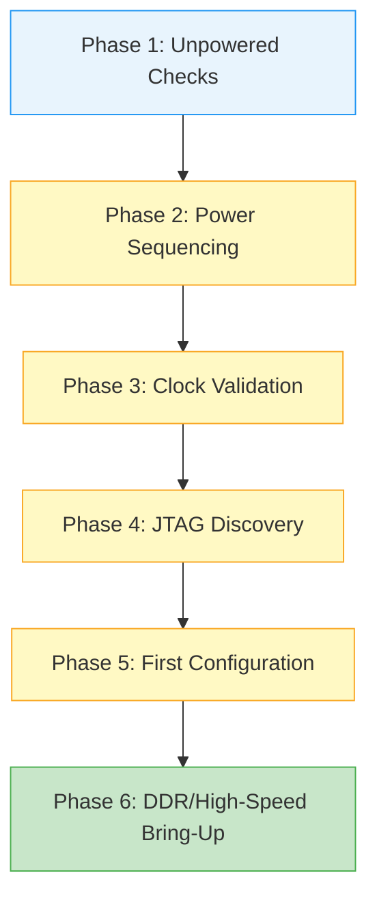

[← 15 Case Studies Home](README.md) · [← Project Home](../../README.md)

# Board Bring-Up Checklist — From Bare PCB to First Blinky

## Overview

Bringing up a newly manufactured custom FPGA board is a high-risk operation. Before a single line of RTL is loaded, the hardware must be methodically validated to prevent destroying the silicon. This article provides a hardened methodology for first-power-on, detailing the exact sequence of checks—from verifying unpowered rail impedances to establishing the JTAG chain and finally loading a minimal "blinky" bitstream. 

## Architecture / The Bring-Up Sequence

The bring-up sequence must follow a strict order of operations. Skipping steps (e.g., plugging in the JTAG cable before verifying power rails) can result in permanent damage to the FPGA or the programmer.



## Phase 1: Unpowered Impedance Checks

Before applying power, use a digital multimeter (DMM) to verify there are no dead shorts on the power delivery network (PDN). FPGAs have naturally low impedance on their core rails, so do not panic if VCCINT reads slightly low, but it should never be zero.

| Rail | Typical Impedance (Unpowered) | Danger Zone | Action if Failed |
|---|---|---|---|
| **VCCINT (Core)** | 5Ω – 50Ω (depends on die size) | < 1Ω | Check decoupling cap solder bridges under the BGA. |
| **VCCAUX/VCCPT** | > 100Ω | < 10Ω | Inspect auxiliary power regulator output. |
| **VCCO (I/O Banks)** | > 500Ω | < 10Ω | Check connected peripherals for shorts. |
| **MGTAVCC (Transceivers)**| 10Ω – 100Ω | < 2Ω | Inspect PLL/transceiver dedicated regulators. |

## Phase 2: Power Sequencing and Ramping

FPGAs require specific power-on sequences. Typically: Core (VCCINT) → Aux (VCCAUX) → I/O (VCCO).

1.  **Current Limiting**: Use a lab bench power supply. Set the current limit to ~500mA above the expected quiescent current.
2.  **Monitor the Sequence**: Use a 4-channel oscilloscope to probe VCCINT, VCCAUX, VCCO, and the `Power Good` (PG) signal from the PMIC.
3.  **Check Monotonic Ramping**: Ensure the rails rise smoothly without dipping. Non-monotonic ramping can cause the FPGA's Power-On Reset (POR) circuit to fail, leaving the device in a locked state.

## Phase 3: Clock Validation

Before connecting JTAG, verify the oscillators are alive. The FPGA cannot configure or respond properly if the underlying clock network is dead.

1.  Probe the crystal oscillators or clock generators using a low-capacitance active probe (to avoid stalling the crystal).
2.  Verify the frequency, amplitude, and DC offset match the IO standard (e.g., LVCMOS33 vs LVDS).

## Phase 4: JTAG Discovery

Only after Power and Clocks are verified should you connect the JTAG programmer.

### OpenOCD JTAG Verification
Use OpenOCD to verify the JTAG boundary scan chain. This proves the physical JTAG pins are connected and the FPGA TAP controller is alive.

```bash
# openocd_check.cfg
adapter driver ftdi
ftdi_vid_pid 0x0403 0x6010
transport select jtag
adapter speed 1000

# Run this in terminal:
$ openocd -f openocd_check.cfg
# Expected output should show the TAP IDCODE:
# Info : JTAG tap: auto0.tap tap/device found: 0x0362c093 (mfg: 0x049 (Xilinx), part: 0x362c, ver: 0x0)
```

If the IDCODE is `0xffffffff` or `0x00000000`, the JTAG chain is broken (check TCK/TMS integrity, or verify VCCAUX is powering the JTAG pins).

## Phase 5: First Configuration (The Blinky)

Create the simplest possible design: a counter driving an LED from the main clock.

1.  **Do not include any IP cores** (No DDR, no PCIe, no PLLs).
2.  **Constraint Verification**: Triple-check the XDC/SDC file. If you assign the LED output to a 1.8V bank but configure the FPGA bitstream for 3.3V LVCMOS, you may damage the I/O bank.
3.  Load the bitstream via JTAG (SRAM configuration, do not flash the SPI yet).

```tcl
# Vivado Tcl for First Load
open_hw_manager
connect_hw_server
open_hw_target
set_property PROGRAM.FILE {blinky.bit} [get_hw_devices xc7a35t_0]
program_hw_devices [get_hw_devices xc7a35t_0]
```

## Pitfalls & Common Mistakes

### 1. The Hot-Plug JTAG Killer
Plugging a JTAG programmer into an unpowered board, or a powered board with a large ground differential, can blow the FPGA's JTAG pins.

**Antipattern:**
Connecting the JTAG ribbon cable while the board is unpowered, then turning on the board power. The JTAG programmer attempts to drive the TMS/TCK pins into an unpowered FPGA bank, violating the maximum clamp diode current.

**Good Practice:**
1. Connect board to power and ground.
2. Connect JTAG programmer to host PC.
3. Turn on board power.
4. Connect JTAG ribbon cable to the board.

### 2. The Missing VCCINT Ramp
Some power regulators have a "soft start" feature. If the ramp time is too slow (e.g., > 50ms), the FPGA's internal Power-On Reset (POR) circuit times out before the voltage reaches the minimum threshold.

> [!WARNING]
> **Ramp Time Violation:** Check the vendor datasheet for `T_POR` (Power-On Reset time) and `T_RAMP` (Maximum Ramp Time). If your VCCINT takes 100ms to rise, the FPGA will never boot, even if the final voltage is perfect.

### 3. Floating Configuration Pins
Pins like `PROGRAM_B`, `INIT_B`, and `DONE` have specific pull-up/pull-down requirements. If the PCB designer left `PROGRAM_B` floating, noise will continuously reset the configuration engine.

## Vendor Context & Tools

| Vendor | JTAG Hardware Tool | Default Chain Debugger | Status Register Command |
|---|---|---|---|
| **Xilinx** | Platform Cable USB II | Vivado Hardware Manager | `report_hw_targets` |
| **Intel** | USB-Blaster II | Quartus Programmer (JTAG Chain Debugger) | `quartus_jli -i` |
| **Lattice** | HW-USBN-2B | Diamond Programmer | Reveal Inserter/Analyzer |
| **Open Source** | FT2232H / Tigard | OpenOCD / xc3sprog | `openocd -c "scan_chain"` |

## Next Steps
Once the blinky is running, proceed to [Debugging DDR Calibration](debugging_ddr.md) and [PCIe Link Training Debug](pcie_bringup.md) to bring up the complex high-speed peripherals.
