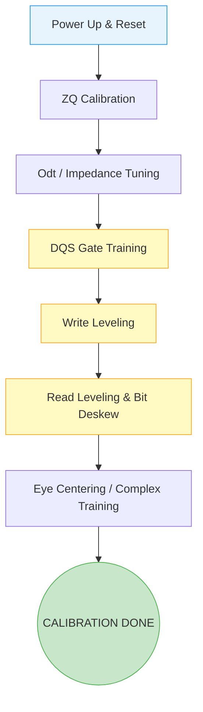

[← 15 Case Studies Home](README.md) · [← Project Home](../../README.md)

# Debugging DDR Calibration — DQS Gating, Read/Write Leveling, and Bit Deskew

## Overview

DDR (Double Data Rate) memory calibration is an initialization sequence performed by hard or soft memory controller IP (like Xilinx MIG or Intel EMIF) immediately after FPGA configuration. It exists because standard PCB manufacturing tolerances, temperature variations, and fly-by routing topologies create unpredictable picosecond-level skews between clock, command, and data lines. The controller must dynamically measure these skews and apply tap delays to precisely center the data strobes (DQS) within the data eyes (DQ). Understanding this sequence is essential because a calibration failure prevents the entire SoC or FPGA from booting or accessing external memory.

## Architecture / The Calibration Sequence

Modern DDR3/DDR4 memory utilizes a "fly-by" routing topology for clocks and address/command lines to improve signal integrity, but this inherently causes a skew between the clock arriving at the first memory chip versus the last. Calibration corrects this.



1.  **ZQ Calibration:** Calibrates on-die termination (ODT) and output driver impedance using an external precision resistor (typically 240Ω).
2.  **DQS Gate Training:** The controller finds the exact moment the memory sends the read preamble. It adjusts internal enable signals so it only captures valid DQS toggles and ignores bus tri-state noise.
3.  **Write Leveling:** Compensates for the clock-to-DQS skew caused by fly-by routing. The controller delays the DQS strobe for each byte lane until it aligns with the clock arriving at the specific DRAM chip.
4.  **Read Leveling & Bit Deskew:** The controller reads a known pattern (like `0xAA55`) and individually adjusts the delay of each data bit (DQ) to perfectly align them to the DQS strobe, centering the sample point.

## Vendor Context & Cross-Platform Comparison

| Feature | Xilinx MIG (Memory Interface Generator) | Intel EMIF (External Memory Interface) | Open Source (LiteDRAM) |
|---|---|---|---|
| **Diagnostic Output** | Generates `init_calib_complete` and `dbg_pi_phase_locked`. Accessible via Vivado Hardware Manager. | Uses the EMIF Debug Toolkit. Generates detailed margin reports per byte lane. | Prints calibration status and tap delays directly to the UART console during BIOS boot. |
| **Calibration Execution** | Hardened PHY microblaze/state machine runs the calibration. | Nios II soft processor (or hard logic on Agilex) runs the calibration sequence. | Built-in software sequence executed by the LiteX CPU before jumping to the payload. |
| **Failure Granularity** | `dbg_calib_err_num` indicates the exact phase (e.g., Phase 2 = DQS Gate). | Provides visual eye diagrams and margin graphs indicating exactly which bit failed. | Console outputs pass/fail for each byte lane during memory training. |

## Pitfalls & Common Mistakes

### 1. The VREF Drift (Power Integrity)
If the VREF (reference voltage) rail is noisy or improperly decoupled, the logic threshold for the DDR signals will fluctuate, causing erratic bit deskew failures.

**Bad Hardware Design:**
Using a standard resistor divider without a dedicated tracking regulator for VREF, or placing the divider far from the FPGA/DRAM pins.

**Good Hardware Design:**
Using a dedicated DDR termination regulator (like the TPS51200) to sink/source current and provide a stable VREF_DQ that tracks VDDQ/2.

### 2. The DQS Gate Failure (Routing Lengths)
A failure during DQS Gate training almost always means the physical trace length mismatch between DQS and Clock exceeds the controller's delay tap capability.

> [!WARNING]
> **Constraint Violation:** You cannot fix a massive PCB trace length disparity with software calibration. The memory controller IP relies on the PCB designer adhering to strict length-matching rules (usually ±10 mils for DQ within a lane, and specific rules for Clock-to-DQS).

### 3. Missing Pin Constraints
If the tool is allowed to freely place DDR pins, it will violate hardware pinout rules for the PHY.

**Bad Code (Missing DQS grouping):**
```tcl
# Randomly assigning DDR pins without checking byte group rules
set_property PACKAGE_PIN A1 [get_ports {ddr3_dq[0]}]
set_property PACKAGE_PIN Z9 [get_ports {ddr3_dqs_p[0]}]
```

**Correct Code (Following Vendor Rules):**
DQS and DQ signals for a specific byte lane *must* be placed within the same dedicated byte group (e.g., Xilinx T0, T1, T2, T3 groups) to utilize the dedicated high-speed PHY routing.

## API / Interface Reference: Debugging via Tcl

When a Xilinx MIG calibration fails, you can interrogate the PHY using Vivado Tcl. This is much faster than guessing PCB errors.

```tcl
/* Vivado 2023.2 Hardware Manager Tcl */

# Check overall calibration status
get_property C_INIT_CALIB_COMPLETE [get_hw_migs *]
# Returns: 0 (Failed/Pending) or 1 (Success)

# If it failed, check the error stage
set err_stage [get_property C_CALIB_ERR_STAGE [get_hw_migs *]]
puts "Failed at stage: $err_stage"
# Stages: 0=No Error, 1=Write Leveling, 2=DQS Gate, 3=Read Leveling, 4=Complex

# Check which byte lane caused the failure
get_property C_CALIB_ERR_LANE [get_hw_migs *]
```

## When to Use Hardware vs Software Calibration

| Criterion | Hardware PHY Calibration (MIG/EMIF) | Software Calibration (LiteDRAM) |
|---|---|---|
| **When to use** | High-performance commercial designs (DDR4/DDR5) | Open-source SoCs, retro-computing (MiSTer), educational boards |
| **Boot Time** | Fast (~milliseconds), entirely hidden | Slower (visible over UART), but highly debuggable |
| **Flexibility** | Black box; hard to modify if a non-standard memory chip is used | Completely open; tap delays can be manually overridden via console commands |

## Best Practices for DDR Bring-Up

1. **Verify Clocks First:** Before looking at the DDR PHY, ensure the reference clock feeding the controller is locked and jitter-free.
2. **Check Reset Sequencing:** Ensure the `sys_rst` is held long enough for PLLs to lock.
3. **Use the Vendor Spreadsheets:** Never guess memory timing parameters. Use the vendor-provided Excel spreadsheets or IP wizards and input the exact values from the Micron/Samsung/SK Hynix datasheet.
4. **Validate Power Rails:** Use an oscilloscope to ensure VDD, VDDQ, VTT, and VREF are stable during the initial burst of current when calibration starts.

## References

- [UG583: UltraScale Architecture PCB Design User Guide](https://docs.xilinx.com/)
- [Intel External Memory Interfaces (EMIF) Handbook](https://www.intel.com/)
- [LiteDRAM GitHub Repository](https://github.com/enjoy-digital/litedram)
- [Overview of FPGA Configuration](02_architecture/infrastructure/configuration.md)
