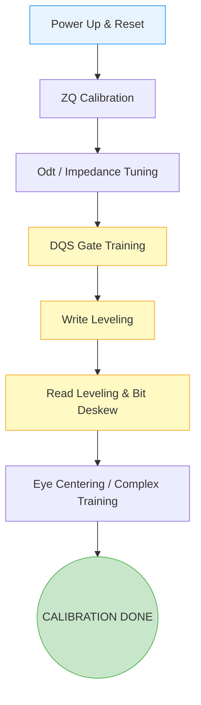

[← 15 Case Studies Home](README.md) · [← Project Home](../../README.md)

# Debugging DDR Calibration — DQS Gating, Read/Write Leveling, and Bit Deskew

DDR (Double Data Rate) memory calibration is an initialization sequence performed by hard or soft memory controller IP (like Xilinx MIG or Intel EMIF) immediately after FPGA configuration. It exists because standard PCB manufacturing tolerances, temperature variations, and fly-by routing topologies create unpredictable picosecond-level skews between clock, command, and data lines. The controller must dynamically measure these skews and apply tap delays to precisely center the data strobes (DQS) within the data eyes (DQ). Understanding this sequence is essential because a calibration failure prevents the entire SoC or FPGA from booting or accessing external memory.

> [!NOTE]
> For memory hierarchy and DDR bandwidth budgeting, see [Memory Hierarchy](../../02_architecture/soc/memory_hierarchy.md). For DDR IP comparison across vendors, see [DDR IP](../../06_ip_and_cores/ddr/README.md). For power integrity affecting DDR, see [Power Integrity](../../09_boards_and_board_design/power_integrity.md).

## Architecture / The Calibration Sequence

Modern DDR3/DDR4 memory utilizes a "fly-by" routing topology for clocks and address/command lines to improve signal integrity, but this inherently causes a skew between the clock arriving at the first memory chip versus the last. Calibration corrects this.


```mermaid
graph TD
    A[Power Up & Reset] --> B[ZQ Calibration]
    B --> C[Odt / Impedance Tuning]
    C --> D[DQS Gate Training]
    D --> E[Write Leveling]
    E --> F[Read Leveling & Bit Deskew]
    F --> G[Eye Centering / Complex Training]
    G --> H((CALIBRATION DONE))
    
    style A fill:#e8f4fd,stroke:#2196f3
    style D fill:#fff9c4,stroke:#f9a825
    style E fill:#fff9c4,stroke:#f9a825
    style F fill:#fff9c4,stroke:#f9a825
    style H fill:#c8e6c9,stroke:#4caf50
```

1.  **ZQ Calibration:** Calibrates on-die termination (ODT) and output driver impedance using an external precision resistor (typically 240Ω).
2.  **DQS Gate Training:** The controller finds the exact moment the memory sends the read preamble. It adjusts internal enable signals so it only captures valid DQS toggles and ignores bus tri-state noise.
3.  **Write Leveling:** Compensates for the clock-to-DQS skew caused by fly-by routing. The controller delays the DQS strobe for each byte lane until it aligns with the clock arriving at the specific DRAM chip.
4.  **Read Leveling & Bit Deskew:** The controller reads a known pattern (like `0xAA55`) and individually adjusts the delay of each data bit (DQ) to perfectly align them to the DQS strobe, centering the sample point.

## Vendor Context & Cross-Platform Comparison

| Feature | Xilinx MIG (Memory Interface Generator) | Intel EMIF (External Memory Interface) | Lattice DDR | Open Source (LiteDRAM) |
|---|---|---|---|---|
| **Diagnostic Output** | Generates `init_calib_complete` and `dbg_pi_phase_locked`. Accessible via Vivado Hardware Manager. | Uses the EMIF Debug Toolkit. Generates detailed margin reports per byte lane. | Limited — check `calib_done` pin. | Prints calibration status and tap delays directly to the UART console during BIOS boot. |
| **Calibration Execution** | Hardened PHY microblaze/state machine runs the calibration. | Nios II soft processor (or hard logic on Agilex) runs the calibration sequence. | State machine in fabric. | Built-in software sequence executed by the LiteX CPU before jumping to the payload. |
| **Failure Granularity** | `dbg_calib_err_num` indicates the exact phase (e.g., Phase 2 = DQS Gate). | Provides visual eye diagrams and margin graphs indicating exactly which bit failed. | Limited to pass/fail. | Console outputs pass/fail for each byte lane during memory training. |
| **Supported Memory** | DDR2/3, DDR4, LPDDR2/3/4 | DDR2/3, DDR4, LPDDR2/3/4, QDR II+ | DDR2/3, LPDDR2/3 | DDR3 (verified), DDR4 (experimental) |

## Pitfalls & Common Mistakes

### 1. The VREF Drift (Power Integrity)
If the VREF (reference voltage) rail is noisy or improperly decoupled, the logic threshold for the DDR signals will fluctuate, causing erratic bit deskew failures.

**Bad Hardware Design:**
Using a standard resistor divider without a dedicated tracking regulator for VREF, or placing the divider far from the FPGA/DRAM pins.

**Good Hardware Design:**
Using a dedicated DDR termination regulator (like the TPS51200) to sink/source current and provide a stable VREF_DQ that tracks VDDQ/2.

### 2. The DQS Gate Failure (Routing Lengths)
A failure during DQS Gate training almost always means the physical trace length mismatch between DQS and Clock exceeds the controller's delay tap capability.

> [!WARNING]
> **Constraint Violation:** You cannot fix a massive PCB trace length disparity with software calibration. The memory controller IP relies on the PCB designer adhering to strict length-matching rules (usually ±10 mils for DQ within a lane, and specific rules for Clock-to-DQS).

### 3. Missing Pin Constraints
If the tool is allowed to freely place DDR pins, it will violate hardware pinout rules for the PHY.

**Bad Code (Missing DQS grouping):**
```tcl
# Randomly assigning DDR pins without checking byte group rules
set_property PACKAGE_PIN A1 [get_ports {ddr3_dq[0]}]
set_property PACKAGE_PIN Z9 [get_ports {ddr3_dqs_p[0]}]
```

**Correct Code (Following Vendor Rules):**
DQS and DQ signals for a specific byte lane *must* be placed within the same dedicated byte group (e.g., Xilinx T0, T1, T2, T3 groups) to utilize the dedicated high-speed PHY routing.

## API / Interface Reference: Debugging via Tcl

When a Xilinx MIG calibration fails, you can interrogate the PHY using Vivado Tcl. This is much faster than guessing PCB errors.

```tcl
/* Vivado 2023.2 Hardware Manager Tcl */

# Check overall calibration status
get_property C_INIT_CALIB_COMPLETE [get_hw_migs *]
# Returns: 0 (Failed/Pending) or 1 (Success)

# If it failed, check the error stage
set err_stage [get_property C_CALIB_ERR_STAGE [get_hw_migs *]]
puts "Failed at stage: $err_stage"
# Stages: 0=No Error, 1=Write Leveling, 2=DQS Gate, 3=Read Leveling, 4=Complex

# Check which byte lane caused the failure
get_property C_CALIB_ERR_LANE [get_hw_migs *]
```

## Diagnostic Checklist: Calibration Failed, Now What?

When `init_calib_complete` stays low, follow this systematic checklist:

### Step 1: Check Clocks
```
Is the reference clock stable?  → Measure with oscilloscope
Is the PLL locked?             → Check PLL_LOCKED output
Is the fabric clock running?   → Check BUFG output
```

### Step 2: Check Reset Sequencing
```
Is sys_rst held long enough?   → Minimum 200 µs after PLL lock
Is the reset de-asserted cleanly? → No glitches on reset line
```

### Step 3: Check Power Rails
```
VDD (FPGA core) stable?        → 1.0V ± 5% (7-Series), 0.85V (UltraScale+)
VDDQ (DDR I/O) stable?         → 1.5V (DDR3), 1.2V (DDR4)
VTT (Termination) present?     → Half of VDDQ, sink/source capable
VREF tracking VDDQ/2?          → Use TPS51200 or equivalent
```

### Step 4: Check Pin Constraints
```
Are DQ/DQS pins in correct byte groups?  → Check XDC/QSF pin assignments
Is the byte group mapping correct?         → Compare against vendor pinout table
```

### Step 5: Check PCB Layout
```
DQ-to-DQS length match within lane?  → ±10 mils typical
Clock-to-DQS length match?            → Per vendor design guide
Address/command fly-by length match?   → Sequential delay per DRAM chip
Impedance control (50Ω single-ended)? → Check stackup and trace width
```

### Step 6: Read Calibration Error Code
```
Xilinx:  Read dbg_calib_err_num via Tcl or ILA
Intel:   Run EMIF Debug Toolkit eye diagram
LiteDRAM: Check UART console output
```

---

## When to Use Hardware vs Software Calibration

| Criterion | Hardware PHY Calibration (MIG/EMIF) | Software Calibration (LiteDRAM) |
|---|---|---|
| **When to use** | High-performance commercial designs (DDR4/DDR5) | Open-source SoCs, retro-computing (MiSTer), educational boards |
| **Boot Time** | Fast (~milliseconds), entirely hidden | Slower (visible over UART), but highly debuggable |
| **Flexibility** | Black box; hard to modify if a non-standard memory chip is used | Completely open; tap delays can be manually overridden via console commands |

## Best Practices for DDR Bring-Up

1. **Verify Clocks First:** Before looking at the DDR PHY, ensure the reference clock feeding the controller is locked and jitter-free.
2. **Check Reset Sequencing:** Ensure the `sys_rst` is held long enough for PLLs to lock (minimum 200 µs after power rails are stable).
3. **Use the Vendor Spreadsheets:** Never guess memory timing parameters. Use the vendor-provided Excel spreadsheets or IP wizards and input the exact values from the Micron/Samsung/SK Hynix datasheet.
4. **Validate Power Rails:** Use an oscilloscope to ensure VDD, VDDQ, VTT, and VREF are stable during the initial burst of current when calibration starts.
5. **Run the vendor's example design first** — before modifying anything, verify that the unmodified MIG/EMIF example design calibrates on your board.
6. **Check solder joint quality** — BGA solder defects on DDR chips cause intermittent calibration failures that look like software bugs. Use X-ray inspection on production boards.

---

## Debugging by Symptom

| Symptom | Likely Cause | Debug Action |
|---|---|---|
| `init_calib_complete` never goes high | Clock or reset issue | Check PLL lock, reset timing, power rails |
| Fails at DQS Gate training | Trace length mismatch | Check PCB length matching for DQS/Clock |
| Fails at Write Leveling | Clock-to-DQS skew too large | Verify fly-by routing, check address/cmd lengths |
| Fails at Read Leveling (specific bit) | Stuck-at fault on DQ line | Check solder joint, check for PCB short/open |
| Passes calibration, data errors in use | VREF noise or timing margin too small | Measure VREF with scope, increase margin by slowing clock |
| Intermittent failures (temperature-dependent) | Thermal drift on VREF or clock | Add thermal monitoring, check VREF regulator stability |
| Works on one board, fails on another | Manufacturing variation | Check impedance control, verify stackup consistency |

## References

- [UG583: UltraScale Architecture PCB Design User Guide](https://docs.xilinx.com/)
- [UG586: 7 Series FPGAs Memory Interface Solutions User Guide](https://docs.xilinx.com/)
- [Intel External Memory Interfaces (EMIF) Handbook](https://www.intel.com/)
- [LiteDRAM GitHub Repository](https://github.com/enjoy-digital/litedram)
- [Memory Hierarchy](../../02_architecture/soc/memory_hierarchy.md) — DDR bandwidth budgeting
- [Power Integrity](../../09_boards_and_board_design/power_integrity.md) — PDN design for DDR
- [DDR IP](../../06_ip_and_cores/ddr/README.md) — Vendor DDR controller comparison
