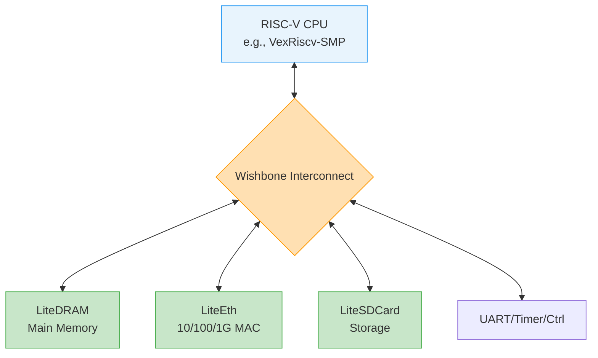

[← 15 Case Studies Home](README.md) · [← Project Home](../../README.md)

# Building a Linux-Capable SoC with LiteX

## Overview

Building a custom System-on-Chip (SoC) capable of booting Linux traditionally requires months of wiring AXI interconnects in vendor GUI tools (like IP Integrator or Platform Designer) and writing thousands of lines of C for bootloaders. **LiteX** revolutionizes this by using Python (Migen/Amaranth) to algorithmically generate the hardware interconnect (Wishbone), instantiate open-source IP cores, compile the FPGA bitstream, and generate the C headers for the BIOS—all from a single script. 

This case study demonstrates how to build a Linux-capable RISC-V SoC targeting two radically different boards: the Lattice ECP5-based **ULX3S** (using fully open-source tools) and the Xilinx Artix-7 **Arty A7** (using Vivado).

## Architecture / The LiteX SoC Topology

Regardless of the target FPGA vendor, LiteX generates a standardized, deterministic hardware architecture:



1.  **CPU Core:** Typically `VexRiscv` (a 32-bit RISC-V core written in SpinalHDL) configured with an MMU and instruction/data caches, making it Linux-capable.
2.  **LiteDRAM:** A highly optimized, vendor-agnostic DDR/SRAM controller that auto-calibrates at boot.
3.  **Wishbone:** The backbone. LiteX automatically calculates memory maps and wires the crossbar.
4.  **LiteX BIOS:** A tiny bootloader compiled into FPGA Block RAM that initializes memory, configures Ethernet, and loads the Linux payload (Image + DTB) via TFTP or SD Card.

## Vendor Context: ECP5 vs. Artix-7

LiteX abstracts the vendor differences entirely in the Python build script, but under the hood, the toolchain paths diverge:

| Aspect | ULX3S (Lattice ECP5 85F) | Arty A7 (Xilinx Artix-7 35T) |
|---|---|---|
| **Toolchain** | Yosys (Synthesis) + nextpnr (PnR) | Xilinx Vivado |
| **Cost of Toolchain** | Free & Open Source | Free (WebPACK edition) |
| **Build Time** | ~2 minutes | ~10-15 minutes |
| **RAM Support** | 32MB SDRAM (SDR) | 256MB DDR3 (requires DQS calibration) |
| **Resource Usage** | ~25K LUTs for SMP Linux | ~20K LUTs for SMP Linux |

## Practical Example: Generating the SoC

Instead of dragging boxes in a GUI, you define the SoC in a Python class. This is the exact code required to generate the Verilog, build the bitstream, and compile the BIOS for the Arty board.

```python
# File: make_arty_linux.py
from litex.boards.targets import digilent_arty
from litex.soc.integration.builder import Builder

# 1. Instantiate the Board Target
# We specify the VexRiscv CPU with Linux-capable parameters (MMU enabled)
soc = digilent_arty.BaseSoC(
    variant="a7-35",
    sys_clk_freq=int(100e6),
    cpu_type="vexriscv",
    cpu_variant="linux",   # Includes MMU and hardware multiplier
    with_ethernet=True,    # Instantiates LiteEth
    with_sdcard=True       # Instantiates LiteSDCard for rootfs
)

# 2. Add an extra peripheral (e.g., an LED chaser)
# LiteX auto-assigns the memory map address and wires the Wishbone bus
soc.add_module("leds", litex.soc.cores.gpio.GPIOOut(soc.platform.request("user_led", 4)))

# 3. Build the Bitstream and BIOS
builder = Builder(soc, output_dir="build/arty", compile_software=True, compile_gateware=True)
builder.build()
```

Run the script: `$ python3 make_arty_linux.py --build --load`

## Pitfalls & Common Mistakes

### 1. The Python Version Trap
LiteX relies heavily on Python metaprogramming and external package dependencies (like Migen). 

**Antipattern:**
Running the build script using your system's global Python environment. A future OS update to `pip` or Python will inevitably break the LiteX dependency tree, destroying your ability to rebuild the hardware.

**Good Practice:**
Always build LiteX inside a dedicated Python Virtual Environment (`venv`) or a Docker container.

### 2. The Clock Domain Crossing (CDC) Assumption
Because LiteX makes it incredibly easy to attach custom logic to the Wishbone bus, beginners often attach external signals directly to Wishbone registers.

> [!WARNING]
> **CDC: requires synchronizer.** If you map an external button or sensor pin directly into a LiteX CSR (Control and Status Register) without a 2-FF synchronizer, the Wishbone bus will eventually experience metastability, causing the CPU to hang.

### 3. Starving the CPU Cache
The VexRiscv Linux variant uses a relatively small cache. If you configure the Wishbone bus to a 32-bit width but attach a slow external PSRAM, the cache refill latency will bottleneck the entire SoC.

**Solution:** Always use LiteDRAM's L2 cache feature when using high-latency external memory, and configure the Wishbone data width to match the native memory controller width (e.g., 128-bit for DDR3).

## Booting Linux (The Final Step)

Once the bitstream is loaded, you connect to the FPGA's UART using `litex_term`:

```bash
$ litex_term /dev/ttyUSB1
```

If successful, you will see the LiteX BIOS initialize the RAM, check for an SD card, and automatically load `Image` (the Linux Kernel) and `rv32.dtb` (the Device Tree Blob). 

```text
--========== Initialization ============--
Initializing SDRAM @0x40000000...
Switching SDRAM to software control.
Read leveling:
  m0, b0: |00000000000000000000000000000000| 
Memtest at 0x40000000 (2.0MiB)...
  Write: 0x40000000-0x40200000 2.0MiB     
  Read:  0x40000000-0x40200000 2.0MiB     
Memtest OK

Booting from SDCard...
Loading boot.json...
Booting Linux...
[    0.000000] Linux version 5.15.0-litex (riscv32)
[    0.000000] Machine model: LiteX VexRiscv-SMP
```

## References

- [LiteX GitHub Repository](https://github.com/enjoy-digital/litex)
- [VexRiscv CPU](11_soft_cores_and_soc_design/riscv_cores/README.md)
- [Yosys & nextpnr Open Source Flow](13_toolchains/open_source_flow.md)
- [Embedded Linux Boot Flow](10_embedded_linux/boot_flow.md)
