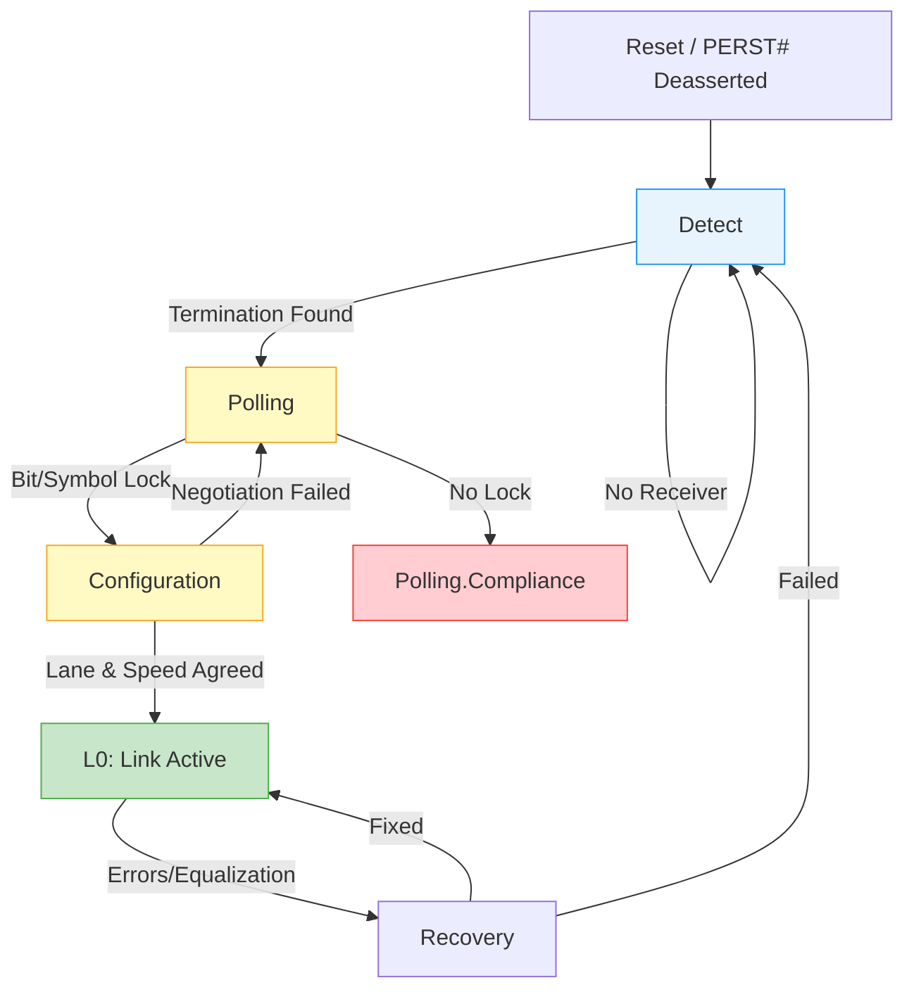

[← 15 Case Studies Home](README.md) · [← Project Home](../../README.md)

# PCIe Link Training Debug — LTSSM, Equalization, and Endpoint Bring-Up

## Overview

PCI Express (PCIe) is the backbone of high-bandwidth FPGA-to-Host communication. Before a Linux host can enumerate the FPGA as an endpoint (via `lspci`), the PCIe hard block (e.g., Xilinx PCIe Gen3/Gen4 Subsystem or Intel P-Tile) must successfully negotiate a link with the root complex. This negotiation is governed by the Link Training and Status State Machine (LTSSM). Understanding the LTSSM is critical, because if the link fails to reach the **L0 (active)** state, the FPGA simply does not exist to the host OS. Debugging this requires interrogating the LTSSM to find out exactly where the handshake failed.

## Architecture / The LTSSM Sequence

The LTSSM is a complex state machine, but physical link debugging almost always centers around the first four major states. 



1.  **Detect:** The FPGA transmitter checks for a receiver on the other end by detecting a common-mode impedance. If stuck here, the physical electrical connection is broken.
2.  **Polling:** The transceivers send out TS1/TS2 (Training Sequences) to achieve bit-lock and symbol-lock. The link speed is locked to Gen1 (2.5 GT/s) here.
3.  **Configuration:** The link partner and FPGA negotiate the link width (e.g., x1, x4, x8) and assign lane numbers. 
4.  **L0 (Active):** The link is up at Gen1 speed. If higher speeds (Gen2/3/4) are supported, the link immediately drops into **Recovery** to negotiate the speed upgrade and perform equalization.

## Vendor Context & Cross-Platform Comparison

| Debug Tooling | Xilinx Vivado (Integrated Block for PCIe) | Intel Quartus (L-/H-/P-Tile) |
|---|---|---|
| **State Visibility** | `cfg_ltssm_state[5:0]` port directly exposes the state. Viewable via ILA. | EMIF/PCIe Debug Toolkit provides a GUI showing LTSSM transitions. |
| **PHY Debug** | The JTAG-to-AXI master can interrogate the PCIe DRP (Dynamic Reconfiguration Port). | SignalTap can probe the core, and Toolkit provides eye diagrams. |
| **Common IP Types** | XDMA (Memory Mapped) or QDMA (Queue-based). | Avalon-MM PCIe Hard IP or P-Tile Avalon-ST. |

## Pitfalls & Common Mistakes

### 1. The PERST# Timing Violation
The host PC motherboard asserts a physical reset signal (`PERST#`) across the PCIe slot. FPGAs often boot slower than the host PC expects.

> [!WARNING]
> **PCIe Specification Limit:** An endpoint must be ready to link train within **100 ms** of power rails stabilizing and `PERST#` deasserting.

**Bad Design:**
Loading the FPGA bitstream from a slow SPI flash memory (e.g., standard x1 SPI) takes 500ms. The host PC boots, asserts `PERST#`, gives up waiting for the FPGA, and drops the PCIe slot before the FPGA is even configured.

**Good Design:**
Use QSPI (Quad SPI) flash or tandem configuration (where the PCIe hard block is configured first, and the rest of the fabric loads later) to meet the 100ms requirement.

### 2. Missing REFCLK Constraints
The 100 MHz PCIe reference clock (`REFCLK`) is provided by the motherboard. It must be routed to dedicated transceiver clock pins (MGTREFCLK).

**Bad Code:**
Routing the REFCLK through standard fabric logic to reach the PCIe IP. This adds massive jitter and guarantees Polling failure.

**Good Code (Xilinx XDC):**
```tcl
# Instantiate a dedicated IBUFDS_GTE to route REFCLK directly into the transceiver
set_property LOC IBUFDS_GTE4_X0Y0 [get_cells refclk_ibuf]
create_clock -name sys_clk -period 10.000 [get_ports sys_clk_p]
```

### 3. Lane Reversal (Tx/Rx Swaps)
Sometimes the PCB designer routes Lane 0 of the host to Lane 3 of the FPGA to make the layout cleaner. While the PCIe spec allows for automatic Lane Reversal, not all FPGA IP configurations enable it by default. If it is disabled, the link gets stuck in **Configuration**.

## API / Interface Reference: Debugging the Link

If the card is plugged in but `lspci` shows nothing, you must debug from the FPGA side. 

### 1. Checking the Host (Linux)
```bash
# Check if the host sees the device at all
lspci -vd 10ee:  # 10ee is the Xilinx Vendor ID

# If it shows up but misbehaves, check the kernel ring buffer for AER (Advanced Error Reporting) logs
dmesg | grep PCIe
```

### 2. Checking the FPGA (Vivado ILA)
You should connect an Integrated Logic Analyzer (ILA) to the PCIe IP core's `cfg_ltssm_state` bus.

```tcl
/* Vivado LTSSM Decoding (Gen3/Gen4 cores) */
0x00 : Detect.Quiet
0x01 : Detect.Active
0x02 : Polling.Active
0x03 : Polling.Compliance
0x04 : Polling.Configuration
0x10 : L0 (Link Up!)
0x11 : Recovery.RcvrLock
```
*If the ILA shows the state bouncing between `0x11` (Recovery) and `0x10` (L0), the link has marginal signal integrity and is trying to renegotiate equalization.* 

## When to Use Protocol Analyzers vs ILA

| Criterion | FPGA Internal Logic Analyzer (ILA) | Hardware PCIe Protocol Analyzer (e.g., LeCroy) |
|---|---|---|
| **Cost** | Free (uses FPGA fabric resources) | Extremely expensive ($10k - $50k+) |
| **Visibility** | Perfect visibility into LTSSM states and AXI bus transactions inside the FPGA. | Perfect visibility into the analog physical layer and TS1/TS2 ordered sets on the wire. |
| **When to use** | 90% of debugging: checking if resets are correct, checking if link reaches L0, debugging DMA logic. | The last 10%: obscure signal integrity issues, interoperability bugs with specific host chipsets, or debugging ASPM (power management) failures. |

## References

- [PCI Express Base Specification Revision 4.0](https://pcisig.com/)
- [Xilinx PG195: PCIe Gen3 Subsystem Product Guide](https://docs.xilinx.com/)
- [Intel L-Tile/H-Tile/P-Tile PCIe User Guides](https://www.intel.com/)
