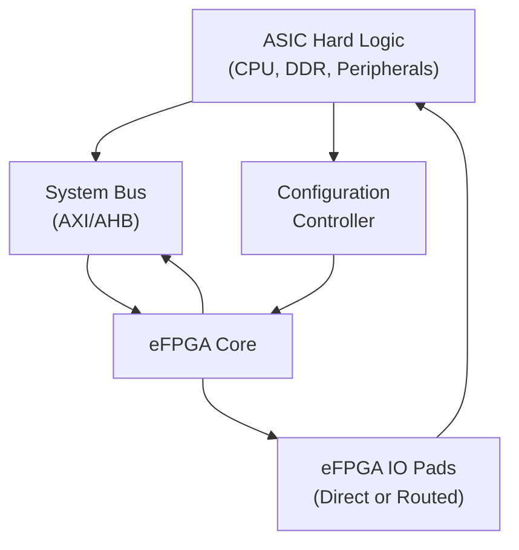
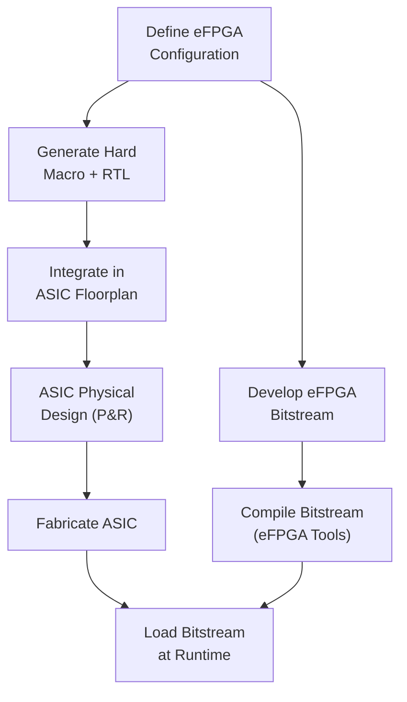
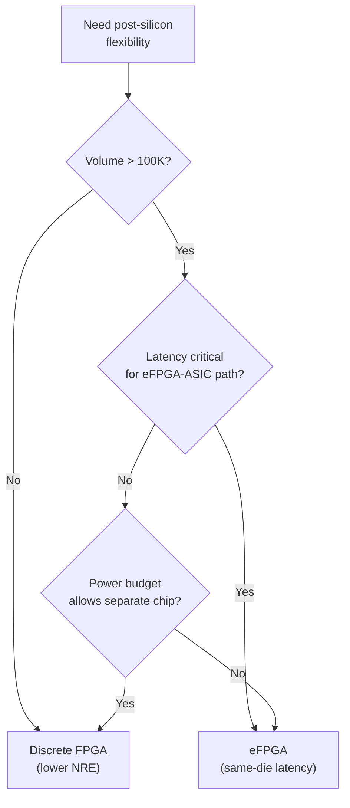

[← Advanced Topics Home](README.md) · [← Project Home](../README.md)

# eFPGA — Embedded FPGA Cores Inside ASICs

An eFPGA (embedded Field-Programmable Gate Array) is a reconfigurable logic fabric delivered as an IP core that is integrated inside a larger ASIC or SoC die. Rather than building a system with a separate FPGA chip next to an ASIC, the eFPGA approach embeds the programmable logic directly on the same silicon — eliminating the PCB area, power, and latency of an external FPGA while retaining post-fabrication flexibility. This article covers the eFPGA architecture, vendor offerings, design flows, and when to choose embedded reconfigurability over a discrete FPGA.

> [!NOTE]
> eFPGA is distinct from a discrete FPGA. A discrete FPGA is a standalone chip with IO pads, configuration logic, and clock infrastructure. An eFPGA is a soft IP macro that sits inside an ASIC alongside processors, memory controllers, and custom RTL — sharing the same power domain and process node.

---

## Overview: Why eFPGA Exists

The fundamental value proposition of eFPGA is **post-silicon flexibility** — the ability to change hardware functionality after the ASIC has been fabricated and deployed:

| Limitation of Fixed ASIC | eFPGA Solution |
|---|---|
| Protocol update required (new bus standard) | Reprogram the eFPGA with updated protocol logic |
| Bug in hardware RTL | Patch the eFPGA to implement a workaround |
| Customer-specific differentiation | Load different eFPGA bitstreams per customer |
| Unknown future requirements | Keep critical paths in reconfigurable logic |
| Long ASIC re-spin time (6–12 months) | Update eFPGA in minutes |

The tradeoff is area and power: eFPGA fabric is 5–15× less dense and 3–10× more power-hungry per function than hardwired ASIC logic, because it carries the same programmable routing and LUT overhead as a discrete FPGA.

---

## eFPGA Architecture

### Block Diagram

### Core Components

| Component | Function | Notes |
|---|---|---|
| **LUT array** | Programmable logic (4/6-input LUTs) | Same as discrete FPGA; density depends on process |
| **Routing fabric** | Programmable interconnect between LUTs | Dominates area (60–70% of eFPGA macro) |
| **Configuration memory** | SRAM cells controlling LUT functions and routing | Loaded at boot; can be reloaded at runtime |
| **IO interface** | Connection to surrounding ASIC logic | AXI4, AHB, or direct parallel; custom width |
| **Configuration interface** | Port for loading bitstreams | JTAG, SPI, or processor-driven |
| **Optional BRAM** | Embedded memory blocks within the eFPGA | Not always included in small configurations |

---

## eFPGA Vendor Offerings

### Flex Logix — InferX eFPGA

Flex Logix is the leading independent eFPGA IP provider. Their InferX architecture is available as synthesizable RTL or hardened macro for TSMC process nodes.

| Feature | Detail |
|---|---|
| **Process nodes** | TSMC 12nm, 16nm, 22nm, 28nm, 40nm, 55nm, 65nm |
| **LUT type** | 4-input LUTs (density-optimized) |
| **Array sizes** | 1K–400K LUTs (configurable in 1K increments) |
| **BRAM** | Optional, configurable depth/width |
| **DSP** | Optional 16×16 multiplier blocks |
| **IO interface** | AXI4, AHB, custom parallel |
| **Configuration** | JTAG, SPI, processor load |
| **Bitstream encryption** | AES-256 optional |
| **Key differentiator** | 4-input LUTs for higher density; "fast compile" tool flow |

**Design flow:**
1. Define eFPGA configuration (LUT count, BRAM, DSP) in Flex Logix's EFLX Compiler
2. Compiler generates Verilog RTL and placement views for ASIC integration
3. Integrate as a hard macro in the ASIC floorplan
4. Compile eFPGA bitstreams separately using EFLX Compiler from standard Verilog

### Menta — Menta eFPGA IP

Menta (a French company) provides eFPGA IP with a focus on configurability and European supply chain.

| Feature | Detail |
|---|---|
| **Process nodes** | TSMC 28nm, 22nm, 12nm; GF 22FDX; STMicro 28nm |
| **LUT type** | 4-input (MentaCore) or 6-input |
| **Array sizes** | 500–200K LUTs |
| **BRAM** | Optional |
| **IO interface** | AXI4, AHB, custom |
| **Configuration** | JTAG, SPI, slave parallel |
| **Key differentiator** | Adaptable logic block (ALB) — configurable between LUT, small state machine, or arithmetic |

### NanoXplore — eFPGA Plus

NanoXplore (also French) provides radiation-hardened eFPGA IP targeting space and defense applications.

| Feature | Detail |
|---|---|
| **Process nodes** | STMicro 28nm FDSOI, 65nm |
| **LUT type** | 6-input |
| **Array sizes** | 5K–500K LUTs |
| **Radiation hardening** | Built-in SEU mitigation (TMR, scrubbing) |
| **BRAM** | Optional with ECC |
| **IO interface** | AXI4, SpaceWire |
| **Key differentiator** | Radiation-hardened by design; space-qualified configurations |

### Adaptive Compute (Achronix-derived)

Achronix, originally a discrete FPGA vendor, offers their Speedster7t FPGA fabric as eFPGA IP for ASIC integration. The company was acquired by Adaptive Compute.

| Feature | Detail |
|---|---|
| **Process nodes** | TSMC 7nm, 12nm, 16nm |
| **LUT type** | 6-input LUTs (same as Speedster7t discrete) |
| **Array sizes** | 10K–2M LUTs |
| **BRAM** | Up to 10 Mb embedded |
| **DSP** | Up to 6,000 multiplier blocks |
| **IO interface** | AXI4, high-speed SerDes |
| **Key differentiator** | Largest eFPGA configurations available; proven 7nm silicon; 2D network-on-chip routing |

### QuickLogic — Australis eFPGA

QuickLogic provides eFPGA IP derived from their EOS S3 platform, targeting low-power IoT and wearable applications.

| Feature | Detail |
|---|---|
| **Process nodes** | TSMC 40nm, 22nm |
| **LUT type** | 4-input |
| **Array sizes** | 1K–50K LUTs |
| **Key differentiator** | Ultra-low power (< 1 mW/MHz); smallest configurations |

---

## Vendor Comparison

| Feature | Flex Logix InferX | Menta | NanoXpore | Adaptive Compute | QuickLogic Australis |
|---|---|---|---|---|---|
| **LUT type** | 4-input | 4/6-input | 6-input | 6-input | 4-input |
| **Max LUTs** | 400K | 200K | 500K | 2M | 50K |
| **Process nodes** | 12–65nm | 12–28nm | 28–65nm | 7–16nm | 22–40nm |
| **BRAM** | Optional | Optional | Optional + ECC | Yes | Optional |
| **DSP** | Optional | Optional | Optional | Yes | No |
| **Radiation hardened** | No | No | Yes | No | No |
| **Bitstream encryption** | AES-256 | AES optional | AES + anti-tamper | AES-256 | AES optional |
| **Open tools** | No (EFLX Compiler) | No | No | No | No (Ace editor) |

---

## Design Flow

### ASIC Integration Flow

1. **Define eFPGA configuration**: Select LUT count, BRAM, DSP, and IO interfaces
2. **Generate hard macro**: The eFPGA vendor provides a placed-and-routed macro for the target process node, with abstract views for the ASIC physical design flow
3. **Integrate in ASIC**: Place the eFPGA macro in the ASIC floorplan, connect power, ground, and IO signals
4. **ASIC fabrication**: Standard ASIC flow — the eFPGA macro is just another hard IP block
5. **Develop eFPGA bitstream**: Using the vendor's toolchain (EFLX Compiler, Menta tools, etc.), compile Verilog to an eFPGA bitstream
6. **Load bitstream at runtime**: Through JTAG, SPI, or processor-driven configuration

### Dual Design Responsibility

A key challenge of eFPGA integration is that two independent design teams work on the same chip:

| Team | Responsibility | Tools |
|---|---|---|
| **ASIC team** | Hardwired logic, floorplan, power, IO | Cadence Innovus, Synopsys ICC2 |
| **eFPGA team** | Reconfigurable logic, bitstreams | Vendor eFPGA compiler, verification tools |

Coordination is critical — the AXI bus width, address map, and interrupt assignments between the ASIC and eFPGA must be agreed upon early and cannot change after fabrication.

---

## When to Use eFPGA vs Discrete FPGA

| Criterion | eFPGA | Discrete FPGA |
|---|---|---|
| **Volume** | High (> 100K units) — amortize NRE | Any volume |
| **Latency** | Low (same-die communication) | Higher (off-chip, PCB routing) |
| **Power** | Lower (no IO drivers, no separate chip) | Higher (chip-to-chip IO, separate power) |
| **Area (PCB)** | Minimal (embedded in ASIC) | Requires separate package on PCB |
| **NRE cost** | High (eFPGA IP license + integration) | Low (buy COTS FPGA) |
| **Flexibility** | Limited by eFPGA size (1K–2M LUTs) | Scalable (select any device size) |
| **Performance** | Limited by eFPGA fabric speed | Full FPGA performance |
| **Tool ecosystem** | Limited (vendor-specific tools) | Rich (Vivado, Quartus, etc.) |
| **Time-to-market** | Long (ASIC + eFPGA co-design) | Short (program and deploy) |
| **Post-fab changes** | Fast (reprogram eFPGA bitstream) | Fast (reprogram FPGA) |

### Decision Flowchart

---

## Common Pitfalls

### 1. Underestimating eFPGA Area

**The problem:** The eFPGA fabric is 5–15× less dense than hardwired ASIC logic. A design that needs 50K ASIC gates may require 250K–750K gates of eFPGA area.

**The fix:** Carefully estimate the LUT count for your reconfigurable function, then add 30–50% margin for routing congestion. Use the vendor's area estimator before committing to a configuration.

### 2. Insufficient eFPGA IO Bandwidth

**The problem:** The eFPGA communicates with the ASIC through a fixed-width bus. If the bus is too narrow, it becomes a bottleneck. If too wide, it wastes routing resources.

**The fix:** Profile the data bandwidth between the ASIC and the reconfigurable function. Add 2× margin for protocol overhead and future expansion. AXI4 with 128-bit width is a common starting point.

### 3. Configuration Latency on Boot

**The problem:** The eFPGA must be configured before it can operate. On a discrete FPGA, this happens during board power-up. On an eFPGA, the ASIC must load the bitstream — and the eFPGA is non-functional during this time.

**The fix:** Plan the boot sequence carefully. Either: (1) keep the eFPGA on a critical path that tolerates the configuration delay, or (2) provide a hardwired bypass path that operates while the eFPGA configures.

### 4. Dual Tool Flow Complexity

**The problem:** ASIC verification uses Cadence/Synopsys tools; eFPGA bitstream compilation uses vendor-specific tools. Co-simulation across the boundary is difficult.

**The fix:** Define clear interface specifications (AXI bus, interrupt signals, memory map). Use AXI VIPs to verify the ASIC side independently. Use the eFPGA vendor's cycle-accurate models for eFPGA-side verification.

---

## References

| Source | Description |
|---|---|
| Flex Logix — EFLX eFPGA Product Brief | https://flex-logix.com/ |
| Menta — eFPGA IP Overview | https://www.menta-efpga.com/ |
| NanoXpore — eFPGA Plus | https://www.nanoxplore.com/ |
| Adaptive Compute — Speedster7t eFPGA | https://www.achronix.com/ |
| QuickLogic — Australis eFPGA | https://www.quicklogic.com/ |
| [FPGA Architecture](../02_architecture/README.md) | LUT, routing, and BRAM architecture that eFPGA inherits |
| [Safety-Critical Design](safety_critical_design.md) | Radiation-hardened eFPGA for space applications |
| [DFX / Partial Reconfiguration](dfx_partial_reconfiguration.md) | Runtime reconfiguration concepts |
