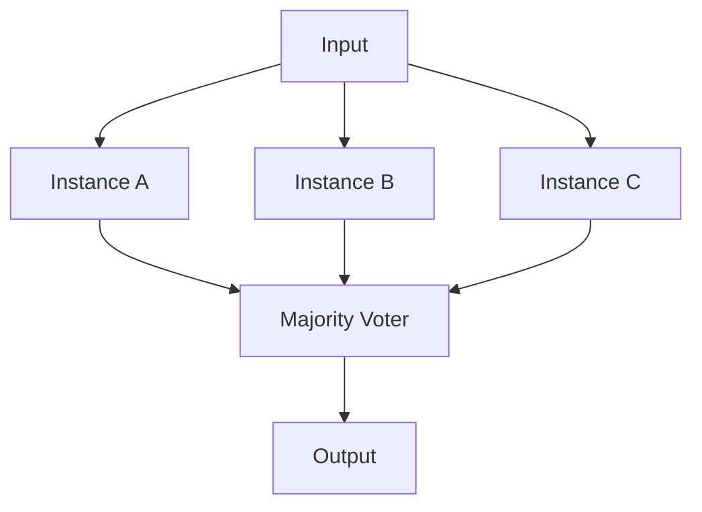

[← Advanced Topics Home](README.md) · [← Project Home](../README.md)

# Safety-Critical FPGA Design — DO-254, IEC 61508, ISO 26262, and Mitigation Strategies

FPGAs in safety-critical systems — avionics, automotive, industrial, rail, and medical — must meet rigorous certification requirements that fundamentally change how you design, verify, and document your hardware. A bit-flip from a cosmic ray at 35,000 feet or a single-event upset in a radiation environment can corrupt an FPGA's configuration memory, silently inverting a flip-flop or corrupting a BRAM entry. Safety-critical FPGA design is the discipline of ensuring that these events are detected, contained, and recovered from — with evidence that satisfies certification authorities. This article covers the certification frameworks, the mitigation techniques (TMR, scrubbing, EDAC), the verification requirements, and the vendor-specific safety-certified FPGA offerings.

> [!NOTE]
> This article focuses on FPGA-specific safety concerns. Software safety (RTOS certification, MISRA-C) is out of scope except where it intersects with FPGA design (e.g., HPS-FPGA safety partitioning on SoC devices).

---

## Overview: Why Safety-Critical FPGA Design Is Different

Standard FPGA design assumes a benign operating environment: stable power, controlled temperature, no radiation, and the luxury of a reboot if something goes wrong. Safety-critical systems cannot make any of these assumptions:

| Concern | Standard Design | Safety-Critical Design |
|---|---|---|
| **Single-event upset (SEU)** | Ignored or accepted | Must be detected and corrected |
| **Configuration corruption** | Power-cycle to fix | Must detect within milliseconds, scrub continuously |
| **Design verification** | Simulation + basic testing | Formal proof, structural coverage, traceability to requirements |
| **Documentation** | Optional | Mandatory (design assurance data per DAL) |
| **Tool qualification** | Assume tools work | Must qualify synthesis/simulation tools |
| **Independence** | Same person designs and verifies | Independence of verification from design |

---

## Certification Frameworks

### DO-254 — Airborne Electronic Hardware

DO-254 ("Design Assurance Guidance for Airborne Electronic Hardware") is the aviation standard for ensuring the safety of electronic hardware — including FPGAs, ASICs, and circuit boards. It was jointly developed by RTCA and EUROCAE (document ED-80 in Europe).

**Design Assurance Levels (DAL)**:

| DAL | Failure Condition | Effect on Aircraft | Verification Rigor |
|---|---|---|---|
| **A** | Catastrophic | Loss of the aircraft | Full: formal methods, structural coverage, independent verification |
| **B** | Hazardous | Serious injury, major damage | Advanced: MCDC or decision coverage, hardware testing |
| **C** | Major | Significant workload increase, discomfort | Standard: statement coverage, hardware testing |
| **D** | Minor | Nuisance, minor workload | Basic: code review, functional testing |
| **E** | No effect | None | Minimal documentation |

**Key DO-254 Requirements for DAL A/B:**
- Requirements traceability (every RTL line → requirement → test)
- Structural coverage analysis (statement, decision, MCDC)
- Elemental analysis (identify and verify safety-relevant features)
- Formal methods encouraged (proof of absence of unsafe behavior)
- Tool qualification for synthesis and simulation
- Independence of verification activities

### IEC 61508 — Functional Safety (Industrial)

IEC 61508 is the international standard for functional safety of electrical, electronic, and programmable electronic systems. It defines Safety Integrity Levels (SIL):

| SIL | Probability of Dangerous Failure per Hour | Typical Application |
|---|---|---|
| **4** | ≥ 10⁻⁹ to < 10⁻⁸ | Nuclear, explosive atmospheres |
| **3** | ≥ 10⁻⁸ to < 10⁻⁷ | Railway signaling, chemical process |
| **2** | ≥ 10⁻⁷ to < 10⁻⁶ | Industrial machinery, process control |
| **1** | ≥ 10⁻⁶ to < 10⁻⁵ | Basic industrial safety |

### ISO 26262 — Automotive Functional Safety

ISO 26262 adapts IEC 61508 for road vehicles, defining Automotive Safety Integrity Levels (ASIL):

| ASIL | Severity | Probability | Exposure | Controllability |
|---|---|---|---|---|
| **D** | Life-threatening | High | High | Difficult to control |
| **C** | Life-threatening | Medium | Medium | Controllable |
| **B** | Severe injury | Low | Medium | Mostly controllable |
| **A** | Minor injury | Low | Low | Controllable |
| **QM** | No safety relevance | N/A | N/A | N/A |

### EN 50129 — Railway

Railway-specific standard for signaling and control systems. Defines Safety Integrity Levels (SIL 1–4) aligned with IEC 61508. Additional requirements for systematic capability and hardware fault tolerance.

### IEC 62304 — Medical Device Software

While primarily for software, medical device standards increasingly require safety analysis of programmable hardware including FPGAs. The risk management framework (ISO 14971) drives the rigor level.

---

## SEU and Radiation Effects on FPGAs

### Configuration Memory Vulnerability

SRAM-based FPGAs store their configuration in volatile SRAM cells. A single cosmic ray can flip a configuration bit, changing a LUT function, a routing connection, or a BRAM initialization:

| FPGA Resource | SEU Effect | Detection Method |
|---|---|---|
| **LUT** (6-input) | Logic function changes | TMR, parity, readback CRC |
| **Routing switch** | Signal disconnected or shorted | TMR, readback CRC |
| **BRAM** | Stored data corrupted | ECC, parity, readback CRC |
| **Flip-flop** | State bit flipped | TMR, parity |
| **DSP slice** | Coefficient changed | TMR, readback CRC |

### Configuration Bit Statistics

| Device Family | Configuration Bits | SEU Cross-Section (per bit) | MTBF at 35,000 ft |
|---|---|---|---|
| Xilinx Virtex-5 | ~40 Mb | ~10⁻¹⁴ cm²/bit | ~10,000 hours |
| Xilinx Kintex-7 | ~50 Mb | ~5×10⁻¹⁵ cm²/bit | ~15,000 hours |
| Xilinx UltraScale+ | ~100 Mb | ~3×10⁻¹⁵ cm²/bit | ~20,000 hours |
| Intel Cyclone V | ~30 Mb | ~8×10⁻¹⁵ cm²/bit | ~12,000 hours |

> [!WARNING]
> **At aircraft altitude, SRAM-FPGA configuration corruption occurs on a timescale of months, not centuries.** A transatlantic flight exposes the FPGA to more radiation in 8 hours than a year at sea level. Continuous scrubbing is mandatory.

---

## Mitigation Techniques

### Triple Modular Redundancy (TMR)

TMR is the gold-standard SEU mitigation technique. Three identical copies of a circuit operate in parallel, and a majority voter selects the correct output. If one copy is corrupted by an SEU, the other two outvote it.



#### TMR Design Considerations

| Consideration | Detail |
|---|---|
| **Voter reliability** | The voter itself is a single point of failure. For DAL A, the voter must be simple (combinational) and proven by formal analysis |
| **Clock domain** | All three instances must share the same clock. Clock skew between instances must be minimized |
| **Feedback loops** | State machines require feedback from the voter output back to all three instances — otherwise the corrupted instance stays corrupted |
| **IO pins** | Input signals must fan out to all three instances. Output voting requires three output pins or internal voting before a single output |
| **Resource cost** | 3× logic + 1× voter ≈ 3.2–3.5× area, 3× power |
| **Coverage** | Protects against single SEU. Does NOT protect against common-mode failures (power supply, clock, design bugs) |

#### Xilinx TMRTool

Xilinx provides TMRTool (part of Vivado) that automatically inserts TMR into an existing design. It supports:

- Full-module TMR (entire design triplicated)
- Selective TMR (only critical modules triplicated)
- IO TMR (input fanout and output voting)
- Automatic voter insertion with feedback

#### Manual TMR (Verilog)

```verilog
// TMR-protected counter with voter
module tmr_counter (
    input  wire        clk,
    input  wire        rst,
    output wire [7:0]  count
);

    wire [7:0] count_a, count_b, count_c;

    // Three redundant instances
    counter u_a (.clk(clk), .rst(rst), .count(count_a));
    counter u_b (.clk(clk), .rst(rst), .count(count_b));
    counter u_c (.clk(clk), .rst(rst), .count(count_c));

    // Majority voter — bitwise
    assign count = (count_a & count_b) |
                   (count_a & count_c) |
                   (count_b & count_c);

endmodule
```

### Configuration Scrubbing

Scrubbing continuously reads back the FPGA configuration memory and corrects bit errors by rewriting the correct values. Two approaches:

| Scrubbing Type | Mechanism | Detection Latency | Correction Latency | Complexity |
|---|---|---|---|---|
| **Readback + Compare** | Read configuration, compare to golden copy, rewrite mismatches | Seconds (depends on readback speed) | Milliseconds | Medium |
| **ECC-based** | Built-in frame ECC detects and corrects single-bit errors per frame | Microseconds (hardware ECC) | Microseconds | Low (hardware) |
| **Blind Scrub** | Periodically rewrite entire configuration regardless of errors | None (always correcting) | Scrub period (seconds) | Very low |

#### Xilinx SEU Mitigation (7-Series and UltraScale+)

Xilinx 7-series and UltraScale+ devices include built-in frame-level ECC in the configuration memory:

- Each configuration frame includes a 32-bit ECC syndrome
- Single-bit errors: detected and corrected by the ICAP (Internal Configuration Access Port)
- Double-bit errors: detected but NOT corrected (requires full reconfiguration)
- Frame size: 101 words (7-series), 93 words (UltraScale+)

```verilog
// Xilinx: SEU detection via FRAME_ECC error signals
// Access via ICAP or STARTUPE3 primitive
wire ecc_single_error;  // Single-bit error detected (correctable)
wire ecc_double_error;  // Double-bit error detected (uncorrectable)

// Connect to soft scrubber that reads via ICAP and corrects
```

#### Intel SEU Mitigation

Intel Cyclone V and Agilex include CRC-based error detection:

- Configuration CRC checked continuously in background
- Error signal (`CRC_ERROR`) asserts when mismatch detected
- Correction requires external scrubber (JTAG or host processor)
- Agilex adds SEU error injection for testing

### EDAC (Error Detection and Correction) for BRAM

BRAM contents are vulnerable to SEUs just like configuration memory. Protection options:

| Protection | Overhead | Capability | Use Case |
|---|---|---|---|
| **Parity** | 1 bit per byte | Detect single-bit errors | DAL C/D — detection only |
| **Hamming (72,64)** | 8 bits per 64 | Single-error correct, double-error detect (SECDED) | DAL A/B — correction required |
| **ECC (UltraScale+ built-in)** | 8 bits per 64 | Hardware SECDED | Simplifies implementation |
| **TMR on BRAM** | 3× BRAM | Full triple redundancy | Critical state machines |

```verilog
// Xilinx UltraScale+ BRAM with built-in ECC
// In Vivado: set BRAM to "ECC" mode during IP configuration
// The BRAM primitive automatically:
//   - Generates check bits on write
//   - Corrects single-bit errors on read
//   - Reports uncorrectable double-bit errors

// ECC status signals
wire sbiterr;  // Single-bit error corrected
wire dbiterr;  // Double-bit error detected (uncorrectable)
```

---

## Vendor Safety-Certified FPGA Offerings

### Xilinx (AMD)

| Device | Certification | Features |
|---|---|---|
| **Virtex-5 QV** | Radiation-hardened, space-qualified | QML-V, SEU-immune configuration, TMR library |
| **Kintex UltraScale KU060** | DO-254 DAL A certified package | Certification data package available |
| **Zynq UltraScale+ MPSoC** | IEC 61508 SIL 2/3, ISO 26262 ASIL B/D | Safety manual, FMEDA, certified software libraries |
| **Versal Premium** | ISO 26262 ASIL D | Integrated safety island, lock-step R5 processors |

### Intel (Altera)

| Device | Certification | Features |
|---|---|---|
| **Cyclone V SEU Mitigation** | DO-254 DAL A capable | CRC-based error detection, JTAG scrubbing |
| **Arria 10 GX SEU** | IEC 61508 SIL 2 | Background CRC check, error injection |
| **Agilex 7** | ISO 26262 ASIL B/D | Safety island, ECC on all memories, SEU mitigation |

### Microchip

| Device | Certification | Features |
|---|---|---|
| **PolarFire** | DO-254, IEC 61508 SIL 3 | Flash-based (no configuration SEU), single-chip safety solution |
| **SmartFusion2** | DO-254 DAL A, IEC 61508 SIL 3 | Flash-based, ARM Cortex-M3 safety monitor |
| **RT PolarFire** | Radiation-tolerant, space-qualified | Flash + SEU-immune configuration |

### Lattice

| Device | Certification | Features |
|---|---|---|
| **Lattice CertusPro-NX** | IEC 61508, ISO 26262 | ECC on configuration, error detection, safety manual |
| **MachXO3** | IEC 61508 SIL 2 | Flash + SRAM hybrid, dual-boot for safety |

> [!NOTE]
> **Flash-based FPGAs (Microchip, some Lattice) have inherent SEU immunity in their configuration memory** — flash cells require significantly higher energy to flip than SRAM cells. This is a major advantage for safety-critical applications, eliminating the need for continuous scrubbing.

---

## Verification Requirements by DAL/SIL

### Structural Coverage

| Coverage Type | What It Measures | Required For |
|---|---|---|
| **Statement** | Every line of RTL executed in simulation | DAL C+, SIL 2+ |
| **Decision (Branch)** | Every if/case branch taken both ways | DAL B+ |
| **MCDC** (Modified Condition Decision Coverage) | Every condition independently affects outcome | DAL A |
| **Toggle** | Every signal transitions 0→1 and 1→0 | DAL C+ (complementary) |
| **FSM** | Every state entered, every transition exercised | DAL C+ |

### Tool Qualification

For DAL A/B, the tools used to design and verify the FPGA must be qualified:

| Tool Category | Qualification Approach | Examples |
|---|---|---|
| **Synthesis** | Output verification (compare synthesized netlist to RTL) | Vivado, Quartus, Precision |
| **Simulation** | Self-checking testbenches + tool validation suite | ModelSim/Questa, XSim, VCS |
| **Formal verification** | Tool qualification per DO-254 Tool Qualification guidance | JasperGold, OneSpin |
| **Timing analysis** | Timing measurement on target hardware | Vivado Timing Analyzer, TimeQuest |

### Traceability

Every requirement must be traceable through the design lifecycle:

```
System Requirement → HW Requirement → RTL Module → Test Case → Coverage Result
```

Tools like IBM DOORS, Jama, or Polarion manage traceability matrices. The FPGA design flow must integrate with these tools through import/export of requirements and coverage data.

---

## Practical Design Checklist

### Pre-Design

- [ ] Determine certification target (DAL/SIL/ASIL) and authority (FAA/EASA/TÜV)
- [ ] Select FPGA with safety-certified data package or proven SEU mitigation
- [ ] Establish requirements traceability tool chain
- [ ] Define independence requirements (design vs. verification personnel)

### During Design

- [ ] Apply TMR to all safety-critical modules
- [ ] Enable ECC on all BRAM instances
- [ ] Implement configuration scrubbing (readback + ECC correction)
- [ ] Add SEU error detection outputs (CRC error, ECC error) to system health monitoring
- [ ] Ensure all clocks have redundancy (primary + backup with switchover)
- [ ] Design safety monitors (watchdog, heart-beat, lock-step comparators)

### Verification

- [ ] Achieve structural coverage targets (statement/decision/MCDC per DAL)
- [ ] Run formal verification on safety-critical modules
- [ ] Perform SEU fault injection testing (Xilinx SEU injection, Intel error injection)
- [ ] Verify scrubbing latency (time from error to correction)
- [ ] Test TMR voter operation under injected faults
- [ ] Document all verification results with traceability

### Certification

- [ ] Prepare Design Assurance Data (DAD) package
- [ ] Submit to Designated Engineering Representative (DER) for DO-254
- [ ] Conduct hardware safety assessment (FHA, FTA, FMEA)
- [ ] Obtain certification authority approval

---

## References

| Source | Description |
|---|---|
| RTCA DO-254 / EUROCAE ED-80 | Design Assurance Guidance for Airborne Electronic Hardware |
| IEC 61508 (all parts) | Functional Safety of Electrical/Electronic Systems |
| ISO 26262 (all parts) | Road Vehicles — Functional Safety |
| EN 50129 | Railway Applications — Safety-related Electronic Systems |
| Xilinx UG1168 | Xilinx Military and Aerospace Product Guide |
| Xilinx XAPP983 | Mitigating SEU in Xilinx FPGAs |
| Intel AN-680 | SEU Mitigation for Intel FPGAs |
| Microchip PB006 | PolarFire FPGA Safety Manual |
| [TMR and DFX](dfx_partial_reconfiguration.md) | Partial reconfiguration for safety-critical updates |
| [Hardware Security](hardware_security.md) | Secure boot and bitstream authentication |
| [Clock Domain Crossing](../05_timing_and_constraints/clock_domain_crossing.md) | CDC is a safety concern — metastability must be mitigated |
